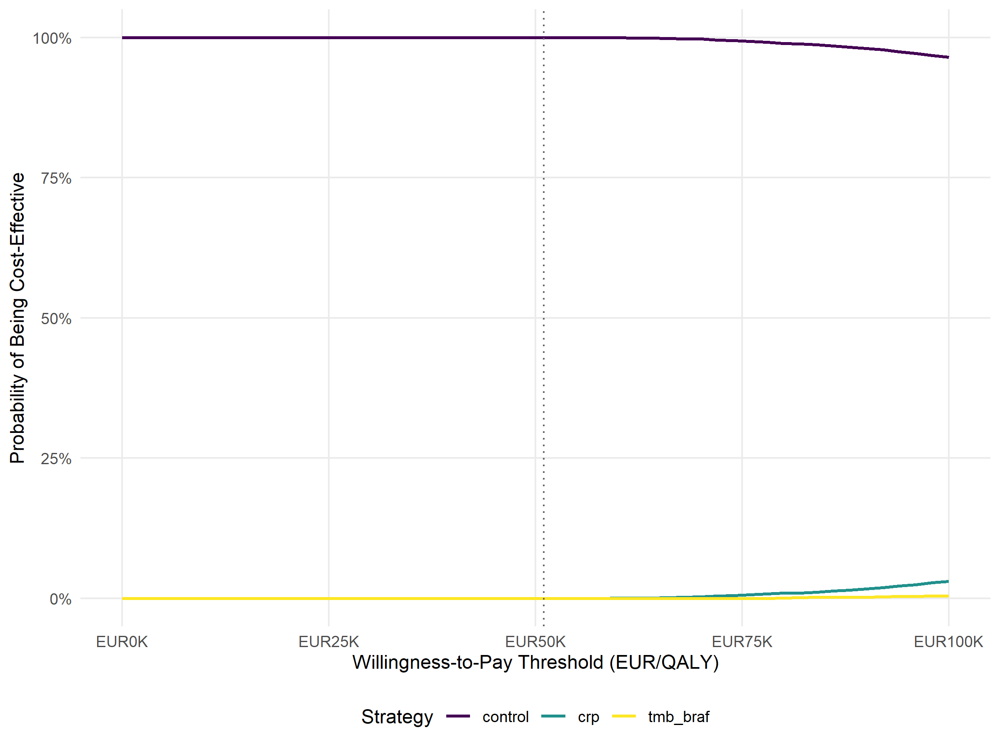
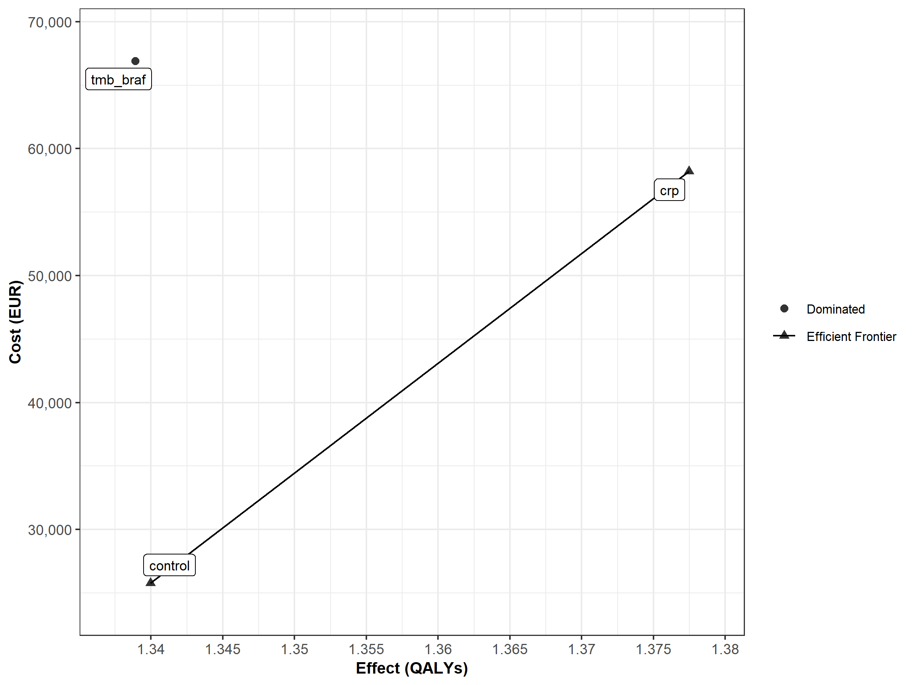

# Cost-Effectiveness Analysis
Ben Geisler
2026-10-01

- [Overview](#overview)
- [Economic Survival Model](#economic-survival-model)
- [Primary Analysis: Probabilistic
  Cost-Effectiveness](#primary-analysis-probabilistic-cost-effectiveness)
  - [Parameters sampled](#parameters-sampled)
  - [Results](#results)
- [Deterministic Point Evaluation](#deterministic-point-evaluation)
- [Methods Diagnostic: Probabilistic and Deterministic
  Estimands](#methods-diagnostic-probabilistic-and-deterministic-estimands)
- [Summary](#summary)
- [Common Target Population](#common-target-population)
- [Scope Limitations](#scope-limitations)
  - [Validation warnings](#validation-warnings)

# Overview

This cost-effectiveness analysis evaluates standard of care against two
pre-immunotherapy biomarker-guided immunotherapy strategies for
metastatic MSS/pMMR colorectal cancer:

- CRP-guided treatment selection (CRP \< 5 mg/L at week 4, before the
  first nivolumab dose)
- TMB/BRAF-guided treatment selection (baseline next-generation
  sequencing)

The headline analysis is probabilistic: decisions use expected net
monetary benefit from the PSA. The deterministic point evaluation
anchors the one-way sensitivity analysis (tornado), which varies one
input at a time around fitted parameters to explain sensitivity. These
analyses answer different questions and need not have identical means.

The economic survival model is a single joint model with CRP and
TMB/BRAF treatment interactions. Economic strategies are restricted to
biomarkers that are available before the decision to add immunotherapy
is made.

**CRP timing.** CRP is not a baseline (pre-randomization) measurement.
In the METIMMOX trial every patient received two cycles of FLOX before
the first nivolumab dose, and the CRP used to define the CRP-guided
strategy is the value measured at week 4 (cycle 3 day 1), i.e. at the
point where the decision to add nivolumab is made. The model clock
starts at randomization, but this has no economic consequence: up to
week 4 both arms receive identical FLOX, monitoring and visits, and the
week-4 blood test is already part of the monitoring schedule. Three
patients without a week-4 CRP value died early (weeks 2.4, 15.7 and
20.9) and are excluded from the complete-case data on which the survival
models are fitted, so the CRP subgroup curves are conditional on
surviving to the week-4 measurement.

# Economic Survival Model

QALYs and ongoing progressed-state cost rates use trapezoidal
integration over the weekly grid: 521 points cover exactly 520 weeks.
Scheduled treatment, diagnostic tests and visits, baseline costs and
end-of-life events retain full charges at their modeled time points
(issue \#163). See the [input-parameter report](input_parameters.md) for
the integration convention.

| Component | Formula |
|:---|:---|
| OS | Surv(OSwk, Death) ~ Age + sex + Rx + crp*Rx + tmb_braf*Rx |
| PFS | Surv(PFSwk, Progression) ~ Age + sex + Rx + crp*Rx + tmb_braf*Rx |
| Control arm | Same joint OS and PFS models, predicted with Rx = control for every patient |

Single economic survival model

| Strategy | Definition |
|:---|:---|
| Standard of Care | All patients receive standard FLOX chemotherapy |
| CRP-guided | CRP-positive patients receive FLOX + nivolumab; CRP-negative patients receive FLOX |
| TMB/BRAF-guided | TMB/BRAF-positive patients receive FLOX + nivolumab; TMB/BRAF-negative patients receive FLOX |

Economic strategies

# Primary Analysis: Probabilistic Cost-Effectiveness

## Parameters sampled

The PSA samples the health-state utilities, the joint biomarker cell
probabilities, and the resource-use costs (visit, baseline work-up,
quarterly follow-up, end-of-life care), together with the survival
models. Unit drug and test prices are **fixed** (issue \#154): they are
published tariffs or, for nivolumab, an assumed acquisition price, so
treating them as uncertain would attribute decision uncertainty — and
value of information — to quantities that no study could resolve. Their
influence is reported in the one-way sensitivity analysis and in the
biosimilar pricing scenario instead.

The two utilities are sampled jointly rather than independently. The PSA
draws a non-negative decrement and sets the progressed utility to the
progression-free utility minus that decrement, so no draw can place the
progressed utility above the progression-free utility.

    Utility-ordering diagnostic: 0 of 5000 PSA draws (0.0%) have u_p > u_np, and 0.0% exceed it by more than 0.05. The decrement parameterisation makes these fractions zero by construction; independent beta draws for the two utilities did not.

## Results

| Strategy | Cost | QALYs | Probability CE |
|:---|:---|:---|:---|
| Standard of Care | EUR 25,732 (EUR 20,789; EUR 31,361) | 1.3775 (0.8327; 1.9959) | 100.0% |
| CRP-guided | EUR 57,740 (EUR 45,581; EUR 70,538) | 1.4007 (0.8726; 1.9218) | 0.0% |
| TMB/BRAF-guided | EUR 66,302 (EUR 53,589; EUR 80,110) | 1.3696 (0.8382; 1.9110) | 0.0% |

Primary probabilistic results: means (95 percent uncertainty intervals),
WTP EUR 51,000

| Strategy | Incremental cost | Incremental QALYs | ICER |
|:---|:---|:---|:---|
| Standard of Care | EUR 0 (EUR 0; EUR 0) | 0.0000 (0.0000; 0.0000) | – |
| CRP-guided | EUR 32,008 (EUR 21,142; EUR 43,951) | 0.0232 (-0.3654; 0.3769) | EUR 1,378,448 |
| TMB/BRAF-guided | EUR 40,570 (EUR 29,050; EUR 53,131) | -0.0079 (-0.3594; 0.3400) | Dominated |

Primary pairwise results versus standard of care: means (95 percent
uncertainty intervals)

Intervals are the 2.5th and 97.5th percentiles of the retained PSA
draws, not confidence intervals for the mean. Incremental intervals use
paired differences within each draw versus standard of care. The ICER is
mean incremental cost divided by mean incremental QALYs, never a mean of
per-draw ratios. Dominance labels compare mean costs and QALYs. Table 5
is the primary publication table.

# Deterministic Point Evaluation

| Strategy         |       Cost | QALYs |        NMB |
|:-----------------|-----------:|------:|-----------:|
| Standard of Care | EUR 25,764 | 1.340 | EUR 42,574 |
| CRP-guided       | EUR 58,203 | 1.377 | EUR 12,048 |
| TMB/BRAF-guided  | EUR 66,916 | 1.339 |  EUR 1,368 |

Deterministic point evaluation anchoring the one-way sensitivity
analysis; WTP = EUR 51,000

| Strategy | Cost | QALYs | Incremental Cost | Incremental QALYs | ICER | Status |
|:---|---:|---:|---:|---:|---:|:---|
| Standard of Care | EUR 25,764 | 1.340 | – | – | – | ND |
| CRP-guided | EUR 58,203 | 1.377 | EUR 32,439 | 0.038 | EUR 864,492 | ND |
| TMB/BRAF-guided | EUR 66,916 | 1.339 | – | – | Dominated | D |

Deterministic efficiency-frontier results

# Methods Diagnostic: Probabilistic and Deterministic Estimands

The PSA and the base case use the same survival formulas and target
population. Since issue \#159, the OS and PFS coefficient vectors are
drawn together from a multivariate normal centred at their
maximum-likelihood estimates. Paired patient bootstrap fits estimate
their cross-endpoint dependence; block whitening and recolouring
preserve each original fit’s marginal covariance. The bootstrap is used
only to estimate dependence, never to supply PSA coefficient draws. See
the [joint sampling specification](technical/joint_survival_sampling.md)
for the covariance construction and diagnostics.

The deterministic result evaluates survival at the fitted coefficients;
the PSA averages nonlinear survival predictions over parameter
uncertainty. Those are different quantities: even correctly centred
coefficient draws need not give outcome means equal to the deterministic
result. Joint sampling changes the dependence and the ordering
correction, but, with fixed marginal coefficient distributions, cannot
remove the raw-curve mean shift in expectation. No draws or outcomes are
recentered. With all coefficient covariance set to zero and economic
parameters and population weights fixed, `test_psa_zero_uncertainty.R`
reproduces every deterministic cost and QALY result. Issue \#180 retires
the historical five-Monte-Carlo-standard-error alignment criterion
because it tested equality of different estimands. The comparison below
describes the difference and simulation precision without a pass/fail
threshold; the structural joint-control check remains in
`test_psa_basecase_alignment.R`, and zero-uncertainty equality is the
correctness criterion.

| Strategy | Outcome | Base Case | PSA Mean | PSA SE | Difference | Difference (SE) |
|:---|:---|---:|---:|---:|---:|---:|
| Standard of Care | Cost | EUR 25,764 | EUR 25,732 | EUR 38 | -EUR 32 | -0.8 |
| Standard of Care | QALYs | 1.3400 | 1.3775 | 0.0042 | +0.0376 | +9.0 |
| CRP-guided | Cost | EUR 58,203 | EUR 57,740 | EUR 90 | -EUR 463 | -5.2 |
| CRP-guided | QALYs | 1.3775 | 1.4007 | 0.0038 | +0.0233 | +6.1 |
| TMB/BRAF-guided | Cost | EUR 66,916 | EUR 66,302 | EUR 97 | -EUR 613 | -6.3 |
| TMB/BRAF-guided | QALYs | 1.3389 | 1.3696 | 0.0039 | +0.0307 | +7.9 |

Methods diagnostic: PSA means versus deterministic point evaluations
(Monte Carlo SE)

The nonlinear mean shift can differ across strategies, so it need not
cancel in increments even though every strategy shares the same
coefficient draw. The incremental comparison below reports this
remaining difference directly. Decisions under uncertainty use expected
net monetary benefit from the PSA; the deterministic results describe
the fitted-parameter scenario.

| Comparison | Outcome | Base Case | PSA Mean | PSA SE | Difference | Difference (SE) |
|:---|:---|---:|---:|---:|---:|---:|
| CRP-guided vs Standard of Care | Cost | EUR 32,439 | EUR 32,008 | EUR 81 | -EUR 431 | -5.3 |
| CRP-guided vs Standard of Care | QALYs | +0.0375 | +0.0232 | 0.0027 | -0.0143 | -5.4 |
| TMB/BRAF-guided vs Standard of Care | Cost | EUR 41,152 | EUR 40,570 | EUR 88 | -EUR 581 | -6.6 |
| TMB/BRAF-guided vs Standard of Care | QALYs | -0.0011 | -0.0079 | 0.0025 | -0.0069 | -2.8 |

Incremental PSA means versus base-case increments relative to standard
of care

The joint covariance improvement is retained: in issue \#159, crossings
fell from 2,422/5,000 (48.44%) to 1,198/5,000 (23.96%), and mean CRP
incremental QALYs increased from 0.00175 to 0.00629. The QALY level
differences remained 5.94–8.77 Monte Carlo SEs. Joint dependence
therefore improved ordering and the incremental decision quantities
without eliminating the nonlinear mean shift; it does not make the two
estimands equal.

# Summary

The economic evaluation now uses one joint survival model and three
economic strategies: standard of care, CRP-guided immunotherapy (week-4
CRP, before the first nivolumab dose), and TMB/BRAF-guided immunotherapy
(baseline NGS).

# Common Target Population

Control and both guided strategies are evaluated in the same
complete-case trial population (n = 68). The base case uses its observed
joint CRP and TMB/BRAF distribution. The PSA draws all four joint cell
probabilities together using a Dirichlet distribution with the observed
cell counts; marginal prevalences are derived from that draw. The age
and sex distributions within each cell remain fixed. Every draw’s common
population weights apply to control and both guided strategies. This
represents uncertainty in the trial population, not transport to an
external population. The prevalence DSA changes one marginal while
retaining the other marginal and joint odds ratio, and reweights every
strategy consistently (issue \#166).

# Scope Limitations

Three scope decisions bound the interpretation of these results (issue
\#154).

**No post-progression treatment costs.** After progression the model
charges only a quarterly follow-up visit, a quarterly CT scan and the
one-time end-of-life cost. Second-line systemic therapy and any further
post-progression visits are not modeled. The strategies differ in time
spent in the progressed state, so this omission is differential rather
than a common offset. A structural scenario charging EUR 5,000 per
quarter in the progressed state is reported in the one-way sensitivity
analysis.

**Second treatment sequence given to all progression-free patients.**
Both arms receive a second eight-cycle sequence at weeks 24-38, applied
to every patient still progression-free at that point. METIMMOX
re-treated on progression during the treatment break, so the model
charges second-sequence drug and visit costs to patients who would not
have been re-treated. A partitioned survival model has no on-treatment
substate, so re-treatment cannot be conditioned on progression without
restructuring the model; a structural scenario removing the second
sequence, with survival held at the trial estimate, bounds the cost side
of the assumption.

**Nivolumab price is an assumption.** The base-case price per
administration is an assumed Norwegian hospital acquisition cost rather
than a citable tariff, because Norwegian hospital prices are set by
confidential LIS tender. It is the largest single cost driver; the
biosimilar scenario and the one-way analysis show how the conclusions
move with it.

Adverse-event costs and disutilities remain outside the modeled scope,
as described in the project documentation.

**Extrapolated survival is checked against external data only
one-sidedly.** Trial follow-up ends before five years, and the published
first-line mCRC sources report survival beyond that only as lower
bounds. Modelled standard-of-care OS is 5.5% at 5 years and meets 0 of
the 3 published lower bounds at 5 years or later. The comparison, its
pre-specified tolerance and the dependent validation against the trial
Kaplan-Meier curves are in the technical report
`survival_external_validation.qmd` (issue \#162).

------------------------------------------------------------------------

**Report completed on:** 2026-10-01  
**Repository:** ben-geisler/METIMMOX-1  
**Report version:** 4.8

## Validation warnings

Warnings recorded during rendering: 18 (9 distinct).

- report setup: Hessian not positive definite: smallest eigenvalue is
  -1.0e+00 (threshold: -1.0e-05). This might indicate that the
  optimization did not converge to the maximum likelihood, so that the
  results are invalid. Continuing with the nearest positive definite
  approximation of the covariance matrix.
- model-table: Warning: ‘xfun::attr()’ is deprecated. Use
  ‘xfun::attr2()’ instead. See help(“Deprecated”)
- strategy-table: Warning: ‘xfun::attr()’ is deprecated. Use
  ‘xfun::attr2()’ instead. See help(“Deprecated”)
- psa-summary: Warning: ‘xfun::attr()’ is deprecated. Use
  ‘xfun::attr2()’ instead. See help(“Deprecated”)
- psa-primary-increments: Warning: ‘xfun::attr()’ is deprecated. Use
  ‘xfun::attr2()’ instead. See help(“Deprecated”)
- basecase-table: Warning: ‘xfun::attr()’ is deprecated. Use
  ‘xfun::attr2()’ instead. See help(“Deprecated”)
- icer-table: Warning: ‘xfun::attr()’ is deprecated. Use ‘xfun::attr2()’
  instead. See help(“Deprecated”)
- psa-basecase-table: Warning: ‘xfun::attr()’ is deprecated. Use
  ‘xfun::attr2()’ instead. See help(“Deprecated”)
- psa-incremental-table: Warning: ‘xfun::attr()’ is deprecated. Use
  ‘xfun::attr2()’ instead. See help(“Deprecated”)
