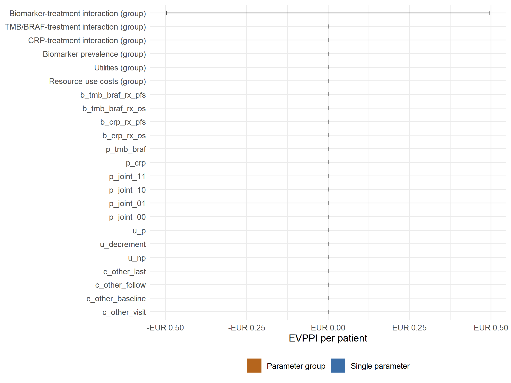

# Value of Information Analysis
Ben Geisler
2026-10-01

- [Overview](#overview)
- [PSA Decision Uncertainty](#psa-decision-uncertainty)
- [EVPPI Results](#evppi-results)
  - [Individual Parameters](#individual-parameters)
  - [Parameter Groups](#parameter-groups)
  - [Group Consistency Check](#group-consistency-check)
- [EVPPI Estimator](#evppi-estimator)
- [Population Scaling](#population-scaling)
  - [Validation warnings](#validation-warnings)

# Overview

This report summarizes expected value of information results for the
single joint economic model. The underlying PSA object contains three
strategies: standard of care, CRP-guided immunotherapy, and
TMB/BRAF-guided immunotherapy.

EVPPI is estimated by nonparametric regression of net monetary benefit
on the parameter(s) of interest (see the EVPPI Estimator section). Every
estimate is reported with its Monte Carlo standard error. Group values
are joint estimates for all members of the group; they are never
obtained by adding single-parameter rows, because EVPPI is not additive.

# PSA Decision Uncertainty

| Strategy         |  Mean Cost | Mean QALYs | Probability Cost-Effective |
|:-----------------|-----------:|-----------:|---------------------------:|
| Standard of Care | EUR 25,732 |      1.378 |                     100.0% |
| CRP-guided       | EUR 57,740 |      1.401 |                       0.0% |
| TMB/BRAF-guided  | EUR 66,302 |      1.370 |                       0.0% |

PSA summary at WTP = EUR 51,000

| Metric           |     Value |
|:-----------------|----------:|
| Per-patient EVPI |  EUR 0.00 |
| Population EVPI  | EUR 0.00M |

Expected value of perfect information

# EVPPI Results

## Individual Parameters

    EVPI is EUR 0.00 per patient: standard of care has the highest net monetary benefit in every PSA draw, so the EVPPI of every parameter and group is zero and no rows are stored (analysis script short-circuit).

## Parameter Groups

Each group row is one joint estimate for all parameters in the group.
The resource-use cost group covers the sampled visit, baseline,
follow-up and end-of-life costs (unit drug and test prices are fixed in
the PSA, issue \#154, so there is no drug-cost, test-cost or all-costs
group); the utilities group is the progression-free utility and the
utility decrement; the biomarker-treatment interaction group covers the
OS and PFS treatment-by-biomarker coefficients of both biomarkers.

## Group Consistency Check

Perfect information on a group of parameters is worth at least as much
as perfect information on any one of them. Each group estimate is
compared with its largest member, allowing for two combined Monte Carlo
standard errors with a floor of 1% of EVPI. The analysis script stops if
a group falls short of this bound.

    No group-consistency check applies: the EVPI threshold short-circuits EVPPI regression, so no parameter or group rows are stored.

# EVPPI Estimator

EVPPI values are estimated with the nonparametric regression method of
Strong, Oakley and Brennan (2014) as implemented in the `voi` package
(`voi::evppi()`). For each parameter or parameter group, the incremental
net monetary benefit of every strategy relative to standard of care is
regressed on the parameter(s) with a generalized additive model. The
fitted values estimate the expected net benefit conditional on the
parameter(s), and EVPPI is the mean over PSA draws of the maximum fitted
value across strategies minus the maximum of the mean fitted values.

Groups of up to four parameters use a tensor-product cubic regression
spline of all members (the `voi` default). Larger groups use additive
cubic regression splines, a form that is well specified for cost
parameters because net monetary benefit is linear and additive in unit
costs; no group in the current parameter set has more than four members
since the unit prices were fixed in issue \#154. The Monte Carlo
standard error is the standard deviation of the EVPPI recomputed for
1,000 draws of the regression coefficients from their asymptotic
posterior distribution. It reflects uncertainty in the fitted
regression, not structural uncertainty about the regression form, and it
shrinks as the number of PSA draws grows.

A zero estimate means that the fitted net-benefit curves never change
which strategy is optimal over the sampled range of the parameter(s); it
is a regression result, not a floored value. Small negative estimates
within one or two standard errors of zero are Monte Carlo noise and are
shown as estimated. Estimates that could not be computed are reported as
missing rather than zero.

Versions of this report before issue \#152 used a nearest-neighbour
estimator (1,000 nearest of 5,000 draws at 500 quantile grid points)
whose output reflected uneven inclusion of draws across neighbourhoods
rather than value of information: a parameter unrelated to the model
returned a non-zero value, groups fell below their members, and values
were capped at EVPI. Those values are not comparable with the estimates
reported here.

References: Strong M, Oakley JE, Brennan A. Estimating multiparameter
partial expected value of perfect information from a probabilistic
sensitivity analysis sample: a nonparametric regression approach.
Medical Decision Making 2014;34(3):311-326. Jackson C, Baio G, Heath A,
Strong M, Welton NJ, Wilson ECF. Value of information analysis in models
to inform health policy. Annual Review of Statistics and Its Application
2022;9:95-118 (the `voi` package).

# Population Scaling

Population-level values assume 1500 annual eligible patients in Norway,
a 10-year research horizon, and a 3.5% annual discount rate for research
benefits. The scaling is linear, so population standard errors are the
per-patient standard errors multiplied by the same factor.

------------------------------------------------------------------------

**Report completed on:** 2026-10-01  
**Repository:** ben-geisler/METIMMOX-1  
**Report version:** 5.3

## Validation warnings

No warnings recorded during rendering.
