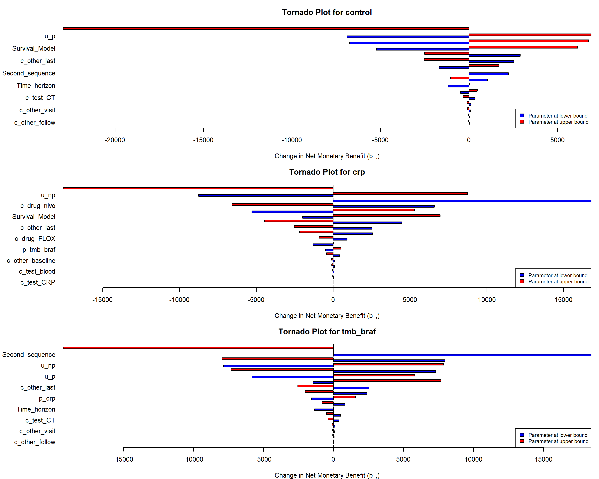
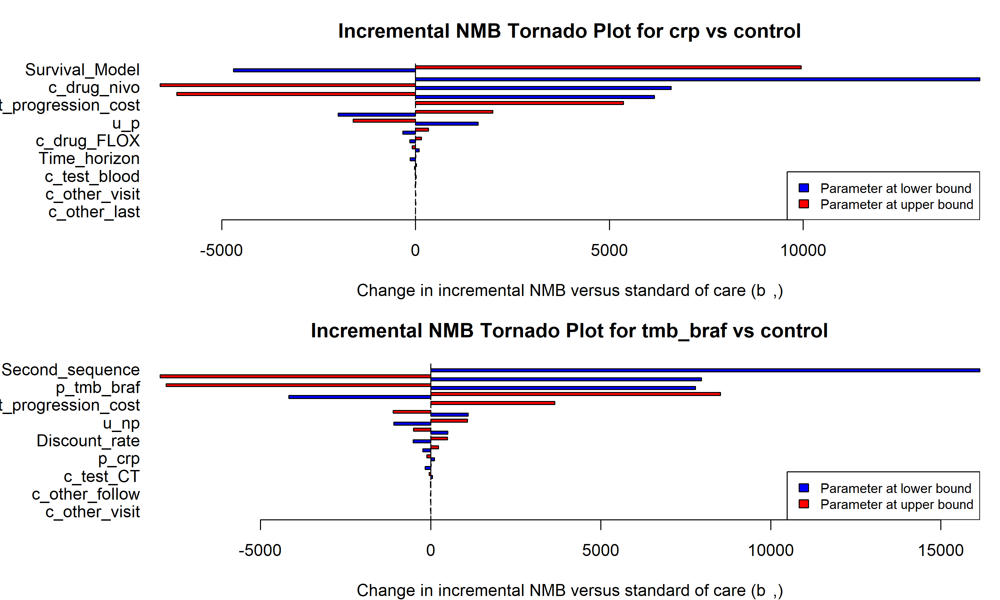

# One-Way Sensitivity Analysis
Ben Geisler
2026-09-25

- [Overview](#overview)
- [Parameter Ranges](#parameter-ranges)
- [Base Case and Optimal Strategy](#base-case-and-optimal-strategy)
- [Tornado Plots](#tornado-plots)
- [Parameter Impact Ranking](#parameter-impact-ranking)
- [Survival Distribution
  Sensitivity](#survival-distribution-sensitivity)
- [Structural Scenarios](#structural-scenarios)
- [Interpretation](#interpretation)

# Overview

This one-way sensitivity analysis varies economic parameters by the
deterministic sensitivity-analysis range and summarizes the impact on
net monetary benefit (NMB). The analysis uses the single joint economic
model and the economic strategies returned by `get_strategies()`.

# Parameter Ranges

| Parameter        |        Low |       High |
|:-----------------|-----------:|-----------:|
| c_drug_nivo      | EUR 11,138 | EUR 16,708 |
| c_drug_FLOX      |    EUR 342 |    EUR 512 |
| c_test_CT        |    EUR 309 |    EUR 463 |
| c_test_blood     |     EUR 13 |     EUR 19 |
| c_test_CRP       |     EUR 13 |     EUR 19 |
| c_test_NGS       |  EUR 2,014 |  EUR 3,022 |
| c_other_visit    |     EUR 26 |     EUR 40 |
| c_other_baseline |    EUR 424 |    EUR 636 |
| c_other_follow   |     EUR 26 |     EUR 40 |
| c_other_last     | EUR 11,042 | EUR 16,564 |
| u_np             |      0.584 |      0.876 |
| u_p              |      0.472 |      0.708 |
| p_crp            |      0.271 |      0.406 |
| p_tmb_braf       |      0.353 |      0.529 |

One-way sensitivity-analysis parameter ranges

# Base Case and Optimal Strategy

| Strategy         |       Cost | QALYs |        NMB |
|:-----------------|-----------:|------:|-----------:|
| Standard of Care | EUR 20,967 | 1.340 | EUR 47,371 |
| CRP-guided       | EUR 53,686 | 1.377 | EUR 16,565 |
| TMB/BRAF-guided  | EUR 62,382 | 1.339 |  EUR 5,901 |

Base case at WTP = EUR 51,000

# Tornado Plots

Two tornado diagrams are shown for each guided strategy. The first ranks
parameters by how far they move the strategy’s own NMB. Parameters that
move every strategy by the same amount (the progression-free utility,
the end-of-life cost) rank highly there without affecting the choice
between strategies. The second ranks parameters by the change in
**incremental NMB versus standard of care**, which is the
decision-relevant quantity and the measure used in Figure 2 (issue
\#156).

    Creating tornado plot for strategy: control ( NMB_diff )
    Omitting 3 parameter(s) with no effect on NMB_diff for control : c_drug_nivo, c_test_CRP, c_test_NGS 

    Creating tornado plot for strategy: crp ( NMB_diff )
    Omitting 1 parameter(s) with no effect on NMB_diff for crp : c_test_NGS 

    Creating tornado plot for strategy: tmb_braf ( NMB_diff )
    Omitting 1 parameter(s) with no effect on NMB_diff for tmb_braf : c_test_CRP 

    Creating tornado plot for strategy: crp ( INMB_diff )
    Omitting 2 parameter(s) with no effect on INMB_diff for crp : c_other_baseline, c_test_NGS 

    Creating tornado plot for strategy: tmb_braf ( INMB_diff )
    Omitting 2 parameter(s) with no effect on INMB_diff for tmb_braf : c_other_baseline, c_test_CRP 

# Parameter Impact Ranking

| Strategy         | Rank | Parameter             |  NMB Range |
|:-----------------|-----:|:----------------------|-----------:|
| Standard of Care |    1 | Post_progression_cost | EUR 22,927 |
| Standard of Care |    2 | u_p                   | EUR 13,798 |
| Standard of Care |    3 | u_np                  | EUR 13,537 |
| CRP-guided       |    1 | Post_progression_cost | EUR 17,567 |
| CRP-guided       |    2 | u_np                  | EUR 17,529 |
| CRP-guided       |    3 | Second_sequence       | EUR 16,789 |
| TMB/BRAF-guided  |    1 | Post_progression_cost | EUR 19,277 |
| TMB/BRAF-guided  |    2 | Second_sequence       | EUR 18,383 |
| TMB/BRAF-guided  |    3 | c_drug_nivo           | EUR 15,920 |

Top one-way sensitivity drivers by strategy (strategy’s own NMB)

| Strategy        | Rank | Parameter       | Incremental NMB Range |
|:----------------|-----:|:----------------|----------------------:|
| CRP-guided      |    1 | Survival_Model  |            EUR 14,643 |
| CRP-guided      |    2 | Second_sequence |            EUR 14,560 |
| CRP-guided      |    3 | c_drug_nivo     |            EUR 13,187 |
| TMB/BRAF-guided |    1 | Second_sequence |            EUR 16,154 |
| TMB/BRAF-guided |    2 | c_drug_nivo     |            EUR 15,920 |
| TMB/BRAF-guided |    3 | p_tmb_braf      |            EUR 15,566 |

Top drivers of incremental NMB versus standard of care (decision
sensitivity)

# Survival Distribution Sensitivity

|  | Strategy | Base NMB (selected pair) | Lowest NMB | Highest NMB | Range |
|:---|:---|---:|---:|---:|---:|
| control.Survival_Model | Standard of Care | EUR 47,371 (gamma) | EUR 42,144 (lognormal) | EUR 53,512 (exponential) | EUR 11,367 |
| crp.Survival_Model | CRP-guided | EUR 16,565 (gamma) | EUR 14,580 (gompertz) | EUR 23,536 (exponential) | EUR 8,956 |
| tmb_braf.Survival_Model | TMB/BRAF-guided | EUR 5,901 (gamma) | EUR 4,439 (gompertz) | EUR 13,576 (exponential) | EUR 9,138 |

Structural sensitivity to the parametric survival family (7 of 9
candidate families evaluated; same family for OS and PFS)

|  | Family | Base case | Status | Reason not evaluated |
|:---|:---|:--:|:---|:---|
| 6 | gamma | Yes | Evaluated |  |
| 1 | exponential |  | Evaluated |  |
| 7 | gompertz |  | Evaluated |  |
| 4 | llogis |  | Evaluated |  |
| 5 | lognormal |  | Evaluated |  |
| 2 | weibull |  | Evaluated |  |
| 3 | weibullph |  | Evaluated |  |
| 9 | genf |  | Not evaluated | OS \< PFS at 1592 curve-time points across the control and biomarker subgroup curves (521 weekly time points per curve); ordering constraint |
| 8 | gengamma |  | Not evaluated | OS \< PFS at 1614 curve-time points across the control and biomarker subgroup curves (521 weekly time points per curve); ordering constraint |

Candidate survival families in the structural sensitivity analysis

Families whose OS and PFS pair violates the OS \>= PFS ordering at some
modeled time point are not run through the model, because the
deterministic model stops on an ordering violation; they are listed
above with the number of violating curve-time points so the table is
complete. The base-case row is the ordering-constrained pair selected in
the survival analysis, which is the base case by construction. \`\`\`

# Structural Scenarios

The discount rate (applied to costs and QALYs together), the model time
horizon, the post-progression treatment cost and the second treatment
sequence are not sampled in the PSA. They are varied here as
deterministic structural scenarios (issues \#153 and \#154); these are
the ranges reported for those parameters in the input-parameter table. A
different time horizon re-predicts the base-case survival curves on the
new weekly grid from the selected joint models and rebuilds the
treatment and monitoring schedules with the same rules as the base case.

Two of the scenarios test scope assumptions rather than parameter
values. The base case applies **no post-progression treatment cost**:
second-line systemic therapy, imaging and visits after progression are
outside the modeled scope, so the progressed state accrues only the
quarterly follow-up contact and the end-of-life cost. Because the
strategies differ in time spent progressed, this omission is
differential, and the scenario charges EUR 5,000 per quarter in the
progressed state as an illustrative upper bound. The base case also
gives a **second treatment sequence at weeks 24–38** to every patient
still progression-free at that point, whereas METIMMOX re-treated on
progression during the treatment break; the scenario removes the second
sequence entirely while holding survival at the trial estimate, so it
bounds the cost side of that assumption only.

Unit drug and test costs are fixed in the PSA (issue \#154) because they
are published tariffs or assumed list prices rather than quantities a
study could resolve; their influence is quantified in the one-way
analysis above, not in the value-of-information results.

| Scenario | NMB SoC | NMB CRP-guided | NMB TMB/BRAF-guided | Optimal |
|:---|---:|---:|---:|:---|
| Base case | EUR 47,371 | EUR 16,565 | EUR 5,901 | SoC |
| Discount rate 0% | EUR 50,263 | EUR 19,126 | EUR 8,283 | SoC |
| Discount rate 8% | EUR 44,857 | EUR 14,379 | EUR 3,880 | SoC |
| Time horizon 5 years | EUR 46,194 | EUR 15,250 | EUR 4,561 | SoC |
| Time horizon 20 years | EUR 47,400 | EUR 16,602 | EUR 5,941 | SoC |
| Post-progression cost EUR 5,000 per quarter | EUR 24,444 | -EUR 1,002 | -EUR 13,376 | SoC |
| No second treatment sequence | EUR 49,600 | EUR 33,354 | EUR 24,285 | SoC |

Net monetary benefit under structural scenarios at WTP = EUR 51,000
(discount rate applies to costs and QALYs)

# Interpretation

The tornado plots and rankings show which parameters drive uncertainty
in NMB for the single economic model; the incremental tornado plots show
which of them drive the decision between a guided strategy and standard
of care. Survival distribution sensitivity is shown separately because
it reflects extrapolation uncertainty rather than a scalar model input.
The structural scenarios show how the discount rate, time horizon,
post-progression cost and second treatment sequence move the NMB of
every strategy; these parameters are fixed in the PSA, as are the unit
drug and test costs.

------------------------------------------------------------------------

**Report completed on:** 2026-09-25  
**Repository:** ben-geisler/METIMMOX-1  
**Report version:** 4.3
