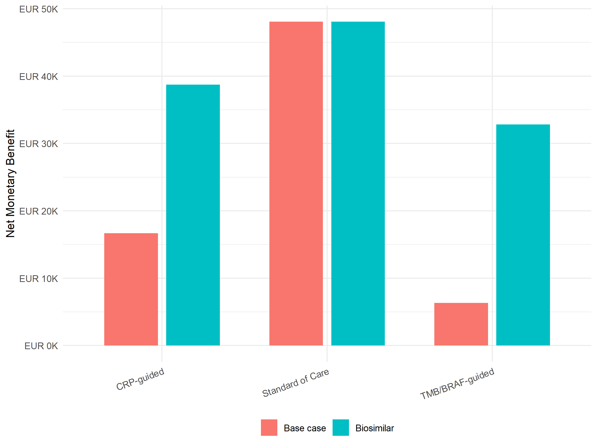

# Biosimilar Nivolumab Pricing Scenario
Ben Geisler
2026-10-02

- [Overview](#overview)
- [Pricing Scenarios](#pricing-scenarios)
- [Deterministic Results](#deterministic-results)
- [Summary](#summary)
  - [Validation warnings](#validation-warnings)

# Overview

This scenario examines whether a lower nivolumab acquisition cost
changes the cost-effectiveness of the single joint economic model. The
strategies are standard of care, CRP-guided immunotherapy, and
TMB/BRAF-guided immunotherapy.

# Pricing Scenarios

| Scenario   | Nivolumab Cost per Administration | Change |
|:-----------|----------------------------------:|-------:|
| Base case  |                        EUR 13,923 |      – |
| Biosimilar |                         EUR 4,641 | -66.7% |

Nivolumab pricing scenarios

# Deterministic Results

| Scenario   | Strategy         |       Cost | QALYs |
|:-----------|:-----------------|-----------:|------:|
| Base case  | Standard of Care | EUR 25,764 | 1.340 |
| Base case  | CRP-guided       | EUR 58,203 | 1.377 |
| Base case  | TMB/BRAF-guided  | EUR 66,916 | 1.339 |
| Biosimilar | Standard of Care | EUR 25,764 | 1.340 |
| Biosimilar | CRP-guided       | EUR 36,225 | 1.377 |
| Biosimilar | TMB/BRAF-guided  | EUR 40,383 | 1.339 |

Base case and biosimilar deterministic results: discounted cost and
QALYs per patient

| Scenario | Strategy | Incr. cost | Incr. QALYs | ICER | Pairwise status | Frontier |
|:---|:---|---:|---:|---:|:---|:---|
| Base case | Standard of Care | – | – | – | Reference | On frontier |
| Base case | CRP-guided | EUR 32,439 | 0.038 | EUR 864,492 | Pairwise ICER vs SoC | On frontier |
| Base case | TMB/BRAF-guided | EUR 41,152 | -0.001 | Dominated | Dominated by SoC | Dominated |
| Biosimilar | Standard of Care | – | – | – | Reference | On frontier |
| Biosimilar | CRP-guided | EUR 10,461 | 0.038 | EUR 278,778 | Pairwise ICER vs SoC | On frontier |
| Biosimilar | TMB/BRAF-guided | EUR 14,619 | -0.001 | Dominated | Dominated by SoC | Dominated |

Incremental results versus standard of care (pairwise convention) with
the efficiency-frontier status

*Note:* Incremental cost, incremental QALYs and ICER compare each guided
strategy with standard of care (pairwise convention). ‘Frontier’ is the
dampack efficiency-frontier status across all three strategies; a
strategy can be dominated on the frontier (more costly and less
effective than another guided strategy) while still having a finite
pairwise ICER versus standard of care. Percentage changes between
pairwise ICERs of frontier-dominated strategies are not reported.

# Summary

The biosimilar scenario is evaluated with the same single joint economic
survival model as the base case. Only the nivolumab administration cost
is changed; strategy definitions, biomarker prevalences, utilities, and
survival curves are unchanged.

------------------------------------------------------------------------

**Report completed on:** 2026-10-02  
**Repository:** ben-geisler/METIMMOX-1  
**Report version:** 4.1

## Validation warnings

No warnings recorded during rendering.
