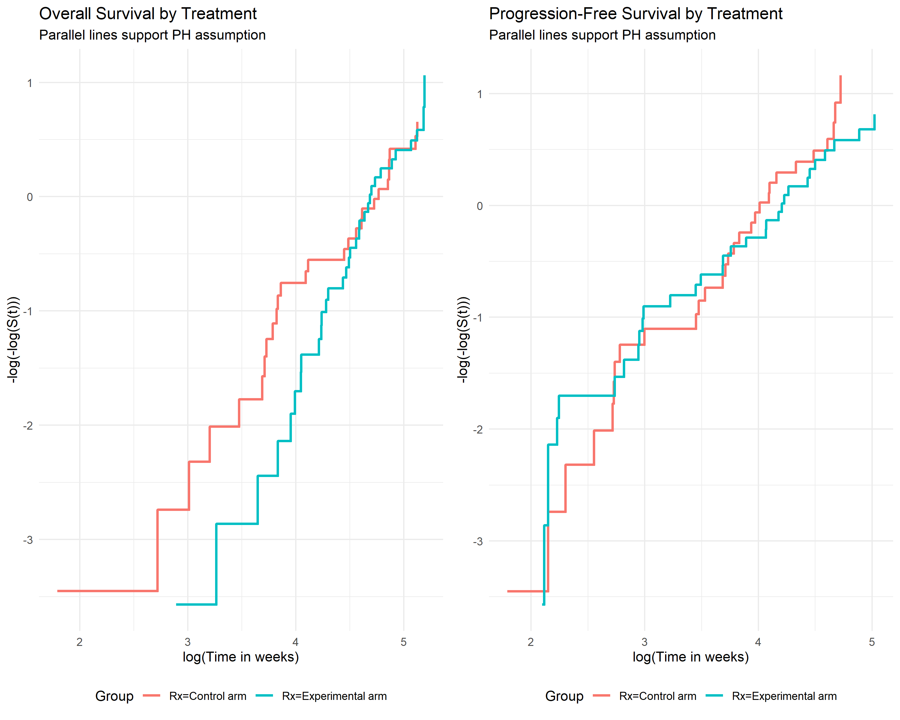
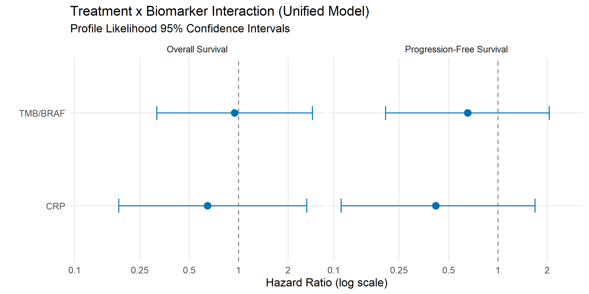
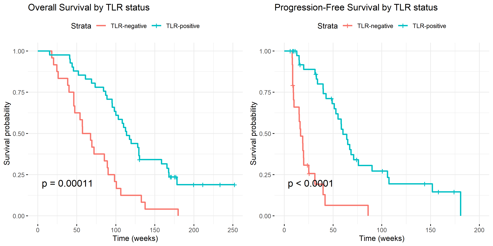

# Clinical Effectiveness
Ben Geisler
2026-09-28

- [Overview](#overview)
- [Methodological Notes](#methodological-notes)
  - [Software Packages](#software-packages)
  - [Firth-Corrected Cox Regression](#firth-corrected-cox-regression)
  - [Ridge Regression Sensitivity
    Analysis](#ridge-regression-sensitivity-analysis)
- [Data Preparation](#data-preparation)
  - [Sample Characteristics](#sample-characteristics)
  - [Biomarker Correlations](#biomarker-correlations)
- [Proportional Hazards Assumption](#proportional-hazards-assumption)
  - [Schoenfeld Residual Tests](#schoenfeld-residual-tests)
  - [Log-Log Survival Plots](#log-log-survival-plots)
- [Primary Analysis: Firth-Corrected Cox
  Models](#primary-analysis-firth-corrected-cox-models)
  - [Standard Cox vs Firth](#standard-cox-vs-firth)
  - [Unified Model Results](#unified-model-results)
    - [Overall Survival](#overall-survival)
    - [Progression-Free Survival](#progression-free-survival)
  - [Forest Plot](#forest-plot)
- [Sensitivity Analysis: Ridge
  Regression](#sensitivity-analysis-ridge-regression)
  - [PFS Endpoint Sensitivity: Death-Censoring
    Rule](#pfs-endpoint-sensitivity-death-censoring-rule)
- [Exploratory: TLR as a Predictive Biomarker (Responder
  Analysis)](#exploratory-tlr-as-a-predictive-biomarker-responder-analysis)
  - [Descriptive Context](#descriptive-context)
    - [TLR Prevalence by Treatment
      Arm](#tlr-prevalence-by-treatment-arm)
    - [Kaplan-Meier Curves Stratified by
      TLR](#kaplan-meier-curves-stratified-by-tlr)
  - [Standard Cox vs Firth](#standard-cox-vs-firth-1)
  - [Firth-Corrected Cox Model](#firth-corrected-cox-model)
    - [Overall Survival](#overall-survival-1)
    - [Progression-Free Survival](#progression-free-survival-1)
  - [Ridge Sensitivity Analysis (TLR Terms
    Penalized)](#ridge-sensitivity-analysis-tlr-terms-penalized)
- [Landmark Analysis: TLR at Week 9](#landmark-analysis-tlr-at-week-9)
  - [Landmark Cohort and Attrition](#landmark-cohort-and-attrition)
  - [Descriptive Context (Landmark
    Cohort)](#descriptive-context-landmark-cohort)
    - [Characteristics of the Week-9 Landmark Cohorts by TLR
      Status](#characteristics-of-the-week-9-landmark-cohorts-by-tlr-status)
    - [TLR Prevalence by Treatment Arm at Week
      9](#tlr-prevalence-by-treatment-arm-at-week-9)
    - [Landmark Kaplan-Meier Curves Stratified by
      TLR](#landmark-kaplan-meier-curves-stratified-by-tlr)
  - [Standard Cox vs Firth (Landmark)](#standard-cox-vs-firth-landmark)
  - [Firth-Corrected Cox Model
    (Landmark)](#firth-corrected-cox-model-landmark)
    - [Overall Survival](#overall-survival-2)
    - [Progression-Free Survival](#progression-free-survival-2)
  - [Ridge Sensitivity Analysis (Landmark, TLR Terms
    Penalized)](#ridge-sensitivity-analysis-landmark-tlr-terms-penalized)
    - [Landmark Sensitivity: Scan-Date and Week-12
      Landmarks](#landmark-sensitivity-scan-date-and-week-12-landmarks)
- [Firth Model Convergence](#firth-model-convergence)
- [Discussion](#discussion)
  - [Primary interaction results](#primary-interaction-results)
  - [Proportional hazards](#proportional-hazards)
  - [Ridge regression sensitivity](#ridge-regression-sensitivity)
  - [TLR responder analysis
    (exploratory)](#tlr-responder-analysis-exploratory)
  - [TLR landmark analysis
    (exploratory)](#tlr-landmark-analysis-exploratory)
- [Summary](#summary)

PFS counts recorded progression and deaths within 16 weeks (inclusive)
of the last assessment, using TTPwk as the assessment-time proxy. In the
primary cohort, 13 deaths without recorded progression are censored at
that assessment and 1 count as PFS death events.

# Overview

This report presents clinical effectiveness results from the METIMMOX-1
trial, evaluating biomarker-guided treatment strategies for selecting
immunotherapy candidates in metastatic MSS/pMMR colorectal cancer.

The analysis uses **Firth-corrected Cox proportional hazards
regression** with profile likelihood confidence intervals to assess
treatment effect heterogeneity across two biomarkers that are available
before the decision to add immunotherapy, identified by the causal DAG
analysis:

- **CRP** (C-reactive protein): Low CRP (\<5 mg/L) at week 4 (cycle 3
  day 1), measured after the two FLOX cycles that both arms receive and
  before the first nivolumab dose — a prognostic and potentially
  predictive marker
- **TMB/BRAF**: High tumor mutational burden (≥9 mut/MB) or BRAF
  mutation — a baseline genomic marker

**CRP timing.** CRP is not a baseline (pre-randomization) measurement:
the value used throughout is the week-4 CRP at the start of nivolumab,
matching the post-hoc CRP analysis of the trial paper. Because nivolumab
has not yet been given at week 4 and both arms receive identical FLOX
until then, the DAG carries no `T -> CRP` edge. Two consequences follow.
First, week-4 CRP-positivity differs by arm (experimental 17/36, control
7/35; Fisher p = 0.023) whereas baseline CRP was balanced (8/38 vs 7/35;
p = 1; `CRP0cat` in `01_data_prep.R`, which is not part of the analysis
data); this is treated as chance imbalance on a week-4 measurement in a
small trial, not as a failure of randomization, and is what the `CRP:Rx`
interaction is estimated against. Second, the 3 patients with no week-4
CRP (1 control-arm and 2 experimental-arm patients) are excluded from
the complete-case data: 1 died before week 4 and 2 were alive at week 4
without a week-4 value (deaths at weeks 2.4, 15.7, 20.9). The exclusion
is therefore not the same as conditioning on survival to week 4; the
technical report `crp_week4_estimand.qmd` restores these patients under
alternative CRP assignments. The clock remains randomization; a landmark
analysis at week 4 would drop no further patients from the complete-case
cohort.

**Model specification is motivated by the causal DAG** (see `dag.qmd`
and `dag_associations.qmd`). The DAG encodes treatment (T) as randomized
with no parents, so no confounding adjustment is needed for causal
identification; Age and Sex are included as precision covariates. Target
lesion reduction (TLR) is positive when the sum of target-lesion
diameters at the first on-treatment CT is at least 10% below its
baseline value. TLR is encoded as a post-randomization intermediate
variable (T → TLR → PFS): it is not a pre-treatment baseline
characteristic and conditioning on it as a covariate would block part of
the treatment effect pathway. TLR is therefore excluded from the primary
survival models and examined separately as a descriptive endpoint.

The **unified DAG-informed model** is:

$$\text{Surv}(\text{time}, \text{event}) \sim \text{Age} + \text{sex} + \text{Rx} + \text{CRP} + \text{TMB/BRAF} + \text{CRP} \times \text{Rx} + \text{TMB/BRAF} \times \text{Rx}$$

Ridge regression (L2-penalized Cox), which shrinks the biomarker main
effects and their treatment interactions together, is applied as a
sensitivity analysis to assess how far the interaction estimates move
under shrinkage. TLR is reported in a separate exploratory section.

# Methodological Notes

## Software Packages

This analysis uses the following R packages:

- `coxphf` version 1.13.4: Firth-corrected Cox regression with profile
  likelihood CIs
- `survival` version 3.7.0: Cox regression and Schoenfeld residual
  diagnostics
- `glmnet` version 4.1.8: Ridge regression sensitivity analysis
- `vcd` version 1.4.13: Cramér’s V for biomarker correlation assessment

## Firth-Corrected Cox Regression

We use Firth’s penalized maximum likelihood method for Cox regression,
which addresses:

1.  **Monotone likelihood**: When a covariate perfectly separates events
    from non-events
2.  **Small sample bias**: Reduces bias in coefficient estimates with
    sparse data
3.  **Unstable confidence intervals**: Profile likelihood CIs are more
    reliable than Wald-based CIs in small samples

Statistical inference is based on **penalized likelihood ratio tests
(PLRT)**, which are more appropriate than Wald tests for testing
treatment-biomarker interactions in this setting.

Firth’s penalty reduces the small-sample bias of the maximum-likelihood
estimate; it does not make the estimate unbiased. Every Firth fit is run
with an iteration limit of 500 (`coxphf`, step size 0.1), and the
section “Firth Model Convergence” reports, for each fit, the estimation
iterations, the largest number of profile-likelihood iterations for a
confidence limit or PLRT, and whether the fit reached the limit.

## Ridge Regression Sensitivity Analysis

We use ridge regression as a sensitivity analysis for the interaction
estimates. Ridge regression (also called L2-penalized regression or
Tikhonov regularization) is a penalized regression method; in survival
analysis it is a penalized Cox model.

**How ridge regression works:**

- Ridge adds a penalty on the sum of the squared (standardized)
  coefficients of the penalized terms, pulling those coefficients toward
  zero (HR toward 1.0). Terms with a penalty factor of zero are
  estimated without shrinkage.
- Unlike LASSO (alpha = 1), which sets some coefficients exactly to zero
  and performs variable selection, ridge (alpha = 0) shrinks the
  penalized coefficients but keeps every term in the model.
- The penalty is shrinkage of a block of coefficients, not of each
  coefficient separately. When two penalized terms are correlated, as a
  biomarker’s main effect and its treatment interaction are, shrinking
  the block can move one of them away from 1 while the other moves
  toward it.
- The degree of shrinkage is controlled by the tuning parameter lambda,
  selected by **cross-validation (CV)**: the data are split into folds,
  each fold is predicted from a model fitted to the others, and the
  lambda with the best out-of-fold performance is chosen. Here this is
  `glmnet::cv.glmnet(family = "cox", alpha = 0)` with 10-fold CV of the
  partial-likelihood deviance and `lambda.min`, over an explicit grid of
  100 lambda values spaced evenly on the log scale from 0.0001 to 1000.
- **Boundary check.** A `lambda.min` at either end of the grid means CV
  preferred the largest (or smallest) penalty tried, so the selected
  penalty reflects the grid limit rather than an interior optimum. The
  report does not stop in that case: the lambda is marked as a boundary
  solution in the tables and a note under the tables says what the
  estimate then represents.
- **Fold seeds.** Fold assignment is seeded with the analysis seed (123)
  for the reported estimates. Because the fold split can change
  `lambda.min` in a sample this small, every ridge model is also
  refitted with 20 fold seeds (123 to 142), and the minimum, median and
  maximum of `lambda.min` and of the interaction HRs are reported.
- **Implementation detail.** The model is fitted on an explicit design
  matrix (Age, sex, Rx, CRP, TMB/BRAF, CRP x Rx, TMB/BRAF x Rx) in which
  the product terms are constructed before fitting. This matters because
  `survival::ridge()` with a factor treatment variable and a formula
  interaction such as `crp:Rx` codes the interaction separately for each
  arm (the CRP slope within the control arm and within the experimental
  arm) rather than as the single treatment-by-biomarker contrast; the
  pre-built product term recovers the same contrast that the Firth model
  estimates.
- **Penalty design.** In the primary model the CRP and TMB/BRAF main
  effects and both interaction terms are penalized (penalty factor 1);
  Age, sex and Rx are unpenalized (penalty factor 0). The biomarker main
  effects and interactions are penalized together because penalizing one
  group alone distorts the comparison (issue \#183). When only the main
  effects were penalized (report versions up to 3.10), CV chose the
  largest or nearly the largest penalty in most fold seeds; this removed
  the CRP and TMB/BRAF main effects and let their prognostic signal move
  into the unpenalized interactions, so the “sensitivity analysis”
  compared the primary model with a model without biomarker main
  effects. When only the interactions are penalized, CV shrinks them to
  HR 1 in most fold seeds. In the exploratory TLR models the TLR main
  effect and the TLR x Rx interaction are penalized; Age, sex, Rx, CRP
  and TMB/BRAF are unpenalized. glmnet does not provide standard errors,
  so ridge results are point estimates.

**Why not LASSO or Elastic Net?**

We determined that LASSO and elastic net are **not appropriate** for
this analysis:

1.  **Correlated biomarkers**: LASSO arbitrarily selects one of
    correlated predictors while setting others to zero, which does not
    reflect the clinical question of comparing ALL biomarker strategies.

2.  **Hierarchy principle violation**: LASSO may select interaction
    terms (e.g., `crp:Rx`) while setting the main effect (`crp`) to
    zero, producing models that are difficult to interpret clinically.

3.  **Clinical objective**: Our goal is to estimate treatment effect
    heterogeneity across ALL biomarkers simultaneously, not to select a
    “winning” biomarker.

Elastic net (alpha = 0.1–0.3) represents a compromise but does not fully
address these concerns.

**Interpreting ridge results:**

Ridge regression does not replace the Firth estimates; it asks how far
each interaction moves when the biomarker terms are shrunk by the amount
that cross-validation selects. When ridge pulls an interaction
substantially toward HR 1 while Firth estimates a large effect, the data
carry too little information to support the Firth magnitude, and the
effect is too unstable to use in practice. When the interaction changes
little, the estimate is stable under shrinkage, although it may still be
imprecise. The CV-selected lambda reflects how much shrinkage gives the
best out-of-sample prediction for this sample size and correlation
structure; in a sample this small the CV curve can be flat, so the
fold-seed spread is reported alongside each estimate.

# Data Preparation

## Sample Characteristics

| Characteristic | Overall | Positive | Negative | Positive | Negative | Positive | Negative |
|:---|:--:|:--:|:--:|:--:|:--:|:--:|:--:|
| Patients, n | 68 | 23 | 45 | 41 | 24 | 30 | 38 |
| Age, mean (SD) | 64.4 (10.0) | 64.5 (10.1) | 64.3 (10.0) | 65.0 (9.9) | 62.2 (10.2) | 64.9 (10.4) | 63.9 (9.7) |
| Male | 36 (52.9%) | 11 (47.8%) | 25 (55.6%) | 22 (53.7%) | 13 (54.2%) | 15 (50.0%) | 21 (55.3%) |
| Female | 32 (47.1%) | 12 (52.2%) | 20 (44.4%) | 19 (46.3%) | 11 (45.8%) | 15 (50.0%) | 17 (44.7%) |
| Control (FLOX alone) | 32 (47.1%) | 6 (26.1%) | 26 (57.8%) | 22 (53.7%) | 7 (29.2%) | 14 (46.7%) | 18 (47.4%) |
| Experimental (FLOX/nivolumab) | 36 (52.9%) | 17 (73.9%) | 19 (42.2%) | 19 (46.3%) | 17 (70.8%) | 16 (53.3%) | 20 (52.6%) |
| Deaths (OS events) | 59 (86.8%) | 17 (73.9%) | 42 (93.3%) | 32 (78.0%) | 24 (100.0%) | 23 (76.7%) | 36 (94.7%) |
| PFS events (progression or death) | 50 (73.5%) | 15 (65.2%) | 35 (77.8%) | 28 (68.3%) | 21 (87.5%) | 19 (63.3%) | 31 (81.6%) |
| CRP-positive (low CRP) | 23 (33.8%) | 23 (100.0%) | 0 (0.0%) | 18 (43.9%) | 4 (16.7%) | 11 (36.7%) | 12 (31.6%) |
| TLR-positive (early response) | 41 (63.1%) | 18 (81.8%) | 23 (53.5%) | 41 (100.0%) | 0 (0.0%) | 18 (62.1%) | 23 (63.9%) |
| TMB/BRAF-positive | 30 (44.1%) | 11 (47.8%) | 19 (42.2%) | 18 (43.9%) | 11 (45.8%) | 30 (100.0%) | 0 (0.0%) |

Sample Characteristics by Biomarker Status

*Note:* Percentages within each column use the column subgroup as
denominator. CRP/TLR/TMB-BRAF rows in the corresponding subgroup column
equal 100% by definition. Overall, CRP and TMB/BRAF columns are the
primary complete-case cohort (n = 68); the TLR columns and the
TLR-positive row use the 65 patients with a first on-treatment CT scan.
The 3 patients without a TLR value (all in the control arm) left the
study before the first on-treatment CT (1 death after progression, 1
adverse event, 1 with no recorded reason). Sex: level 0 of the trial
variable is female.

## Biomarker Correlations

| Biomarker Pair  | Cramer’s V | Interpretation |
|:----------------|-----------:|:---------------|
| CRP vs TLR      |      0.278 | Weak           |
| CRP vs TMB/BRAF |      0.053 | Negligible     |
| TLR vs TMB/BRAF |      0.019 | Negligible     |

Biomarker Correlations (Cramer’s V)

**Note:** Cramér’s V interpretation: \<0.1 = Negligible, 0.1–0.3 = Weak,
\>0.3 = Moderate/Strong. The observed correlations are weak to
negligible. While modest, any correlation among candidate biomarkers
supports our decision not to use LASSO, which would arbitrarily select
among correlated predictors.



# Proportional Hazards Assumption

## Schoenfeld Residual Tests

The proportional hazards assumption was tested using scaled Schoenfeld
residuals. A significant p-value indicates potential violation of the PH
assumption for that covariate.

| Covariate     | Chi-square (OS) | p-value | Chi-square (PFS) | p-value |
|:--------------|----------------:|:--------|-----------------:|:--------|
| Age           |            0.68 | 0.411   |             0.05 | 0.816   |
| Sex           |            0.12 | 0.729   |             0.01 | 0.928   |
| Rx            |            4.83 | 0.028   |             0.03 | 0.856   |
| CRP           |            0.38 | 0.536   |             2.14 | 0.144   |
| TMB/BRAF      |            0.94 | 0.332   |             3.67 | 0.056   |
| CRP x Rx      |            3.08 | 0.079   |             1.53 | 0.216   |
| TMB/BRAF x Rx |            0.97 | 0.324   |             3.32 | 0.068   |
| GLOBAL        |            8.98 | 0.254   |            14.28 | 0.046   |

Schoenfeld Residual Test for Proportional Hazards Assumption

**Note:** GLOBAL is the omnibus test for all covariates. Individual
covariate tests help identify specific PH violations. In OS, the
covariate-level test is below 0.05 for Rx (p = 0.028), so the OS
treatment hazard ratio is a time-averaged summary of an effect that may
change over follow-up. No covariate-level test is below 0.05 in PFS.

## Log-Log Survival Plots

**Interpretation:** Approximately parallel lines on the log-log plot
support the proportional hazards assumption. Crossing or converging
lines suggest time-varying effects.



# Primary Analysis: Firth-Corrected Cox Models

## Standard Cox vs Firth

The standard Cox model is the unpenalized maximum-likelihood reference.
Divergence between standard Cox and Firth estimates flags small-sample
or near-separation instability that Firth corrects.

| Term                         | Standard Cox HR (95% CI) | Firth HR (95% CI) |
|:-----------------------------|:-------------------------|:------------------|
| CRP x Rx                     | 0.71 (0.18-2.72)         | 0.65 (0.19-2.60)  |
| TMB/BRAF x Rx                | 0.97 (0.32-2.92)         | 0.95 (0.32-2.82)  |
| Rx (experimental vs control) | 1.51 (0.73-3.15)         | 1.53 (0.74-3.18)  |
| CRP                          | 0.57 (0.19-1.68)         | 0.63 (0.19-1.62)  |
| TMB/BRAF                     | 0.89 (0.40-1.94)         | 0.91 (0.41-1.96)  |
| Age (per year)               | 1.01 (0.98-1.04)         | 1.01 (0.98-1.04)  |
| Sex (male vs female)         | 1.44 (0.84-2.49)         | 1.44 (0.84-2.48)  |

Unified Model - Overall Survival: Standard Cox vs Firth

| Term                         | Standard Cox HR (95% CI) | Firth HR (95% CI) |
|:-----------------------------|:-------------------------|:------------------|
| CRP x Rx                     | 0.28 (0.06-1.41)         | 0.26 (0.06-1.34)  |
| TMB/BRAF x Rx                | 0.67 (0.18-2.52)         | 0.65 (0.18-2.41)  |
| Rx (experimental vs control) | 1.82 (0.79-4.17)         | 1.81 (0.81-4.19)  |
| CRP                          | 1.15 (0.31-4.27)         | 1.29 (0.32-4.04)  |
| TMB/BRAF                     | 0.67 (0.26-1.75)         | 0.70 (0.27-1.76)  |
| Age (per year)               | 0.99 (0.96-1.02)         | 0.99 (0.96-1.02)  |
| Sex (male vs female)         | 1.15 (0.63-2.12)         | 1.15 (0.63-2.12)  |

Unified Model - Progression-Free Survival: Standard Cox vs Firth

## Unified Model Results

The unified DAG-informed model includes CRP (week 4, before the first
nivolumab dose) and TMB/BRAF (baseline) as pre-immunotherapy biomarkers
with their treatment interactions, adjusted for Age and Sex.

**Formula:**
`Surv(time, event) ~ Age + sex + Rx + CRP + TMB/BRAF + CRP:Rx + TMB/BRAF:Rx`

### Overall Survival

| Term                         | HR (95% CI)      | PLRT p-value |
|:-----------------------------|:-----------------|:-------------|
| CRP x Rx                     | 0.65 (0.19-2.60) | 0.520        |
| TMB/BRAF x Rx                | 0.95 (0.32-2.82) | 0.919        |
| Age (per year)               | 1.01 (0.98-1.04) | 0.691        |
| Sex (male vs female)         | 1.44 (0.84-2.48) | 0.187        |
| Rx (experimental vs control) | 1.53 (0.74-3.18) | 0.250        |
| CRP-positive                 | 0.63 (0.19-1.62) | 0.355        |
| TMB/BRAF-positive            | 0.91 (0.41-1.96) | 0.815        |

Unified Model: Overall Survival - Full Coefficient Table

### Progression-Free Survival

| Term                         | HR (95% CI)      | PLRT p-value |
|:-----------------------------|:-----------------|:-------------|
| CRP x Rx                     | 0.26 (0.06-1.34) | 0.102        |
| TMB/BRAF x Rx                | 0.65 (0.18-2.41) | 0.516        |
| Age (per year)               | 0.99 (0.96-1.02) | 0.611        |
| Sex (male vs female)         | 1.15 (0.63-2.12) | 0.649        |
| Rx (experimental vs control) | 1.81 (0.81-4.19) | 0.147        |
| CRP-positive                 | 1.29 (0.32-4.04) | 0.695        |
| TMB/BRAF-positive            | 0.70 (0.27-1.76) | 0.453        |

Unified Model: Progression-Free Survival - Full Coefficient Table



## Forest Plot

**Interpretation:** HR \< 1 indicates that biomarker-positive patients
derive greater benefit from experimental treatment (reduced hazard of
death/progression). The dashed line at HR = 1 represents no differential
treatment effect.



# Sensitivity Analysis: Ridge Regression

Ridge regression (L2-penalized Cox, alpha = 0) shrinks the penalized
coefficients toward zero without removing any term, and shows how far
the interaction estimates move under shrinkage. The unified model terms
are entered through an explicit design matrix in which the CRP x Rx and
TMB/BRAF x Rx product terms are built before fitting, so each ridge
interaction coefficient is the single treatment-by-biomarker contrast
that the Firth model estimates (issue \#153). The CRP and TMB/BRAF main
effects and both interaction terms are penalized together; Age, sex and
Rx carry a penalty factor of zero (issue \#183). The penalty lambda is
chosen by 10-fold cross-validation of the partial-likelihood deviance
(`glmnet::cv.glmnet`, `lambda.min`) over 100 lambda values spaced evenly
on the log scale from 0.0001 to 1000, with fold assignment seeded by the
analysis seed (123). The fit is repeated for 20 fold seeds to show how
much the result depends on the fold split.

| Interaction   | Firth HR (95% CI) | Ridge HR |
|:--------------|:------------------|:---------|
| CRP x Rx      | 0.65 (0.19-2.60)  | 0.80     |
| TMB/BRAF x Rx | 0.95 (0.32-2.82)  | 0.91     |

Overall Survival: Firth vs Ridge Regression

*Note:* Ridge: glmnet Cox, alpha = 0. Penalized: CRP, TMB/BRAF, CRP x Rx
and TMB/BRAF x Rx; Age, sex and Rx unpenalized. lambda.min = 0.658 by
10-fold CV (fold seed 123). glmnet gives no standard errors.

| Interaction   | Firth HR (95% CI) | Ridge HR |
|:--------------|:------------------|:---------|
| CRP x Rx      | 0.26 (0.06-1.34)  | 0.66     |
| TMB/BRAF x Rx | 0.65 (0.18-2.41)  | 0.74     |

Progression-Free Survival: Firth vs Ridge Regression

*Note:* Ridge: glmnet Cox, alpha = 0. Penalized: CRP, TMB/BRAF, CRP x Rx
and TMB/BRAF x Rx; Age, sex and Rx unpenalized. lambda.min = 0.343 by
10-fold CV (fold seed 123). glmnet gives no standard errors.

Cross-validation selected lambda.min = 0.658 for OS and 0.343 for PFS,
both inside the grid, so neither ridge estimate is a boundary solution.

| Endpoint | Quantity         | Seed 123 (reported) |   Min | Median |   Max |
|:---------|:-----------------|--------------------:|------:|-------:|------:|
| OS       | lambda.min       |               0.658 | 0.404 |  0.658 | 0.911 |
| OS       | CRP x Rx HR      |                0.80 |  0.76 |   0.80 |  0.83 |
| OS       | TMB/BRAF x Rx HR |                0.91 |  0.91 |   0.91 |  0.92 |
| PFS      | lambda.min       |               0.343 | 0.179 |  0.343 | 0.658 |
| PFS      | CRP x Rx HR      |                0.66 |  0.59 |   0.66 |  0.74 |
| PFS      | TMB/BRAF x Rx HR |                0.74 |  0.71 |   0.74 |  0.79 |

Primary model ridge: lambda.min and interaction HRs over 20
cross-validation fold seeds

*Note:* Reported: the fit with fold seed 123, used in the tables and
text. Min, Median, Max: over 20 fold seeds (123 to 142), including the
reported one. lambda.min was at an end of the grid in 0 of 20 seeds for
OS and 0 of 20 seeds for PFS. Grid: 100 lambda values spaced evenly on
the log scale from 0.0001 to 1000.

Across the 20 fold seeds, lambda.min ranged from 0.404 to 0.911 (OS) and
from 0.179 to 0.658 (PFS). The CRP x Rx HR ranged from 0.76 to 0.83 (OS)
and 0.59 to 0.74 (PFS), and the TMB/BRAF x Rx HR from 0.91 to 0.92 (OS)
and 0.71 to 0.79 (PFS). Each interaction’s Firth-to-ridge shift gets the
same label (substantial or little; at least 1.5-fold is substantial)
under every fold seed.

**Interpretation:** Firth’s method maximizes a penalized likelihood
whose penalty reduces the small-sample bias of the maximum-likelihood
estimate; the resulting estimate is bias-reduced, not unbiased. Ridge
shrinks the CRP and TMB/BRAF main effects and both interaction terms
jointly toward HR 1, with the penalty strength chosen by
cross-validation, and leaves Age, sex and Rx unpenalized. Comparing the
two shows how much of each interaction estimate survives shrinkage: if
Firth and ridge agree closely, the estimate is stable under shrinkage
(though still imprecise); if ridge pulls the interaction substantially
toward 1, the data carry too little information to support the Firth
magnitude. Because each biomarker’s main effect and interaction are
shrunk together, a single interaction can also move away from 1. The
Discussion lists the shift of each interaction.



## PFS Endpoint Sensitivity: Death-Censoring Rule

| Rule | Window (wk) | Anchor | PFS events | Deaths censored | CRP x Rx HR (95% CI) | PLRT p | TMB/BRAF x Rx HR (95% CI) | PLRT p | KM control (wk) | KM experimental (wk) |
|:---|---:|:---|---:|---:|:---|:---|:---|:---|---:|---:|
| primary | 16 | TTPwk | 50 | 13 | 0.26 (0.06-1.34) | 0.102 | 0.65 (0.18-2.41) | 0.516 | 41.9 | 42.9 |
| all_deaths | Inf | TTPwk | 63 | 0 | 0.42 (0.11-1.68) | 0.213 | 0.66 (0.21-2.05) | 0.469 | 44.0 | 45.9 |
| anchor_alt | 16 | LastEvalwk | 50 | 13 | 0.36 (0.09-1.78) | 0.197 | 0.80 (0.22-2.91) | 0.737 | 41.9 | 42.9 |
| window8 | 8 | TTPwk | 50 | 13 | 0.26 (0.06-1.34) | 0.102 | 0.65 (0.18-2.41) | 0.516 | 41.9 | 42.9 |
| window24 | 24 | TTPwk | 51 | 12 | 0.24 (0.06-1.23) | 0.084 | 0.68 (0.19-2.47) | 0.553 | 41.9 | 42.9 |

PFS sensitivity to the death window and last-assessment proxy, on the
same complete-case cohort

*Note:* A death without recorded progression is an event if the gap from
the assessment is at most the window; otherwise censor at that
assessment. Inf reproduces the pre-181 rule, an upper bound on observed
PFS follow-up. Recorded progression times are unchanged. KM values are
median PFS by randomized arm. TTPwk is Days until progression;
LastEvalwk is Days until last evaluation. Assessment-date provenance
remains subject to data-provider reconciliation.

The primary rule gives 50 PFS events and CRP x Rx HR 0.26 (0.06-1.34);
counting all deaths gives 63 events and HR 0.42 (0.11-1.68). Using the
alternative assessment date gives HR 0.36 (0.09-1.78). These analyses
change endpoint ascertainment while holding the patient cohort and model
formula fixed.

# Exploratory: TLR as a Predictive Biomarker (Responder Analysis)

This section presents an **exploratory responder analysis** that
includes target lesion reduction (TLR) as an effect modifier in a Cox
model with the same structural form as the primary analysis. Because TLR
is measured post-randomization (at the first on-treatment CT scan), this
is not a treatment-selection analysis: TLR status is itself influenced
by treatment, and the resulting TLR x Rx interaction is informative only
as a hypothesis-generating, responder-stratified contrast. It cannot be
used to guide the decision to add immunotherapy, which is made before
TLR is observed. The primary causal-DAG-informed analysis remains the
inferential anchor for predictive biomarker claims.

The model adjusts for the pre-immunotherapy biomarkers **CRP** and
**TMB/BRAF** as prognostic main effects (their treatment interactions
belong to the primary analysis and are not re-estimated here). In the
ridge sensitivity model, CRP and TMB/BRAF remain **unpenalized**
(well-established prognostic adjustment covariates), while the **TLR
main effect and TLR x Rx interaction are penalized**. These are the
post-randomization terms whose stability we want to stress-test against
the small effective sample size and the coupling of TLR and progression,
which are read from the same first on-treatment scan.

**Formula:**
`Surv(time, event) ~ Age + sex + Rx + CRP + TMB/BRAF + TLR + TLR:Rx`

## Descriptive Context

### TLR Prevalence by Treatment Arm

| Treatment Arm            |   N | TLR-positive |    % |
|:-------------------------|----:|-------------:|-----:|
| Control (FLOX)           |  29 |           22 | 75.9 |
| Experimental (FLOX/nivo) |  36 |           19 | 52.8 |

TLR Prevalence by Treatment Arm (Descriptive)

*Note:* TLR = target lesion reduction at the first on-treatment CT
(post-treatment; definition in the Overview).

### Kaplan-Meier Curves Stratified by TLR

**Note:** These curves are purely descriptive and stratify by a
post-treatment response variable. The observed difference in survival by
TLR status reflects treatment response, not a pre-treatment patient
characteristic.



## Standard Cox vs Firth

The standard Cox model is the unpenalized maximum-likelihood reference.
Divergence between standard Cox and Firth estimates flags small-sample
or near-separation instability that Firth corrects.

| Term                         | Standard Cox HR (95% CI) | Firth HR (95% CI) |
|:-----------------------------|:-------------------------|:------------------|
| TLR x Rx                     | 2.43 (0.74-7.95)         | 2.47 (0.75-7.75)  |
| TLR (main effect)            | 0.21 (0.08-0.54)         | 0.21 (0.08-0.55)  |
| Rx (experimental vs control) | 0.60 (0.23-1.55)         | 0.59 (0.24-1.55)  |
| CRP                          | 0.52 (0.25-1.06)         | 0.53 (0.25-1.05)  |
| TMB/BRAF                     | 0.86 (0.48-1.52)         | 0.86 (0.48-1.52)  |
| Age (per year)               | 1.01 (0.98-1.04)         | 1.01 (0.98-1.04)  |
| Sex (male vs female)         | 1.48 (0.81-2.68)         | 1.47 (0.82-2.67)  |

TLR Responder Model - Overall Survival: Standard Cox vs Firth

| Term                         | Standard Cox HR (95% CI) | Firth HR (95% CI) |
|:-----------------------------|:-------------------------|:------------------|
| TLR x Rx                     | 0.71 (0.19-2.65)         | 0.73 (0.20-2.56)  |
| TLR (main effect)            | 0.18 (0.06-0.54)         | 0.19 (0.07-0.56)  |
| Rx (experimental vs control) | 1.31 (0.43-3.94)         | 1.26 (0.45-3.91)  |
| CRP                          | 0.42 (0.18-0.98)         | 0.44 (0.19-0.97)  |
| TMB/BRAF                     | 0.46 (0.23-0.94)         | 0.48 (0.23-0.94)  |
| Age (per year)               | 1.00 (0.97-1.03)         | 1.00 (0.97-1.03)  |
| Sex (male vs female)         | 1.10 (0.55-2.18)         | 1.10 (0.56-2.17)  |

TLR Responder Model - Progression-Free Survival: Standard Cox vs Firth

## Firth-Corrected Cox Model

### Overall Survival

| Term                         | HR (95% CI)      | PLRT p-value |
|:-----------------------------|:-----------------|:-------------|
| TLR x Rx                     | 2.47 (0.75-7.75) | 0.135        |
| Age (per year)               | 1.01 (0.98-1.04) | 0.626        |
| Sex (male vs female)         | 1.47 (0.82-2.67) | 0.201        |
| Rx (experimental vs control) | 0.59 (0.24-1.55) | 0.270        |
| CRP-positive                 | 0.53 (0.25-1.05) | 0.071        |
| TMB/BRAF-positive            | 0.86 (0.48-1.52) | 0.609        |
| TLR-positive                 | 0.21 (0.08-0.55) | 0.002        |

TLR Responder Model: Overall Survival - Full Coefficient Table

### Progression-Free Survival

| Term                         | HR (95% CI)      | PLRT p-value |
|:-----------------------------|:-----------------|:-------------|
| TLR x Rx                     | 0.73 (0.20-2.56) | 0.630        |
| Age (per year)               | 1.00 (0.97-1.03) | 0.987        |
| Sex (male vs female)         | 1.10 (0.56-2.17) | 0.788        |
| Rx (experimental vs control) | 1.26 (0.45-3.91) | 0.664        |
| CRP-positive                 | 0.44 (0.19-0.97) | 0.043        |
| TMB/BRAF-positive            | 0.48 (0.23-0.94) | 0.033        |
| TLR-positive                 | 0.19 (0.07-0.56) | 0.004        |

TLR Responder Model: Progression-Free Survival - Full Coefficient Table



## Ridge Sensitivity Analysis (TLR Terms Penalized)

Ridge regression is applied here with a targeted penalty: only the TLR
main effect and the TLR x Rx interaction are L2-shrunk. CRP, TMB/BRAF,
Age, sex, and Rx are estimated without penalty, since they enter the
model as adjustment covariates whose effects are not the inferential
target. The fit uses the same glmnet approach as the primary ridge
model: an explicit design matrix with a pre-built TLR x Rx product term,
lambda chosen by 10-fold cross-validation over the same grid with the
analysis seed, the same boundary check, and the same 20 fold seeds for
the spread. Report versions up to 3.10 used `survival::ridge()` with a
fixed penalty (theta = 1) that was not cross-validated.

| Term                         | Firth HR (95% CI) | Ridge HR |
|:-----------------------------|:------------------|:---------|
| TLR x Rx                     | 2.47 (0.75-7.75)  | 1.13     |
| TLR (main effect)            | 0.21 (0.08-0.55)  | 0.44     |
| Age (per year)               | 1.01 (0.98-1.04)  | 1.01     |
| Sex (male vs female)         | 1.47 (0.82-2.67)  | 1.55     |
| Rx (experimental vs control) | 0.59 (0.24-1.55)  | 1.09     |
| CRP                          | 0.53 (0.25-1.05)  | 0.51     |
| TMB/BRAF                     | 0.86 (0.48-1.52)  | 0.88     |

TLR Responder Model - Overall Survival: Firth vs Ridge, all coefficients

*Note:* Ridge: glmnet Cox, alpha = 0. Penalized: TLR main effect and TLR
x Rx; Age, sex, Rx, CRP and TMB/BRAF unpenalized. lambda.min = 0.0572 by
10-fold CV (fold seed 123). glmnet gives no standard errors.

| Term                         | Firth HR (95% CI) | Ridge HR |
|:-----------------------------|:------------------|:---------|
| TLR x Rx                     | 0.73 (0.20-2.56)  | 0.58     |
| TLR (main effect)            | 0.19 (0.07-0.56)  | 0.38     |
| Age (per year)               | 1.00 (0.97-1.03)  | 1.00     |
| Sex (male vs female)         | 1.10 (0.56-2.17)  | 1.13     |
| Rx (experimental vs control) | 1.26 (0.45-3.91)  | 1.69     |
| CRP                          | 0.44 (0.19-0.97)  | 0.42     |
| TMB/BRAF                     | 0.48 (0.23-0.94)  | 0.50     |

TLR Responder Model - Progression-Free Survival: Firth vs Ridge, all
coefficients

*Note:* Ridge: glmnet Cox, alpha = 0. Penalized: TLR main effect and TLR
x Rx; Age, sex, Rx, CRP and TMB/BRAF unpenalized. lambda.min = 0.0792 by
10-fold CV (fold seed 123). glmnet gives no standard errors.

Cross-validation selected lambda.min = 0.0572 for OS and 0.0792 for PFS,
both inside the grid, so neither ridge estimate is a boundary solution.

| Endpoint | Quantity    | Seed 123 (reported) |    Min | Median |    Max |
|:---------|:------------|--------------------:|-------:|-------:|-------:|
| OS       | lambda.min  |              0.0572 | 0.0112 | 0.0419 |  0.343 |
| OS       | TLR x Rx HR |                1.13 |   0.92 |   1.25 |   1.80 |
| PFS      | lambda.min  |              0.0792 | 0.0486 | 0.0673 | 0.0933 |
| PFS      | TLR x Rx HR |                0.58 |   0.57 |   0.57 |   0.58 |

TLR responder ridge: lambda.min and TLR x Rx HR over 20 cross-validation
fold seeds

*Note:* Reported: the fit with fold seed 123, used in the tables and
text. Min, Median, Max: over 20 fold seeds (123 to 142), including the
reported one. lambda.min was at an end of the grid in 0 of 20 seeds for
OS and 0 of 20 seeds for PFS. Grid: 100 lambda values spaced evenly on
the log scale from 0.0001 to 1000.

**Interpretation:** The Firth HR is the penalized-likelihood estimate of
the TLR x Rx interaction; Firth’s penalty reduces its small-sample bias
but does not make it unbiased. Ridge shrinks the TLR main effect and the
TLR x Rx interaction together, with the penalty chosen by
cross-validation. In the responder model, for OS the TLR x Rx HR changes
substantially and moves toward 1 (Firth 2.47, ridge 1.13; 0.92 to 1.80
over the 20 fold seeds, a range that includes 1), and whether the shift
counts as substantial depends on the fold seed; for PFS the TLR x Rx HR
changes little and moves away from 1 (Firth 0.73, ridge 0.58; 0.57 to
0.58 over the 20 fold seeds). The reported ridge OS estimate stays above
1, but not under every fold seed, so the direction of the OS interaction
is not robust to shrinkage. The ridge PFS estimate stays below 1 under
every fold seed, so shrinkage changes its size but not its direction.
Because the two TLR terms are correlated and shrunk jointly, the
interaction need not move toward 1: when the penalty shrinks the TLR
main effect (the TLR contrast in the control arm) more than the TLR
contrast in the experimental arm, the interaction moves away from 1. An
interaction that changes substantially under ridge, or whose ridge
estimate depends on the fold seed, is not pinned down by these data, and
its magnitude should not be interpreted. Findings here are exploratory
and should not be used for treatment selection, since TLR is not
measurable before nivolumab starts. They may motivate landmark or formal
causal-mediation analyses in future work.



# Landmark Analysis: TLR at Week 9

The responder analysis above treats TLR status as if it were known at
baseline. It is not: TLR is measured at the first on-treatment CT scan,
so a patient can only be classified TLR-positive or TLR-negative once
alive at that scan. Remaining progression-free is not required: a
patient whose progression is recorded at the scan is classified
TLR-negative. Conditioning survival on a post-baseline response
therefore induces **guarantee-time (immortal-time) bias** —
TLR-classified patients are, by construction, a more favourable risk set
than the full randomized population.

A **landmark analysis** addresses this bias by (i) fixing a landmark
time, (ii) restricting each endpoint to the patients still at risk for
it at the landmark, and (iii) measuring time **from the landmark
onward**. The at-risk conditions differ by endpoint: the **OS** cohort
requires only that the patient is alive and uncensored at the landmark,
whereas the **PFS** cohort also requires that no progression and no
PFS-counted death has occurred and that the patient was not censored at
an earlier assessment. The primary landmark is **week 9**, the protocol
time of the second CT (the first on-treatment response assessment): TLR
compares this scan to the baseline CT, so a patient’s TLR status does
not exist until that scan. The actual first on-treatment scans, however,
were not all at week 9: in the trial extract they fell between weeks 6.7
and 12.1 after inclusion (median 8.6). A fixed week-9 landmark therefore
does not guarantee that every retained patient had reached the scan, and
it does not remove every patient whose progression was recorded at the
first scan, so it reduces the bias rather than removing it. Both
departures are counted below, and two sensitivity landmarks are reported
(issue \#155): a **per-patient landmark at each patient’s own first-scan
date**, which by construction retains no patient whose TLR is read after
the landmark and, for PFS, no first-scan progressor, and a **fixed
week-12 landmark**, which excludes every first-scan progressor but still
retains 1 patient whose TLR was read after week 12, because the latest
first scan was at week 12.1. This section **complements** the responder
analysis above (which is retained for comparison); it does not replace
it.

The base cohort and the three landmark definitions live in
`R/tlr_landmark.R` and are shared with Figure 1 of the clinical
effectiveness paper and the DAG association tests (issue \#184). All
three start from the same 65 TLR-classified patients of the 68-patient
complete-case cohort (`tlr_landmark_base_cohort()`) and apply the same
rule: a patient enters an endpoint-specific cohort only if the endpoint
time is strictly after the landmark. They therefore analyse the same
landmark cohorts. Because the small trial loses patients with events or
censoring before the landmark, the cohort sizes and event counts are
reported explicitly, and all model fits are wrapped so a too-small
cohort degrades gracefully rather than aborting the render.

## Landmark Cohort and Attrition

| Endpoint | TLR-complete N | At risk after week 9 | Excluded by week 9 | Events after week 9 |
|:---|---:|---:|---:|---:|
| Overall survival | 65 | 65 | 0 | 56 |
| Progression-free survival | 65 | 56 | 9 | 44 |

Week-9 landmark cohort: attrition and remaining events

*Note:* OS cohort: patients alive and uncensored after week 9. PFS
cohort: patients who, by week 9, also had no recorded progression, no
PFS-counted death and no censoring at an earlier assessment. Time is
measured from week 9 onward.

## Descriptive Context (Landmark Cohort)

### Characteristics of the Week-9 Landmark Cohorts by TLR Status

The two tables below describe the patients who enter the landmark
analysis, overall and split by the TLR status that becomes defined at
the week-9 scan. The at-risk set is endpoint-specific: the
**overall-survival** cohort keeps everyone alive and uncensored at week
9, whereas the **progression-free-survival** cohort additionally drops
patients who had progressed, died within the death window, or been
censored by week 9. The PFS cohort is therefore smaller. Reporting both
fixes the denominators for the OS and PFS models that follow and makes
the composition of the two TLR groups directly comparable.

#### Overall-survival at-risk set (OSwk \> 9)

| Characteristic                    | At-risk cohort | TLR-positive | TLR-negative |
|:----------------------------------|---------------:|-------------:|-------------:|
| n                                 |             65 |           41 |           24 |
| Age, years, mean (SD)             |    64.0 (10.0) |   65.0 (9.9) |  62.2 (10.2) |
| Female sex                        |     30 (46.2%) |   19 (46.3%) |   11 (45.8%) |
| Control arm (FLOX)                |     29 (44.6%) |   22 (53.7%) |    7 (29.2%) |
| Experimental arm (FLOX/nivolumab) |     36 (55.4%) |   19 (46.3%) |   17 (70.8%) |
| Deaths (OS events)                |     56 (86.2%) |   32 (78.0%) |  24 (100.0%) |
| PFS events (progression or death) |     49 (75.4%) |   28 (68.3%) |   21 (87.5%) |
| CRP-positive                      |     22 (33.8%) |   18 (43.9%) |    4 (16.7%) |
| TMB/BRAF-positive                 |     29 (44.6%) |   18 (43.9%) |   11 (45.8%) |

Characteristics of the week-9 OS landmark cohort (alive at week 9), by
TLR status

Because no patient of the TLR-complete cohort dies or is censored by
week 9, the OS at-risk set coincides with that cohort (n = 65). The 3
complete-case patients without a TLR value are outside this cohort: they
left the study before the first on-treatment CT (1 death after
progression, 1 adverse event, 1 with no recorded reason).

#### Progression-free-survival at-risk set (PFSwk \> 9)

| Characteristic                    | At-risk cohort | TLR-positive | TLR-negative |
|:----------------------------------|---------------:|-------------:|-------------:|
| n                                 |             56 |           38 |           18 |
| Age, years, mean (SD)             |     64.7 (9.6) |   65.6 (9.2) |  62.8 (10.5) |
| Female sex                        |     26 (46.4%) |   18 (47.4%) |    8 (44.4%) |
| Control arm (FLOX)                |     24 (42.9%) |   19 (50.0%) |    5 (27.8%) |
| Experimental arm (FLOX/nivolumab) |     32 (57.1%) |   19 (50.0%) |   13 (72.2%) |
| Deaths (OS events)                |     47 (83.9%) |   29 (76.3%) |  18 (100.0%) |
| PFS events (progression or death) |     44 (78.6%) |   28 (73.7%) |   16 (88.9%) |
| CRP-positive                      |     20 (35.7%) |   16 (42.1%) |    4 (22.2%) |
| TMB/BRAF-positive                 |     24 (42.9%) |   17 (44.7%) |    7 (38.9%) |

Characteristics of the week-9 PFS landmark cohort (alive and
progression-free at week 9), by TLR status

The PFS at-risk set drops the 9 patient(s) who had already progressed,
died, or were censored by week 9, leaving n = 56.

*Definitions:* percentages are column percentages; the “Deaths” and “PFS
events” rows count events over the whole follow-up, not only after the
landmark. CRP-positive = CRP \< 5 mg/L; TMB/BRAF-positive = TMB \>= 9
mut/Mb or BRAF mutation; TLR-positive = target lesion reduction, as
defined in the Overview.

**Note:** In both cohorts the two TLR groups are well matched on age,
sex, and TMB/BRAF status, but differ sharply on treatment arm and CRP:
the TLR-positive group is enriched for control-arm patients and for
CRP-positivity, while every TLR-negative patient died during follow-up.
These imbalances are the descriptive counterpart of the interaction
estimates below and reinforce that TLR status is realised after
randomization rather than being a baseline characteristic.

### TLR Prevalence by Treatment Arm at Week 9

| Treatment Arm            |   N | TLR-positive |    % |
|:-------------------------|----:|-------------:|-----:|
| Control (FLOX)           |  29 |           22 | 75.9 |
| Experimental (FLOX/nivo) |  36 |           19 | 52.8 |

TLR Prevalence by Treatment Arm, Week-9 Landmark Cohort (OS at-risk set)

*Note:* Restricted to patients alive and uncensored at week 9. TLR =
target lesion reduction (definition in the Overview).

### Landmark Kaplan-Meier Curves Stratified by TLR

**Note:** Follow-up time is measured from the week-9 landmark. All
patients shown were alive and uncensored (OS) or alive, progression-free
and uncensored (PFS) at the landmark. The landmark reduces, but does not
remove, the guarantee-time bias of the responder-analysis curves above:
19 patients in the OS cohort and 19 in the PFS cohort had their TLR read
after week 9, and the PFS cohort retains 3 first-scan progressors.



## Standard Cox vs Firth (Landmark)

| Term                         | Standard Cox HR (95% CI) | Firth HR (95% CI) |
|:-----------------------------|:-------------------------|:------------------|
| TLR x Rx                     | 2.43 (0.74-7.95)         | 2.47 (0.75-7.75)  |
| TLR (main effect)            | 0.21 (0.08-0.54)         | 0.21 (0.08-0.55)  |
| Rx (experimental vs control) | 0.60 (0.23-1.55)         | 0.59 (0.24-1.55)  |
| CRP                          | 0.52 (0.25-1.06)         | 0.53 (0.25-1.05)  |
| TMB/BRAF                     | 0.86 (0.48-1.52)         | 0.86 (0.48-1.52)  |
| Age (per year)               | 1.01 (0.98-1.04)         | 1.01 (0.98-1.04)  |
| Sex (male vs female)         | 1.48 (0.81-2.68)         | 1.47 (0.82-2.67)  |

Landmark (Week 9) TLR Model - Overall Survival: Standard Cox vs Firth

| Term                         | Standard Cox HR (95% CI) | Firth HR (95% CI) |
|:-----------------------------|:-------------------------|:------------------|
| TLR x Rx                     | 0.86 (0.21-3.54)         | 0.88 (0.21-3.38)  |
| TLR (main effect)            | 0.17 (0.05-0.56)         | 0.18 (0.06-0.58)  |
| Rx (experimental vs control) | 0.98 (0.28-3.42)         | 0.95 (0.29-3.40)  |
| CRP                          | 0.54 (0.23-1.26)         | 0.55 (0.23-1.24)  |
| TMB/BRAF                     | 0.34 (0.15-0.73)         | 0.35 (0.16-0.73)  |
| Age (per year)               | 1.00 (0.97-1.04)         | 1.00 (0.97-1.04)  |
| Sex (male vs female)         | 0.93 (0.44-1.97)         | 0.94 (0.45-1.97)  |

Landmark (Week 9) TLR Model - Progression-Free Survival: Standard Cox vs
Firth

## Firth-Corrected Cox Model (Landmark)

### Overall Survival

| Term                         | HR (95% CI)      | PLRT p-value |
|:-----------------------------|:-----------------|:-------------|
| TLR x Rx                     | 2.47 (0.75-7.75) | 0.135        |
| Age (per year)               | 1.01 (0.98-1.04) | 0.626        |
| Sex (male vs female)         | 1.47 (0.82-2.67) | 0.201        |
| Rx (experimental vs control) | 0.59 (0.24-1.55) | 0.270        |
| CRP-positive                 | 0.53 (0.25-1.05) | 0.071        |
| TMB/BRAF-positive            | 0.86 (0.48-1.52) | 0.609        |
| TLR-positive                 | 0.21 (0.08-0.55) | 0.002        |

Landmark TLR Model: Overall Survival - Full Coefficient Table

### Progression-Free Survival

| Term                         | HR (95% CI)      | PLRT p-value |
|:-----------------------------|:-----------------|:-------------|
| TLR x Rx                     | 0.88 (0.21-3.38) | 0.852        |
| Age (per year)               | 1.00 (0.97-1.04) | 0.807        |
| Sex (male vs female)         | 0.94 (0.45-1.97) | 0.860        |
| Rx (experimental vs control) | 0.95 (0.29-3.40) | 0.936        |
| CRP-positive                 | 0.55 (0.23-1.24) | 0.153        |
| TMB/BRAF-positive            | 0.35 (0.16-0.73) | 0.005        |
| TLR-positive                 | 0.18 (0.06-0.58) | 0.006        |

Landmark TLR Model: Progression-Free Survival - Full Coefficient Table



## Ridge Sensitivity Analysis (Landmark, TLR Terms Penalized)

Ridge regression is applied to the landmark cohorts with the same
targeted penalty, glmnet design, lambda grid, boundary check and fold
seeds as the responder analysis: only the TLR main effect and the TLR x
Rx interaction are L2-shrunk, while Age, sex, Rx, CRP, and TMB/BRAF
remain unpenalized.

| Term                         | Firth HR (95% CI) | Ridge HR |
|:-----------------------------|:------------------|:---------|
| TLR x Rx                     | 2.47 (0.75-7.75)  | 1.13     |
| TLR (main effect)            | 0.21 (0.08-0.55)  | 0.44     |
| Age (per year)               | 1.01 (0.98-1.04)  | 1.01     |
| Sex (male vs female)         | 1.47 (0.82-2.67)  | 1.55     |
| Rx (experimental vs control) | 0.59 (0.24-1.55)  | 1.09     |
| CRP                          | 0.53 (0.25-1.05)  | 0.51     |
| TMB/BRAF                     | 0.86 (0.48-1.52)  | 0.88     |

Landmark TLR Model - Overall Survival: Firth vs Ridge, all coefficients

*Note:* Week-9 landmark cohort; time from the landmark. Ridge: glmnet
Cox, alpha = 0. Penalized: TLR main effect and TLR x Rx; Age, sex, Rx,
CRP and TMB/BRAF unpenalized. lambda.min = 0.0572 by 10-fold CV (fold
seed 123). glmnet gives no standard errors.

| Term                         | Firth HR (95% CI) | Ridge HR |
|:-----------------------------|:------------------|:---------|
| TLR x Rx                     | 0.88 (0.21-3.38)  | 0.63     |
| TLR (main effect)            | 0.18 (0.06-0.58)  | 0.32     |
| Age (per year)               | 1.00 (0.97-1.04)  | 1.00     |
| Sex (male vs female)         | 0.94 (0.45-1.97)  | 0.99     |
| Rx (experimental vs control) | 0.95 (0.29-3.40)  | 1.31     |
| CRP                          | 0.55 (0.23-1.24)  | 0.53     |
| TMB/BRAF                     | 0.35 (0.16-0.73)  | 0.36     |

Landmark TLR Model - Progression-Free Survival: Firth vs Ridge, all
coefficients

*Note:* Week-9 landmark cohort; time from the landmark. Ridge: glmnet
Cox, alpha = 0. Penalized: TLR main effect and TLR x Rx; Age, sex, Rx,
CRP and TMB/BRAF unpenalized. lambda.min = 0.0486 by 10-fold CV (fold
seed 123). glmnet gives no standard errors.

Cross-validation selected lambda.min = 0.0572 for OS and 0.0486 for PFS,
both inside the grid, so neither ridge estimate is a boundary solution.

| Endpoint | Quantity    | Seed 123 (reported) |    Min | Median |   Max |
|:---------|:------------|--------------------:|-------:|-------:|------:|
| OS       | lambda.min  |              0.0572 | 0.0112 | 0.0419 | 0.343 |
| OS       | TLR x Rx HR |                1.13 |   0.92 |   1.25 |  1.80 |
| PFS      | lambda.min  |              0.0486 | 0.0413 | 0.0792 |  0.11 |
| PFS      | TLR x Rx HR |                0.63 |   0.63 |   0.64 |  0.65 |

Landmark TLR ridge: lambda.min and TLR x Rx HR over 20 cross-validation
fold seeds

*Note:* Reported: the fit with fold seed 123, used in the tables and
text. Min, Median, Max: over 20 fold seeds (123 to 142), including the
reported one. lambda.min was at an end of the grid in 0 of 20 seeds for
OS and 0 of 20 seeds for PFS. Grid: 100 lambda values spaced evenly on
the log scale from 0.0001 to 1000.

Under the week-9 landmark, for OS the TLR x Rx HR changes substantially
and moves toward 1 (Firth 2.47, ridge 1.13; 0.92 to 1.80 over the 20
fold seeds, a range that includes 1), and whether the shift counts as
substantial depends on the fold seed; for PFS the TLR x Rx HR changes
little and moves away from 1 (Firth 0.88, ridge 0.63; 0.63 to 0.65 over
the 20 fold seeds). The reported ridge OS estimate stays above 1, but
not under every fold seed, so the direction of the OS interaction is not
robust to shrinkage. The ridge PFS estimate stays below 1 under every
fold seed, so shrinkage changes its size but not its direction.

**Interpretation:** The two endpoints behave differently under the
landmark.

*Overall survival*: no patient of the TLR-complete cohort dies or is
censored by week 9, so the landmark OS cohort is the whole TLR-complete
cohort and every OS risk set is the same as in the responder analysis. A
Cox model is invariant to a common shift of the time origin when no
patient leaves the risk set, so the landmark Firth TLR x Rx HR (2.47
(0.75-7.75)) is identical to the responder estimate (2.47 (0.75-7.75)).
The identity is a consequence of the absence of deaths and censoring
before week 9 in this cohort; it is not evidence against a
guarantee-time artefact, because the 3 complete-case patients who left
the study before the first on-treatment CT are outside both analyses.

*Progression-free survival*: 9 patients are excluded, of whom 5
progressed (5 of them **TLR-negative**); 0 died progression-free within
the death window and 4 were censored at a last assessment on or before
week 9. Progression and TLR are read from the *same* first on-treatment
scan, so a patient whose tumour grows at that scan is classified both as
a progression and as TLR-negative. In total 8 patients progressed at
their first scan, all TLR-negative. The fixed week-9 cut removes only
the 5 whose scan fell before week 9 and **keeps 3** whose scan fell
after it, with landmark times of 0.3 to 1.0 weeks; it also keeps 19
patients whose TLR was read after week 9, so for them the landmark
covariate is measured after the landmark. Under the landmark the Firth
TLR main effect is essentially unchanged (HR 0.19 (0.07-0.56) responder,
0.18 (0.06-0.58) week-9 landmark), and the TLR x Rx HR moves slightly
toward 1, from 0.73 (0.20-2.56) (responder) to 0.88 (0.21-3.38) (week-9
landmark), within the responder confidence interval. Excluding these
early events therefore does not weaken the TLR-PFS association, and the
landmark results do not indicate that the responder association is
driven by the coupling of TLR-negativity and progression at the same
scan. The sensitivity landmarks below remove all 8 first-scan
progressors.

### Landmark Sensitivity: Scan-Date and Week-12 Landmarks

| Landmark | N (OS) | N (PFS) | PFS events | Censored before landmark | First-scan progressors retained | TLR read after landmark | OS TLR x Rx HR (95% CI) | PLRT p | PFS TLR x Rx HR (95% CI) | PLRT p |
|:---|---:|---:|---:|---:|---:|---:|:---|:---|:---|:---|
| Fixed week 9 (primary) | 65 | 56 | 44 | 4 | 3 | 19 | 2.47 (0.75-7.75) | 0.135 | 0.88 (0.21-3.38) | 0.852 |
| Per-patient first on-treatment CT date | 65 | 52 | 41 | 5 | 0 | 0 | 2.42 (0.73-7.58) | 0.144 | 0.75 (0.16-3.18) | 0.703 |
| Fixed week 12 | 65 | 51 | 41 | 6 | 0 | 1 | 2.47 (0.75-7.75) | 0.135 | 0.85 (0.18-3.57) | 0.829 |

TLR x Rx interaction under three landmark definitions (Firth Cox, full
adjustment set)

*Note:* Cohorts are patients with the endpoint time strictly after the
landmark; time is measured from the landmark. First on-treatment scans
fell between weeks 6.7 and 12.1 after inclusion. ‘First-scan progressors
retained’ counts patients whose progression was recorded at the first
scan (TLR-negative by construction) but who remain in the PFS cohort;
‘TLR read after landmark’ counts retained PFS patients whose first scan
came after the landmark. The per-patient landmark sets both to zero by
construction.

The per-patient scan-date landmark and the week-12 landmark both exclude
all 8 first-scan progressors (PFS cohort n = 52 and 51 versus 56 at week
9) and give a PFS TLR x Rx HR of 0.75 (0.16-3.18) (PLRT p 0.703) and
0.85 (0.18-3.57) (p 0.829), against 0.88 (0.21-3.38) (p 0.852) at week
9. The direction of the PFS estimate is therefore not an artefact of the
3 first-scan progressors that the week-9 cut retains, but the confidence
intervals are wide under every definition. The week-12 landmark still
retains 1 patient whose TLR was read after week 12. For OS, no patient
of the TLR-complete cohort dies or is censored by week 12, so the week-9
and week-12 landmarks are common shifts of the time origin and reproduce
the responder estimate exactly (TLR x Rx HR 2.47 (0.75-7.75)). The
scan-date landmark gives 2.42 (0.73-7.58): a per-patient landmark is not
a common shift of the time origin, so it changes the OS risk sets. The
OS estimate is therefore unchanged under the fixed landmarks and nearly
unchanged under the scan-date landmark.

Neither analysis resolves the most fundamental issue: TLR lies on the
causal path of treatment (Rx -\> TLR -\> outcome), so the TLR x Rx
contrast is not a baseline patient-selection estimate under any time
origin; disentangling it would require formal causal mediation, not a
landmark. All estimates remain exploratory and imprecise (week-9 PLRT p
0.135 OS, 0.852 PFS) and must not guide treatment selection.



# Firth Model Convergence

Each Firth fit reports the Newton-Raphson iterations of the
penalized-likelihood estimation and, for every coefficient, the
iterations used to find the two profile-likelihood confidence limits and
the PLRT p-value. `coxphf` sets a limit or p-value to missing when its
iteration count reaches the limit, so a fit that reaches it is flagged
below; warnings raised during a fit (numerical problems) are also
counted.

| Model | N | Events | Iterations | PL iterations | Limit | Status |
|:---|---:|---:|---:|---:|---:|:---|
| Primary model, OS | 68 | 59 | 7 | 27 | 500 | Converged |
| Primary model, PFS | 68 | 50 | 10 | 54 | 500 | Converged |
| PFS rule: all deaths, TTPwk | 68 | 63 | 8 | 74 | 500 | Converged |
| PFS rule: 16-wk window, LastEvalwk | 68 | 50 | 9 | 53 | 500 | Converged |
| PFS rule: 8-wk window, TTPwk | 68 | 50 | 10 | 54 | 500 | Converged |
| PFS rule: 24-wk window, TTPwk | 68 | 51 | 11 | 61 | 500 | Converged |
| TLR responder, OS | 65 | 56 | 12 | 145 | 500 | Converged |
| TLR responder, PFS | 65 | 49 | 13 | 69 | 500 | Converged |
| Landmark week 9, OS | 65 | 56 | 12 | 145 | 500 | Converged |
| Landmark week 9, PFS | 56 | 44 | 13 | 29 | 500 | Converged |
| Landmark scan date, OS | 65 | 56 | 12 | 157 | 500 | Converged |
| Landmark scan date, PFS | 52 | 41 | 12 | 26 | 500 | Converged |
| Landmark week 12, OS | 65 | 56 | 12 | 145 | 500 | Converged |
| Landmark week 12, PFS | 51 | 41 | 12 | 29 | 500 | Converged |
| Marginal CRP -\> PFS (DAG) | 68 | 50 | 7 | 6 | 100 | Converged |

Convergence of the Firth-corrected Cox fits

*Note:* Iterations: Newton-Raphson iterations of the
penalized-likelihood estimation. PL iterations: the largest iteration
count over all coefficients’ lower and upper profile-likelihood limits
and PLRT p-values. Limit: the iteration limit (maxit). Status is
‘Reached maxit’ when any count reaches the limit and ‘Numerical warning’
when coxphf reported a numerical problem. The primary PFS rule and the
week-9 refit of the landmark sensitivity table are the primary PFS and
week-9 landmark fits and are not repeated.

All 15 Firth fits converged: estimation took at most 13 iterations and
the profile-likelihood limits and PLRT at most 157, against a limit of
500 or 100; no fit reached the limit or raised a numerical warning.

# Discussion

## Primary interaction results

The death-censoring sensitivity gives CRP x Rx PFS HR 0.26 (0.06-1.34)
under the primary window, 0.42 (0.11-1.68) when all deaths count, and
0.36 (0.09-1.78) under the alternative last-assessment proxy;
uncertainty about off-study ascertainment therefore affects this
exploratory estimate.

Neither biomarker-treatment interaction reached conventional
significance in the unified model (Firth HR with 95% CI in parentheses).
For **overall survival**, CRP × Rx yielded HR 0.65 (0.19-2.60) (PLRT p =
0.520) and TMB/BRAF × Rx HR 0.95 (0.32-2.82) (p = 0.919) — point
estimates close to null with very wide confidence intervals. For
**progression-free survival**, the CRP × Rx interaction was
directionally favourable but imprecise (HR 0.26 (0.06-1.34), p = 0.102).
The interaction HR is the ratio of the treatment hazard ratio in
CRP-positive patients to that in CRP-negative patients (at the same
TMB/BRAF status), so an estimate below 1 means a smaller estimated
treatment hazard ratio in CRP-positive than in CRP-negative patients;
the CI spans more than an order of magnitude and includes 1. The
TMB/BRAF × Rx PFS interaction was HR 0.65 (0.18-2.41) (p = 0.516). These
results are consistent with the trial being underpowered to detect
treatment-effect heterogeneity (n = 68, 50 PFS events (progression or
death), 59 deaths): even a moderate subgroup effect (HR ~0.5) would
require far larger samples for reliable estimation.

The PFS pattern is worth noting as a hypothesis-generating finding. The
CRP direction (HR 0.26) is consistent with the DAG association test
showing CRP → PFS (marginal Firth HR 0.39, p = 0.003; see the DAG
associations report) and the biological hypothesis that low CRP
(reflecting lower systemic inflammation) identifies patients more likely
to respond to immunotherapy. However, the OS CRP interaction estimate
(HR 0.65) is closer to null, suggesting that any PFS benefit does not
clearly translate to an OS benefit in this dataset.

## Proportional hazards

The Schoenfeld global test gives p = 0.254 for OS and p = 0.046 for PFS.
In PFS, the biomarker main-effect tests give p = 0.144 for CRP and 0.056
for TMB/BRAF; the interaction tests give p = 0.216 and 0.068,
respectively. These tests do not establish that the global PFS departure
is confined to the main effects or that the interaction hazards are
constant. In OS, the covariate-level test is below 0.05 for Rx (p =
0.028), so the OS treatment hazard ratio is a time-averaged summary of
an effect that may change over follow-up. No covariate-level test is
below 0.05 in PFS. The reported Cox hazard ratios are time-averaged
summaries; time-varying effects would require further investigation in a
larger cohort.

## Ridge regression sensitivity

The ridge model shrinks the CRP and TMB/BRAF main effects and both
treatment interactions together, leaves Age, sex and Rx unpenalized, and
chooses lambda by cross-validation (OS lambda.min = 0.658, PFS
lambda.min = 0.343). The interactions are pre-built product terms, so
the ridge and Firth interaction coefficients are the same
treatment-by-biomarker contrast. For OS, the CRP × Rx estimate changes
little under shrinkage and moves toward 1 (Firth HR 0.65 → Ridge HR
0.80), and the TMB/BRAF × Rx estimate changes little and moves away from
1 (0.95 → 0.91). For PFS, the CRP × Rx estimate changes substantially
and moves toward 1 (0.26 → 0.66), and the TMB/BRAF × Rx estimate changes
little and moves toward 1 (0.65 → 0.74). A shift of at least 1.5-fold in
the HR is labelled “substantial”. Of the four interaction HRs, only CRP
x Rx (PFS) changes substantially under shrinkage. Each interaction’s
Firth-to-ridge shift gets the same label (substantial or little; at
least 1.5-fold is substantial) under every fold seed. An interaction
that ridge pulls substantially toward 1 carries too little information
in this sample to support its Firth magnitude and should not be
over-interpreted; one that changes little is stable under shrinkage but
remains imprecise, as its wide Firth confidence interval shows. Because
each biomarker’s main effect and interaction are shrunk together, a
small move away from 1 reflects the joint shrinkage of correlated terms
rather than support for a larger effect.

## TLR responder analysis (exploratory)

The exploratory responder model —
`Surv ~ Age + sex + Rx + CRP + TMB/BRAF + TLR + TLR:Rx` — estimates the
differential treatment effect between TLR-positive and TLR-negative
subgroups while adjusting for the pre-immunotherapy biomarkers as
prognostic main effects. The Firth-estimated TLR × Rx HR was 2.47
(0.75-7.75) for overall survival and 0.73 (0.20-2.56) for
progression-free survival. The OS estimate sits **above 1.0**, which
directionally implies the (TLR-positive vs TLR-negative) hazard contrast
is *worse* on the experimental arm than on the control arm — the
opposite of a “TLR-positive predicts immunotherapy benefit” pattern. PFS
is closer to null. Under ridge shrinkage of the TLR main effect and the
TLR × Rx interaction (glmnet, cross-validated lambda), for OS the TLR x
Rx HR changes substantially and moves toward 1 (Firth 2.47, ridge 1.13;
0.92 to 1.80 over the 20 fold seeds, a range that includes 1), and
whether the shift counts as substantial depends on the fold seed; for
PFS the TLR x Rx HR changes little and moves away from 1 (Firth 0.73,
ridge 0.58; 0.57 to 0.58 over the 20 fold seeds). The reported ridge OS
estimate stays above 1, but not under every fold seed, so the direction
of the OS interaction is not robust to shrinkage. The ridge PFS estimate
stays below 1 under every fold seed, so shrinkage changes its size but
not its direction. PLRT p-values (0.135 OS, 0.630 PFS) do not reach
conventional significance, consistent with the wide profile-likelihood
CIs in this small sample.

The directional pattern is consistent with the descriptive imbalance:
TLR-positive prevalence is 75.9% in the control arm and 52.8% in the
experimental arm. If TLR cleanly captured immunotherapy response one
would expect higher TLR-positivity in the experimental arm, not lower.
The observed prevalence pattern, together with the OS direction (HR
\> 1) of the TLR × Rx interaction, is more consistent with TLR acting as
a **prognostic** marker (identifying chemotherapy-responsive disease,
which is more prevalent in the control arm by chance or by timing) than
as a predictive marker for immunotherapy benefit. Possible explanations
for the imbalance include small-sample randomization imbalance, a timing
artefact (TLR measured at a fixed CT that may occur during different
treatment phases across arms), or genuine heterogeneity in the patient
mix. Because TLR is itself influenced by treatment, the TLR × Rx
interaction is a responder-stratified contrast — useful for hypothesis
generation, but not a causal predictive-biomarker estimate.

## TLR landmark analysis (exploratory)

A **week-9 landmark analysis** measures survival from the protocol time
of the second (first on-treatment) CT, close to the first on-treatment
scan at which TLR is defined, to examine the guarantee-time bias of the
responder analysis. Its at-risk conditions differ by endpoint: the OS
cohort requires only that the patient is alive and uncensored at week 9,
whereas the PFS cohort also requires no progression, no PFS-counted
death and no censoring at an earlier assessment. For **OS**, no patient
of the TLR-complete cohort dies or is censored by week 9, so the
landmark TLR x Rx HR (2.47 (0.75-7.75)) equals the responder estimate by
construction; this identity reflects the absence of early deaths and
censoring in that cohort and does not test for a guarantee-time
artefact. For **PFS**, 9 patients are excluded (including 4 censored at
their last assessment and 0 death events within the window), with 5 of
the 5 excluded progressors being TLR-negative, because progression and
TLR are ascertained at the same scan. The Firth TLR main effect is
essentially unchanged (HR 0.19 responder, 0.18 landmark) and the TLR ×
Rx HR moves slightly toward 1, from 0.73 (0.20-2.56) (responder) to 0.88
(0.21-3.38) (week-9 landmark), within the responder confidence interval.
Excluding these early events therefore does not weaken the TLR-PFS
association, and the landmark results do not indicate that the responder
association is driven by the coupling of TLR-negativity and progression
at the same scan. Because the actual first scans fell between weeks 6.7
and 12.1, the fixed week-9 cut retains 3 of the 8 first-scan progressors
and 19 patients whose TLR was read after the landmark; a per-patient
landmark at the scan date and a fixed week-12 landmark, which exclude
all first-scan progressors, give PFS TLR × Rx HRs of 0.75 (0.16-3.18)
and 0.85 (0.18-3.57), so the direction of the estimate does not depend
on the landmark choice. Under any time origin TLR remains on the causal
path of treatment, so a definitive predictive-biomarker estimate would
require causal mediation rather than a landmark. Both analyses remain
underpowered and exploratory, and neither supports baseline treatment
selection on TLR.



# Summary

**Study:** METIMMOX-1 biomarker subgroup analysis. N = 68 complete
cases, 59 OS events, 50 PFS events (progression or death).

**Methods:** Two Firth-corrected Cox analyses are presented. **Primary
(DAG-informed):**
`Surv ~ Age + sex + Rx + CRP + TMB/BRAF + CRP:Rx + TMB/BRAF:Rx` —
pre-immunotherapy biomarkers (week-4 CRP before the first nivolumab
dose; baseline TMB/BRAF) as effect modifiers; TLR omitted because it is
measured on treatment. **Exploratory responder analysis:**
`Surv ~ Age + sex + Rx + CRP + TMB/BRAF + TLR + TLR:Rx` — adds TLR and
its treatment interaction, with CRP and TMB/BRAF retained as prognostic
main-effect adjustments. Profile likelihood CIs, PLRT for interaction
testing; all 15 Firth fits converged without reaching the iteration
limit. Ridge sensitivity analysis (glmnet, lambda by 10-fold CV over a
fixed grid, spread over 20 fold seeds) shrinks the CRP and TMB/BRAF main
effects and their treatment interactions together in the primary model,
and the TLR terms (main effect + TLR:Rx) in the exploratory models.

**Proportional hazards:** Global Schoenfeld p = 0.254 for OS and 0.046
for PFS. PFS biomarker main-effect p-values are 0.144 (CRP) and 0.056
(TMB/BRAF), with interaction p-values 0.216 and 0.068. The global PFS
result does not isolate a particular term. In OS, the covariate-level
test is below 0.05 for Rx (p = 0.028), so the OS treatment hazard ratio
is a time-averaged summary of an effect that may change over follow-up.
No covariate-level test is below 0.05 in PFS. Interpret the Cox HRs as
time-averaged summaries.

**Endpoint sensitivity:** The primary rule censors 13 late deaths
without recorded progression; CRP x Rx PFS HR is 0.26 (0.06-1.34),
compared with 0.42 (0.11-1.68) under the former all-deaths rule.

**Interaction estimates:**

| Interaction   | OS HR (95% CI)   | PLRT p | PFS HR (95% CI)  | PLRT p |
|---------------|------------------|--------|------------------|--------|
| CRP × Rx      | 0.65 (0.19-2.60) | 0.520  | 0.26 (0.06-1.34) | 0.102  |
| TMB/BRAF × Rx | 0.95 (0.32-2.82) | 0.919  | 0.65 (0.18-2.41) | 0.516  |

No interaction is statistically significant. CRP × Rx PFS (HR 0.26) is
the strongest directional signal; under ridge shrinkage of the biomarker
main effects and interactions together (glmnet, CV lambda) it changes
substantially and moves toward 1 (Ridge HR 0.66; 0.59 to 0.74 over 20
fold seeds). Of the four interaction HRs, only CRP x Rx (PFS) changes
substantially under shrinkage. The PFS PH diagnostic does not establish
which term drives the global departure.

**TLR responder analysis (exploratory):** Firth TLR × Rx HR 2.47
(0.75-7.75) for OS and 0.73 (0.20-2.56) for PFS. Ridge with the TLR
terms penalized (glmnet, CV lambda): TLR × Rx HR 1.13 for OS (0.92 to
1.80 over 20 fold seeds) and 0.58 for PFS (0.57 to 0.58). The reported
ridge OS estimate stays above 1, but not under every fold seed, so the
direction of the OS interaction is not robust to shrinkage. The ridge
PFS estimate stays below 1 under every fold seed, so shrinkage changes
its size but not its direction. PLRT p-values (0.135 OS, 0.630 PFS) do
not reach conventional significance in this small sample. TLR-positive
prevalence: control 75.9%, experimental 52.8% — markedly higher
TLR-positivity in the control arm. The OS direction (HR \> 1) of TLR ×
Rx, combined with the prevalence pattern, is more consistent with TLR
acting as a prognostic marker for chemo-responsive disease than as a
predictive marker for immunotherapy benefit. Because TLR is
post-randomization, this is a responder-stratified,
hypothesis-generating contrast rather than a causal predictive-biomarker
estimate.

**TLR week-9 landmark analysis (exploratory):** A fixed week-9 landmark
analysis — close to the first on-treatment scan at which TLR is defined
— was added; its OS cohort requires patients alive and uncensored at
week 9, and its PFS cohort also requires them to be progression-free and
not censored at an earlier assessment. For **OS**, no patient of the
TLR-complete cohort dies or is censored by week 9, so the landmark TLR x
Rx HR (2.47 (0.75-7.75)) equals the responder estimate by construction;
this identity reflects the absence of early deaths and censoring in that
cohort and does not test for a guarantee-time artefact. For **PFS**, 9
patients are excluded (including 4 censored at their last assessment and
0 death events within the window), 5 of the 5 excluded progressors being
TLR-negative because progression and TLR are read from the same scan.
The TLR main effect is essentially unchanged (HR 0.19 responder, 0.18
landmark) and the TLR x Rx HR moves slightly toward 1, from 0.73
(0.20-2.56) (responder) to 0.88 (0.21-3.38) (week-9 landmark), within
the responder confidence interval; the week-9 PLRT p-values are 0.135
(OS) and 0.852 (PFS). Because first scans fell between weeks 6.7 and
12.1, the week-9 cut retains 3 first-scan progressors and 19 patients
scanned after the landmark; sensitivity landmarks at each patient’s scan
date (PFS HR 0.75 (0.16-3.18)) and at week 12 (0.85 (0.18-3.57)) exclude
all first-scan progressors and leave the direction unchanged. Both
analyses are retained for comparison; both are underpowered and
exploratory, and the residual confounding from TLR being
treatment-influenced needs causal mediation, not a landmark. Neither
supports baseline treatment selection on TLR.

------------------------------------------------------------------------

**Report completed on:** 2026-09-28  
**Repository:** ben-geisler/METIMMOX-1  
**Report version:** 3.11
