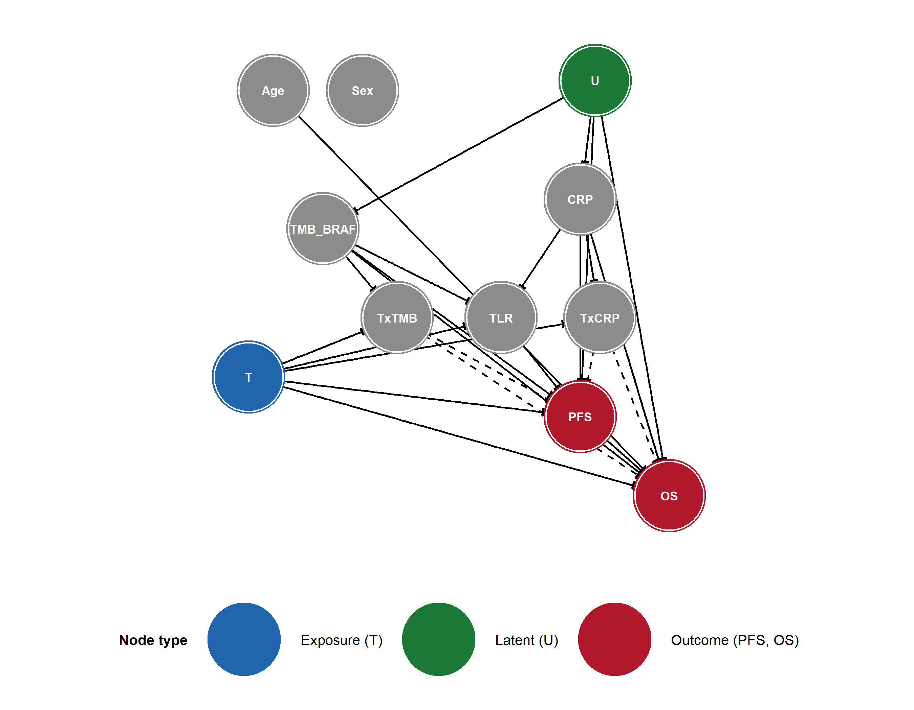

# Causal DAG
Ben Geisler
2026-09-25

- [Introduction](#introduction)
- [Node Definitions](#node-definitions)
- [Causal Structure](#causal-structure)
- [Causal Analysis](#causal-analysis)
  - [Adjustment Sets](#adjustment-sets)
  - [Implied Conditional
    Independencies](#implied-conditional-independencies)
- [Sensitivity Analysis: Excluding Age/Sex →
  TMB/BRAF](#sensitivity-analysis-excluding-agesex--tmbbraf)
  - [Sensitivity DAG](#sensitivity-dag)
  - [Sensitivity Causal Analysis](#sensitivity-causal-analysis)
    - [Adjustment Sets](#adjustment-sets-1)
    - [Implied Conditional
      Independencies](#implied-conditional-independencies-1)
- [Simplified DAG](#simplified-dag)

# Introduction

This report presents the directed acyclic graph (DAG) for the METIMMOX-1
cost-effectiveness analysis. The DAG encodes the assumed causal
structure between patient characteristics, biomarkers, treatment,
intermediate outcomes, and survival endpoints. It was specified in
DAGitty format and visualised using the **ggdag** package in R.

Three node types are distinguished:

- **Exposure** (T): the randomised treatment (alternating FLOX +
  nivolumab vs FLOX alone)
- **Outcomes** (PFS, OS): the clinical endpoints of interest
- **Latent** (U): unmeasured patient characteristics that act as common
  causes of biomarkers and/or survival

# Node Definitions

| Node | Display | Type | Description |
|:---|:---|:---|:---|
| Age | Age | Covariate | Patient age at baseline |
| Sex | Sex | Covariate | Patient sex |
| U | U | Latent | Unmeasured prognostic factors (latent) |
| TMB_BRAF | TMB/BRAF | Biomarker | Combined biomarker: TMB \>= 9 mut/MB or BRAF mutation |
| CRP | CRP | Biomarker | C-reactive protein at week 4, before the first nivolumab dose (positive: CRP \< 5 mg/L) |
| T | T | Exposure | Treatment: alternating FLOX + nivolumab vs FLOX alone |
| TxTMB | T x TMB | Effect modifier | Interaction between treatment and TMB/BRAF status |
| TxCRP | T x CRP | Effect modifier | Interaction between treatment and CRP status |
| TLR | TLR | Mediator | Target lesion reduction: at least 10% reduction in the sum of target-lesion diameters at the first on-treatment CT |
| PFS | PFS | Outcome | Progression-free survival |
| OS | OS | Outcome | Overall survival |

DAG node definitions

**CRP timing.** The CRP node is the week-4 value (cycle 3 day 1),
measured after the two FLOX cycles that both arms receive and before the
first nivolumab dose, not the baseline (pre-randomization) value. It is
nevertheless drawn without a `T -> CRP` edge: at week 4 no nivolumab has
been given and the two arms have received identical treatment, so
treatment assignment cannot yet have affected CRP. CRP is therefore a
pre-immunotherapy covariate in the DAG, unlike TLR, which is read from
the first on-treatment CT after nivolumab has started and is modelled as
a mediator (`T -> TLR`).

# Causal Structure

# Causal Analysis

Because T is a randomised exposure with no parents in the DAG, there are
no backdoor paths from T to PFS or OS. The sections below confirm this
using dagitty’s formal algorithms and list the implied conditional
independencies encoded by the DAG.

## Adjustment Sets

**T -\> PFS:** Minimal adjustment sets: {}

**T -\> OS:** Minimal adjustment sets: {}

## Implied Conditional Independencies

The DAG implies 19 conditional independencies. 4 of them hold by
construction: the interaction nodes are deterministic
(`TxTMB = T x TMB_BRAF`, `TxCRP = T x CRP`), so a statement that
conditions on both parents of an interaction node and involves that node
is true whatever the data. The remaining 15 statements are the testable
implications examined in the DAG association report.

| Implied conditional independence (X *\|\|* Y \| {Z}) | Holds by construction |
|:---|:---|
| Age *\|\|* CRP | No |
| Age *\|\|* Sex | No |
| Age *\|\|* T | No |
| Age *\|\|* TLR \| {CRP, TMB_BRAF} | No |
| Age *\|\|* TxCRP | No |
| Age *\|\|* TxTMB \| {TMB_BRAF} | No |
| CRP *\|\|* Sex | No |
| CRP *\|\|* T | No |
| CRP *\|\|* TxTMB \| {TMB_BRAF} | No |
| Sex *\|\|* T | No |
| Sex *\|\|* TLR \| {CRP, TMB_BRAF} | No |
| Sex *\|\|* TxCRP | No |
| Sex *\|\|* TxTMB \| {TMB_BRAF} | No |
| T *\|\|* TMB_BRAF | No |
| TLR *\|\|* TxCRP \| {CRP, T} | Yes (TxCRP fixed by {Z}) |
| TLR *\|\|* TxTMB \| {T, TMB_BRAF} | Yes (TxTMB fixed by {Z}) |
| TMB_BRAF *\|\|* TxCRP \| {CRP} | No |
| TxCRP *\|\|* TxTMB \| {T, TMB_BRAF} | Yes (TxTMB fixed by {Z}) |
| TxCRP *\|\|* TxTMB \| {CRP, T} | Yes (TxCRP fixed by {Z}) |

Conditional independencies implied by the causal DAG

# Sensitivity Analysis: Excluding Age/Sex → TMB/BRAF

This sensitivity DAG removes the `Age -> TMB_BRAF` and `Sex -> TMB_BRAF`
edges while keeping the remainder of the structure identical to the
primary specification. The primary DAG retains these arrows on
biological grounds; this sensitivity analysis shows the downstream
implications of omitting them.

## Sensitivity DAG

## Sensitivity Causal Analysis

The treatment node remains randomised in the sensitivity DAG, so the
formal adjustment recommendations for `T -> PFS` and `T -> OS` are
unchanged. The main difference is in the implied conditional
independencies, which now reflect the omission of direct Age/Sex effects
on TMB/BRAF status.

### Adjustment Sets

**T -\> PFS:** Minimal adjustment sets: {}

**T -\> OS:** Minimal adjustment sets: {}

### Implied Conditional Independencies

| Implied conditional independence (X *\|\|* Y \| {Z}) | Holds by construction |
|:---|:---|
| Age *\|\|* CRP | No |
| Age *\|\|* PFS | No |
| Age *\|\|* Sex | No |
| Age *\|\|* T | No |
| Age *\|\|* TLR | No |
| Age *\|\|* TMB_BRAF | No |
| Age *\|\|* TxCRP | No |
| Age *\|\|* TxTMB | No |
| CRP *\|\|* Sex | No |
| CRP *\|\|* T | No |
| CRP *\|\|* TxTMB \| {TMB_BRAF} | No |
| OS *\|\|* Sex | No |
| PFS *\|\|* Sex | No |
| Sex *\|\|* T | No |
| Sex *\|\|* TLR | No |
| Sex *\|\|* TMB_BRAF | No |
| Sex *\|\|* TxCRP | No |
| Sex *\|\|* TxTMB | No |
| T *\|\|* TMB_BRAF | No |
| TLR *\|\|* TxCRP \| {CRP, T} | Yes (TxCRP fixed by {Z}) |
| TLR *\|\|* TxTMB \| {T, TMB_BRAF} | Yes (TxTMB fixed by {Z}) |
| TMB_BRAF *\|\|* TxCRP \| {CRP} | No |
| TxCRP *\|\|* TxTMB \| {T, TMB_BRAF} | Yes (TxTMB fixed by {Z}) |
| TxCRP *\|\|* TxTMB \| {CRP, T} | Yes (TxCRP fixed by {Z}) |

Conditional independencies implied by the sensitivity DAG

# Simplified DAG

The following DAG presents the same causal assumptions in a condensed
form intended for a clinical audience. The interaction terms (T x
TMB/BRAF and T x CRP), the latent common-cause node (U) and the TLR
mediator have been omitted, and PFS and OS are merged into one survival
node; their roles are described in the text. Age and sex are separate
nodes, so that the simplified graph keeps the full DAG’s covariate
structure: both point to TMB/BRAF, and only age points to survival (the
full DAG’s `Age -> OS`; there is no edge from sex to an outcome). The
dashed arrow from T to survival indicates that the magnitude of the
treatment effect on survival outcomes is hypothesised to be modified by
TMB/BRAF and CRP status, the central question addressed by the biomarker
analysis.

------------------------------------------------------------------------

**Report completed on:** 2026-09-25  
**Repository:** ben-geisler/METIMMOX-1  
**Report version:** 2.3
