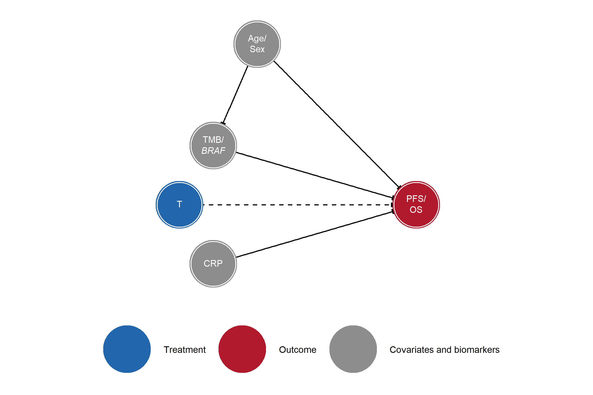

# Causal DAG
Ben Geisler
2026-09-18

- [Introduction](#introduction)
- [Node Definitions](#node-definitions)
- [Causal Structure](#causal-structure)
- [Causal Analysis](#causal-analysis)
  - [Adjustment Sets](#adjustment-sets)
  - [Implied Conditional
    Independencies](#implied-conditional-independencies)
- [Sensitivity Analysis: Excluding Age/Sex →
  TMB/BRAF](#sensitivity-analysis-excluding-agesex--tmbbraf)
  - [Sensitivity DAG](#sensitivity-dag)
  - [Sensitivity Causal Analysis](#sensitivity-causal-analysis)
    - [Adjustment Sets](#adjustment-sets-1)
    - [Implied Conditional
      Independencies](#implied-conditional-independencies-1)
- [Simplified DAG](#simplified-dag)

# Introduction

This report presents the directed acyclic graph (DAG) for the METIMMOX-1
cost-effectiveness analysis. The DAG encodes the assumed causal
structure between patient characteristics, biomarkers, treatment,
intermediate outcomes, and survival endpoints. It was specified in
DAGitty format and visualised using the **ggdag** package in R.

Three node types are distinguished:

- **Exposure** (T): the randomised treatment (alternating FLOX +
  nivolumab vs FLOX alone)
- **Outcomes** (PFS, OS): the clinical endpoints of interest
- **Latent** (U): unmeasured patient characteristics that act as common
  causes of biomarkers and/or survival

# Node Definitions

| Node | Display | Type | Description |
|:---|:---|:---|:---|
| Age | Age | Covariate | Patient age at baseline |
| Sex | Sex | Covariate | Patient sex |
| U | U | Latent | Unmeasured prognostic factors (latent) |
| TMB_BRAF | TMB/BRAF | Biomarker | Combined biomarker: TMB \>= 9 mut/MB or BRAF mutation |
| CRP | CRP | Biomarker | C-reactive protein at week 4, before the first nivolumab dose (positive: CRP \< 5 mg/L) |
| T | T | Exposure | Treatment: alternating FLOX + nivolumab vs FLOX alone |
| TxTMB | T x TMB | Effect modifier | Interaction between treatment and TMB/BRAF status |
| TxCRP | T x CRP | Effect modifier | Interaction between treatment and CRP status |
| TLR | TLR | Mediator | Tumour lesion reduction (radiological response) |
| PFS | PFS | Outcome | Progression-free survival |
| OS | OS | Outcome | Overall survival |

DAG node definitions

**CRP timing.** The CRP node is the week-4 value (cycle 3 day 1),
measured after the two FLOX cycles that both arms receive and before the
first nivolumab dose, not the baseline (pre-randomization) value. It is
nevertheless drawn without a `T -> CRP` edge: at week 4 no nivolumab has
been given and the two arms have received identical treatment, so
treatment assignment cannot yet have affected CRP. CRP is therefore a
pre-immunotherapy covariate in the DAG, unlike TLR, which is read from
the first on-treatment CT after nivolumab has started and is modelled as
a mediator (`T -> TLR`).

# Causal Structure

# Causal Analysis

Because T is a randomised exposure with no parents in the DAG, there are
no backdoor paths from T to PFS or OS. The sections below confirm this
using dagitty’s formal algorithms and list the implied conditional
independencies encoded by the DAG.

## Adjustment Sets

**T -\> PFS:** Minimal adjustment sets: {}

**T -\> OS:** Minimal adjustment sets: {}

## Implied Conditional Independencies

| Implied conditional independence (X *\|\|* Y \| {Z}) |
|:-----------------------------------------------------|
| Age *\|\|* CRP                                       |
| Age *\|\|* Sex                                       |
| Age *\|\|* T                                         |
| Age *\|\|* TLR \| {CRP, TMB_BRAF}                    |
| Age *\|\|* TxCRP                                     |
| Age *\|\|* TxTMB \| {TMB_BRAF}                       |
| CRP *\|\|* Sex                                       |
| CRP *\|\|* T                                         |
| CRP *\|\|* TxTMB \| {TMB_BRAF}                       |
| Sex *\|\|* T                                         |
| Sex *\|\|* TLR \| {CRP, TMB_BRAF}                    |
| Sex *\|\|* TxCRP                                     |
| Sex *\|\|* TxTMB \| {TMB_BRAF}                       |
| T *\|\|* TMB_BRAF                                    |
| TLR *\|\|* TxCRP \| {CRP, T}                         |
| TLR *\|\|* TxTMB \| {T, TMB_BRAF}                    |
| TMB_BRAF *\|\|* TxCRP \| {CRP}                       |
| TxCRP *\|\|* TxTMB \| {T, TMB_BRAF}                  |
| TxCRP *\|\|* TxTMB \| {CRP, T}                       |

Conditional independencies implied by the causal DAG

# Sensitivity Analysis: Excluding Age/Sex → TMB/BRAF

This sensitivity DAG removes the `Age -> TMB_BRAF` and `Sex -> TMB_BRAF`
edges while keeping the remainder of the structure identical to the
primary specification. The primary DAG retains these arrows on
biological grounds; this sensitivity analysis shows the downstream
implications of omitting them.

## Sensitivity DAG

## Sensitivity Causal Analysis

The treatment node remains randomised in the sensitivity DAG, so the
formal adjustment recommendations for `T -> PFS` and `T -> OS` are
unchanged. The main difference is in the implied conditional
independencies, which now reflect the omission of direct Age/Sex effects
on TMB/BRAF status.

### Adjustment Sets

**T -\> PFS:** Minimal adjustment sets: {}

**T -\> OS:** Minimal adjustment sets: {}

### Implied Conditional Independencies

| Implied conditional independence (X *\|\|* Y \| {Z}) |
|:-----------------------------------------------------|
| Age *\|\|* CRP                                       |
| Age *\|\|* PFS                                       |
| Age *\|\|* Sex                                       |
| Age *\|\|* T                                         |
| Age *\|\|* TLR                                       |
| Age *\|\|* TMB_BRAF                                  |
| Age *\|\|* TxCRP                                     |
| Age *\|\|* TxTMB                                     |
| CRP *\|\|* Sex                                       |
| CRP *\|\|* T                                         |
| CRP *\|\|* TxTMB \| {TMB_BRAF}                       |
| OS *\|\|* Sex                                        |
| PFS *\|\|* Sex                                       |
| Sex *\|\|* T                                         |
| Sex *\|\|* TLR                                       |
| Sex *\|\|* TMB_BRAF                                  |
| Sex *\|\|* TxCRP                                     |
| Sex *\|\|* TxTMB                                     |
| T *\|\|* TMB_BRAF                                    |
| TLR *\|\|* TxCRP \| {CRP, T}                         |
| TLR *\|\|* TxTMB \| {T, TMB_BRAF}                    |
| TMB_BRAF *\|\|* TxCRP \| {CRP}                       |
| TxCRP *\|\|* TxTMB \| {T, TMB_BRAF}                  |
| TxCRP *\|\|* TxTMB \| {CRP, T}                       |

Conditional independencies implied by the sensitivity DAG

# Simplified DAG

The following DAG presents the same causal assumptions in a condensed
form intended for a clinical audience. The interaction terms (T ×
TMB/BRAF and T × CRP) and the latent common-cause node (U) have been
omitted; their roles are described in the text. Dashed arrows from T to
PFS and OS indicate that the magnitude of the treatment effect on
survival outcomes is hypothesised to be modified by TMB/BRAF and CRP
status — the central question addressed by the biomarker analysis.

------------------------------------------------------------------------

**Report completed on:** 2026-09-18  
**Repository:** ben-geisler/METIMMOX-1  
**Report version:** 2.2
