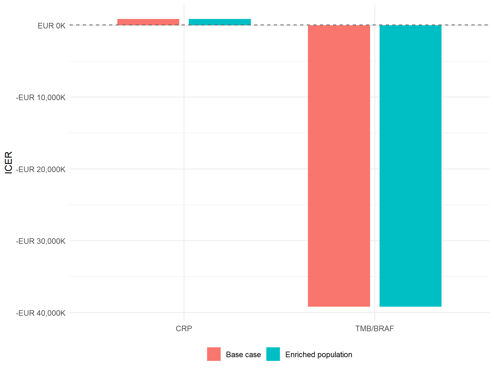

# Enriched Population Analysis
Ben Geisler
2026-09-25

- [Overview](#overview)
- [Biomarker Prevalence](#biomarker-prevalence)
- [Base Case vs Enriched Population](#base-case-vs-enriched-population)
- [Interpretation](#interpretation)

# Overview

This report presents a ceiling scenario for the economic biomarkers
included in the single joint model. The analysis compares
biomarker-positive patients receiving FLOX + nivolumab with
biomarker-positive patients receiving FLOX only.

Economic biomarkers are CRP and TMB/BRAF.

**Screening cost.** To treat one biomarker-positive patient the guided
strategy must first identify one. On average 1 / prevalence patients are
tested per positive found, so the experimental arm carries the expected
screening cost per identified positive, the biomarker test cost divided
by the canonical full-cohort prevalence, in place of a single test
(issue \#157). The control arm carries no test cost, because every
patient receives FLOX under standard of care whether or not the
biomarker is known. The screening cost is reported as its own column in
the detailed table; it is EUR 47 for CRP and EUR 5,707 for TMB/BRAF per
identified positive.

# Biomarker Prevalence

| Biomarker | Prevalence | N Positive |
|:----------|-----------:|-----------:|
| CRP       |      33.8% |         24 |
| TMB/BRAF  |      44.1% |         31 |

Economic biomarker-positive prevalences

# Base Case vs Enriched Population

| Biomarker | Prevalence | Base ICER (vs SoC) | Base frontier | Enriched ICER (vs SoC) | Change |
|:---|---:|---:|:---|---:|---:|
| CRP | 33.8% | EUR 871,972 | On frontier | EUR 871,972 | +0.0% |
| TMB/BRAF | 44.1% | Dominated | Dominated | Dominated | – |

Base case and enriched-population ICERs (pairwise versus standard of
care)

*Note:* Both ICER columns are pairwise comparisons against standard of
care. ‘Base Case Frontier’ is the dampack efficiency-frontier status of
the guided strategy among the three base-case strategies: a strategy
that is dominated on the frontier (more costly and less effective than
the other guided strategy) still has a finite pairwise ICER, but the
percentage change between such ICERs is not meaningful and is shown as
‘–’.

| Biomarker | Experimental Cost | Experimental QALYs | Control Cost | Control QALYs | Screening cost per identified positive | Enriched ICER |
|:---|---:|---:|---:|---:|---:|---:|
| CRP | EUR 117,467 | 1.773 | EUR 20,730 | 1.662 | EUR 47 | EUR 871,972 |
| TMB/BRAF | EUR 115,301 | 1.420 | EUR 21,426 | 1.422 | EUR 5,707 | Dominated |

Detailed enriched-population results (pairwise versus standard of care)

*Note:* The experimental cost includes the screening cost per identified
positive (biomarker test cost divided by the canonical prevalence) in
place of a single test; the control cost includes no test. The enriched
ICER is the pairwise comparison of the two arms.

# Interpretation

The enriched analysis isolates expected value among biomarker-positive
patients and removes dilution from biomarker-negative patients who would
receive standard care under a guided strategy. The enriched control arm
is counterfactual and is generated from the fitted single joint survival
model. The comparison is not free of the biomarker-negative patients
altogether: finding each positive requires testing 1 / prevalence
patients, and that screening cost is charged to the experimental arm.

------------------------------------------------------------------------

**Report completed on:** 2026-09-25  
**Repository:** ben-geisler/METIMMOX-1  
**Report version:** 4.2
