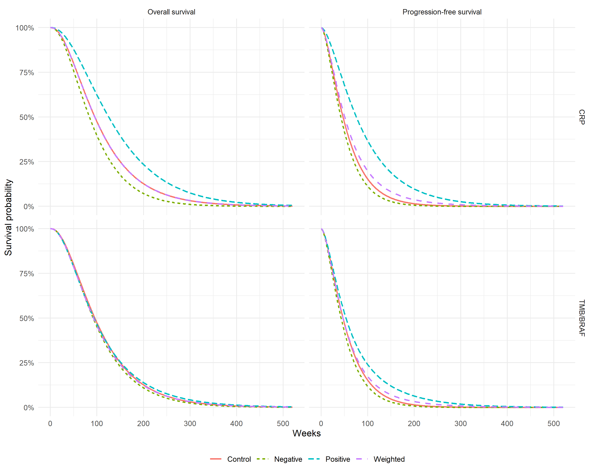

# Parametric Survival Models
Ben Geisler
2026-09-22

- [Overview](#overview)
- [Distribution Selection](#distribution-selection)
- [Coefficients](#coefficients)
- [Strategy Survival Curves](#strategy-survival-curves)
- [Summary](#summary)

# Overview

This report documents the parametric survival models used in the
economic evaluation. A single joint model is fitted for both endpoints:

| Endpoint | Formula |
|:---|:---|
| Overall survival | Surv(OSwk, Death) ~ Age + sex + Rx + crp \* Rx + tmb_braf \* Rx |
| Progression-free survival | Surv(PFSwk, Progression) ~ Age + sex + Rx + crp \* Rx + tmb_braf \* Rx |

Economic survival formulas

# Distribution Selection

The OS and PFS distributions are selected **jointly** from the nine
candidate families: the selected pair is the one with the lowest
combined AIC among all pairs whose population-averaged curves satisfy OS
\>= PFS for control and every economic biomarker subgroup at every
weekly time point of the 10-year horizon. Under this rule the selected
pair is **OS gamma / PFS gamma** (combined AIC 1304.16), which is 2.22
AIC above the unconstrained minimum-AIC pair. The lowest marginal-AIC
distribution of an endpoint taken on its own is therefore not
necessarily the selected one; the “Selected” column marks the
distributions in use.

| Distribution |    AIC |    BIC | delta_AIC | delta_BIC | Selected |
|:-------------|-------:|-------:|----------:|----------:|:--------:|
| weibull      | 666.98 | 686.96 |      0.00 |      0.00 |          |
| weibullph    | 666.98 | 686.96 |      0.00 |      0.00 |          |
| gamma        | 667.31 | 687.28 |      0.32 |      0.32 |   Yes    |
| llogis       | 668.86 | 688.83 |      1.87 |      1.87 |          |
| gengamma     | 668.97 | 691.17 |      1.99 |      4.21 |          |
| lognormal    | 670.97 | 690.95 |      3.99 |      3.99 |          |
| genf         | 670.98 | 695.39 |      3.99 |      8.43 |          |
| gompertz     | 673.66 | 693.63 |      6.67 |      6.67 |          |
| exponential  | 686.14 | 703.89 |     19.15 |     16.93 |          |

Overall survival distribution comparison (ordered by marginal AIC)

| Distribution |    AIC |    BIC | delta_AIC | delta_BIC | Selected |
|:-------------|-------:|-------:|----------:|----------:|:--------:|
| lognormal    | 634.96 | 654.93 |      0.00 |      0.00 |          |
| gamma        | 636.86 | 656.83 |      1.90 |      1.90 |   Yes    |
| gengamma     | 636.96 | 659.15 |      2.00 |      4.22 |          |
| llogis       | 637.39 | 657.37 |      2.44 |      2.44 |          |
| weibull      | 638.25 | 658.23 |      3.29 |      3.29 |          |
| weibullph    | 638.25 | 658.23 |      3.29 |      3.29 |          |
| genf         | 638.96 | 663.37 |      4.00 |      8.44 |          |
| gompertz     | 640.68 | 660.66 |      5.73 |      5.73 |          |
| exponential  | 645.75 | 663.51 |     10.80 |      8.58 |          |

Progression-free survival distribution comparison (ordered by marginal
AIC)

| Rank | OS distribution | PFS distribution | Combined AIC | OS \>= PFS | Violating points | Selected |
|---:|:---|:---|---:|:--:|---:|:--:|
| 1 | weibull | lognormal | 1301.94 | No | 865 |  |
| 2 | weibullph | lognormal | 1301.94 | No | 865 |  |
| 3 | gamma | lognormal | 1302.26 | No | 563 |  |
| 4 | llogis | lognormal | 1303.81 | No | 8 |  |
| 5 | weibull | gamma | 1303.84 | No | 241 |  |
| 6 | weibullph | gamma | 1303.84 | No | 241 |  |
| 7 | gengamma | lognormal | 1303.93 | No | 826 |  |
| 8 | weibull | gengamma | 1303.94 | No | 855 |  |
| 9 | weibullph | gengamma | 1303.94 | No | 855 |  |
| 10 | gamma | gamma | 1304.16 | Yes | 0 | Yes |
| 11 | gamma | gengamma | 1304.26 | No | 555 |  |
| 12 | weibull | llogis | 1304.38 | No | 1162 |  |

Joint (OS, PFS) pair audit: top 12 of 81 pairs by combined AIC plus the
selected pair

*Note:* Violating points: number of (subgroup, week) points at which the
population-averaged PFS curve exceeds the OS curve over the model
horizon. The selected pair is the lowest combined-AIC pair with no
violation.

# Coefficients

Coefficient scales differ by row type. Rows named after a distribution
parameter (for example `shape` and `rate` for the gamma family, `shape`
and `scale` for Weibull PH) are the baseline parameters on their natural
scale. All covariate rows (Age, sex, Rx, biomarkers and their
interactions) are additive effects on the log of the distribution’s
location parameter (`log(rate)` for gamma, `log(scale)` for Weibull PH,
so that exp(coefficient) is a rate ratio for gamma and a hazard ratio
for Weibull PH). The `Scale` column states this for every row.

| Outcome | Distribution | Parameter | Scale | Estimate | SE | 95% CI |
|:---|:---|:---|:---|---:|---:|---:|
| OS | gamma | shape | baseline parameter (natural scale) | 2.4303 | 0.4236 | \[1.7270, 3.4198\] |
| OS | gamma | rate | baseline parameter (natural scale) | 0.0185 | 0.0123 | \[0.0051, 0.0678\] |
| OS | gamma | Age | covariate effect on log(rate) | 0.0036 | 0.0092 | \[-0.0145, 0.0217\] |
| OS | gamma | sex1 | covariate effect on log(rate) | 0.1796 | 0.1675 | \[-0.1486, 0.5079\] |
| OS | gamma | RxExperimental arm | covariate effect on log(rate) | 0.2215 | 0.2365 | \[-0.2420, 0.6850\] |
| OS | gamma | crp1 | covariate effect on log(rate) | -0.3896 | 0.3306 | \[-1.0375, 0.2583\] |
| OS | gamma | tmb_braf1 | covariate effect on log(rate) | -0.0663 | 0.2474 | \[-0.5513, 0.4187\] |
| OS | gamma | RxExperimental arm:crp1 | covariate effect on log(rate) | -0.1711 | 0.4137 | \[-0.9820, 0.6397\] |
| OS | gamma | RxExperimental arm:tmb_braf1 | covariate effect on log(rate) | -0.0982 | 0.3451 | \[-0.7746, 0.5782\] |
| PFS | gamma | shape | baseline parameter (natural scale) | 1.7902 | 0.2925 | \[1.2996, 2.4659\] |
| PFS | gamma | rate | baseline parameter (natural scale) | 0.0466 | 0.0343 | \[0.0110, 0.1973\] |
| PFS | gamma | Age | covariate effect on log(rate) | -0.0038 | 0.0107 | \[-0.0248, 0.0171\] |
| PFS | gamma | sex1 | covariate effect on log(rate) | 0.0554 | 0.1987 | \[-0.3341, 0.4448\] |
| PFS | gamma | RxExperimental arm | covariate effect on log(rate) | 0.4732 | 0.2760 | \[-0.0676, 1.0141\] |
| PFS | gamma | crp1 | covariate effect on log(rate) | -0.2964 | 0.4125 | \[-1.1050, 0.5121\] |
| PFS | gamma | tmb_braf1 | covariate effect on log(rate) | -0.1892 | 0.2963 | \[-0.7698, 0.3915\] |
| PFS | gamma | RxExperimental arm:crp1 | covariate effect on log(rate) | -0.6076 | 0.5076 | \[-1.6026, 0.3873\] |
| PFS | gamma | RxExperimental arm:tmb_braf1 | covariate effect on log(rate) | -0.2977 | 0.4200 | \[-1.1209, 0.5254\] |
| OS | weibullph | shape | baseline parameter (natural scale) | 1.7474 | 0.1883 | \[1.4147, 2.1583\] |
| OS | weibullph | scale | baseline parameter (natural scale) | 0.0001 | 0.0002 | \[0.0000, 0.0023\] |
| OS | weibullph | Age | covariate effect on log(scale) | 0.0075 | 0.0154 | \[-0.0227, 0.0378\] |
| OS | weibullph | sex1 | covariate effect on log(scale) | 0.3440 | 0.2744 | \[-0.1938, 0.8818\] |
| OS | weibullph | RxExperimental arm | covariate effect on log(scale) | 0.4496 | 0.3718 | \[-0.2791, 1.1783\] |
| OS | weibullph | crp1 | covariate effect on log(scale) | -0.8269 | 0.5524 | \[-1.9097, 0.2559\] |
| OS | weibullph | tmb_braf1 | covariate effect on log(scale) | -0.1029 | 0.4000 | \[-0.8868, 0.6810\] |
| OS | weibullph | RxExperimental arm:crp1 | covariate effect on log(scale) | -0.0989 | 0.6809 | \[-1.4333, 1.2356\] |
| OS | weibullph | RxExperimental arm:tmb_braf1 | covariate effect on log(scale) | -0.1275 | 0.5628 | \[-1.2305, 0.9756\] |
| PFS | weibullph | shape | baseline parameter (natural scale) | 1.3913 | 0.1383 | \[1.1450, 1.6906\] |
| PFS | weibullph | scale | baseline parameter (natural scale) | 0.0058 | 0.0066 | \[0.0006, 0.0531\] |
| PFS | weibullph | Age | covariate effect on log(scale) | -0.0056 | 0.0150 | \[-0.0350, 0.0238\] |
| PFS | weibullph | sex1 | covariate effect on log(scale) | 0.0293 | 0.2747 | \[-0.5090, 0.5677\] |
| PFS | weibullph | RxExperimental arm | covariate effect on log(scale) | 0.6002 | 0.3696 | \[-0.1241, 1.3246\] |
| PFS | weibullph | crp1 | covariate effect on log(scale) | -0.3980 | 0.5603 | \[-1.4962, 0.7003\] |
| PFS | weibullph | tmb_braf1 | covariate effect on log(scale) | -0.3171 | 0.4013 | \[-1.1037, 0.4695\] |
| PFS | weibullph | RxExperimental arm:crp1 | covariate effect on log(scale) | -0.7331 | 0.6940 | \[-2.0933, 0.6272\] |
| PFS | weibullph | RxExperimental arm:tmb_braf1 | covariate effect on log(scale) | -0.4088 | 0.5834 | \[-1.5522, 0.7346\] |

Selected (OS gamma, PFS gamma) and Weibull PH coefficient estimates

*Note:* Baseline parameters are on their natural scale; covariate rows
are additive effects on the log location parameter (gamma: log(rate),
exp(coef) = rate ratio; Weibull PH: log(scale), exp(coef) = hazard
ratio).

# Strategy Survival Curves

# Summary

The economic model uses one joint formula for both CRP-guided and
TMB/BRAF-guided strategies. The OS and PFS distributions are selected
jointly as the minimum combined-AIC pair that keeps OS \>= PFS for every
subgroup over the model horizon (currently OS gamma, PFS gamma), not by
marginal AIC per endpoint; Weibull PH is retained as a familiar
reference fit.

------------------------------------------------------------------------

**Report completed on:** 2026-09-22  
**Repository:** ben-geisler/METIMMOX-1  
**Report version:** 4.1
