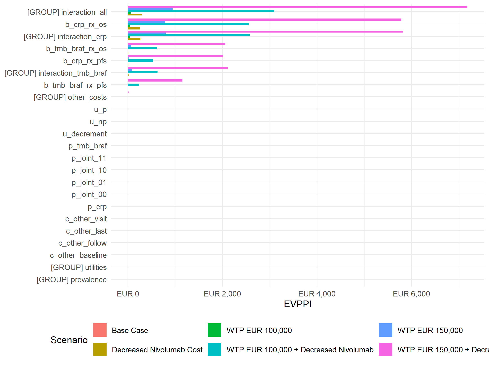

# Scenario Analysis
Ben Geisler
2026-09-30

- [Overview](#overview)
- [Scenario Definitions](#scenario-definitions)
- [PSA Summary by Scenario](#psa-summary-by-scenario)
- [Scenario EVPPI](#scenario-evppi)

# Overview

This report summarizes scenario EVPPI and PSA outputs for the single
joint economic model. It requires the full
`scenario_evppi_results_{utility}.rds` cache generated by
`12_scenario_EVPPIs.R`. EVPPI values are regression estimates
(`voi::evppi()`, generalized additive models; Strong et al. 2014)
reported with Monte Carlo standard errors; the Value of Information
report describes the estimator. Rows prefixed `[GROUP]` are joint
estimates for a parameter group and are never sums of single-parameter
rows.

# Scenario Definitions

| scenario_id | scenario_name | wtp | c_drug_nivo |
|:---|:---|:---|:---|
| base | Base Case | EUR 51,000 | EUR 13,923 |
| s1_decreased_nivo | Decreased Nivolumab Cost | EUR 51,000 | EUR 4,641 |
| s2_wtp100k | WTP EUR 100,000 | EUR 100,000 | EUR 13,923 |
| s3_wtp100k_decreased | WTP EUR 100,000 + Decreased Nivolumab | EUR 100,000 | EUR 4,641 |
| s4_wtp150k | WTP EUR 150,000 | EUR 150,000 | EUR 13,923 |
| s5_wtp150k_decreased | WTP EUR 150,000 + Decreased Nivolumab | EUR 150,000 | EUR 4,641 |

Scenario definitions loaded from scenario_evppi_results_correct.rds

# PSA Summary by Scenario

|  | Scenario | WTP | Strategy | Mean Cost | Mean QALYs | Mean NMB |
|:---|:---|---:|:---|---:|---:|---:|
| control…1 | Base Case | EUR 51,000 | Standard of Care | EUR 25,732 | 1.378 | EUR 44,522 |
| crp…2 | Base Case | EUR 51,000 | CRP-guided | EUR 57,740 | 1.401 | EUR 13,698 |
| tmb_braf…3 | Base Case | EUR 51,000 | TMB/BRAF-guided | EUR 66,302 | 1.370 | EUR 3,548 |
| control…4 | WTP EUR 100,000 | EUR 100,000 | Standard of Care | EUR 25,732 | 1.378 | EUR 112,021 |
| crp…5 | WTP EUR 100,000 | EUR 100,000 | CRP-guided | EUR 57,740 | 1.401 | EUR 82,335 |
| tmb_braf…6 | WTP EUR 100,000 | EUR 100,000 | TMB/BRAF-guided | EUR 66,302 | 1.370 | EUR 70,660 |
| control…7 | WTP EUR 150,000 | EUR 150,000 | Standard of Care | EUR 25,732 | 1.378 | EUR 180,897 |
| crp…8 | WTP EUR 150,000 | EUR 150,000 | CRP-guided | EUR 57,740 | 1.401 | EUR 152,373 |
| tmb_braf…9 | WTP EUR 150,000 | EUR 150,000 | TMB/BRAF-guided | EUR 66,302 | 1.370 | EUR 139,141 |
| control…10 | Decreased Nivolumab Cost | EUR 51,000 | Standard of Care | EUR 25,732 | 1.378 | EUR 44,522 |
| crp…11 | Decreased Nivolumab Cost | EUR 51,000 | CRP-guided | EUR 36,064 | 1.401 | EUR 35,374 |
| tmb_braf…12 | Decreased Nivolumab Cost | EUR 51,000 | TMB/BRAF-guided | EUR 40,181 | 1.370 | EUR 29,670 |
| control…13 | WTP EUR 100,000 + Decreased Nivolumab | EUR 100,000 | Standard of Care | EUR 25,732 | 1.378 | EUR 112,021 |
| crp…14 | WTP EUR 100,000 + Decreased Nivolumab | EUR 100,000 | CRP-guided | EUR 36,064 | 1.401 | EUR 104,011 |
| tmb_braf…15 | WTP EUR 100,000 + Decreased Nivolumab | EUR 100,000 | TMB/BRAF-guided | EUR 40,181 | 1.370 | EUR 96,782 |
| control…16 | WTP EUR 150,000 + Decreased Nivolumab | EUR 150,000 | Standard of Care | EUR 25,732 | 1.378 | EUR 180,897 |
| crp…17 | WTP EUR 150,000 + Decreased Nivolumab | EUR 150,000 | CRP-guided | EUR 36,064 | 1.401 | EUR 174,048 |
| tmb_braf…18 | WTP EUR 150,000 + Decreased Nivolumab | EUR 150,000 | TMB/BRAF-guided | EUR 40,181 | 1.370 | EUR 165,263 |

PSA summary by scenario

# Scenario EVPPI

The `[EVPI]` row is total scenario EVPI, calculated from the scenario
PSA even when no regression estimates were returned. Exact zero EVPI
bounds every group at zero; skipped or failed estimates at positive EVPI
remain missing with a reason.

| Scenario | WTP | Parameter | EVPPI | SE | Percent of EVPI | Population EVPPI |
|:---|---:|:---|---:|---:|---:|---:|
| Base Case | EUR 51,000 | \[EVPI\] | EUR 0.00 | – | – | EUR 0.00M |
| Base Case | EUR 51,000 | \[GROUP\] other_costs | EUR 0.00 | EUR 0.00 | – | EUR 0.00M |
| Base Case | EUR 51,000 | \[GROUP\] utilities | EUR 0.00 | EUR 0.00 | – | EUR 0.00M |
| Base Case | EUR 51,000 | \[GROUP\] prevalence | EUR 0.00 | EUR 0.00 | – | EUR 0.00M |
| Base Case | EUR 51,000 | \[GROUP\] interaction_crp | EUR 0.00 | EUR 0.00 | – | EUR 0.00M |
| Decreased Nivolumab Cost | EUR 51,000 | \[EVPI\] | EUR 576.72 | – | 100.0% | EUR 7.19M |
| Decreased Nivolumab Cost | EUR 51,000 | \[GROUP\] interaction_all | EUR 297.59 | EUR 18.17 | 51.6% | EUR 3.71M |
| Decreased Nivolumab Cost | EUR 51,000 | \[GROUP\] interaction_crp | EUR 263.84 | EUR 19.66 | 45.7% | EUR 3.29M |
| Decreased Nivolumab Cost | EUR 51,000 | b_crp_rx_os | EUR 260.00 | EUR 18.62 | 45.1% | EUR 3.24M |
| Decreased Nivolumab Cost | EUR 51,000 | \[GROUP\] interaction_tmb_braf | EUR 13.91 | EUR 4.89 | 2.4% | EUR 0.17M |
| WTP EUR 100,000 | EUR 100,000 | \[EVPI\] | EUR 232.29 | – | 100.0% | EUR 2.90M |
| WTP EUR 100,000 | EUR 100,000 | \[GROUP\] interaction_all | EUR 56.32 | EUR 11.45 | 24.2% | EUR 0.70M |
| WTP EUR 100,000 | EUR 100,000 | b_crp_rx_os | EUR 43.02 | EUR 9.59 | 18.5% | EUR 0.54M |
| WTP EUR 100,000 | EUR 100,000 | \[GROUP\] interaction_crp | EUR 41.08 | EUR 10.65 | 17.7% | EUR 0.51M |
| WTP EUR 100,000 | EUR 100,000 | \[GROUP\] interaction_tmb_braf | EUR 1.48 | EUR 2.18 | 0.6% | EUR 0.02M |
| WTP EUR 100,000 + Decreased Nivolumab | EUR 100,000 | \[EVPI\] | EUR 4,087.98 | – | 100.0% | EUR 51.00M |
| WTP EUR 100,000 + Decreased Nivolumab | EUR 100,000 | \[GROUP\] interaction_all | EUR 3,088.74 | EUR 70.83 | 75.6% | EUR 38.53M |
| WTP EUR 100,000 + Decreased Nivolumab | EUR 100,000 | \[GROUP\] interaction_crp | EUR 2,577.34 | EUR 74.93 | 63.0% | EUR 32.15M |
| WTP EUR 100,000 + Decreased Nivolumab | EUR 100,000 | b_crp_rx_os | EUR 2,555.88 | EUR 74.47 | 62.5% | EUR 31.88M |
| WTP EUR 100,000 + Decreased Nivolumab | EUR 100,000 | \[GROUP\] interaction_tmb_braf | EUR 625.81 | EUR 40.80 | 15.3% | EUR 7.81M |
| WTP EUR 150,000 | EUR 150,000 | \[EVPI\] | EUR 1,828.88 | – | 100.0% | EUR 22.82M |
| WTP EUR 150,000 | EUR 150,000 | \[GROUP\] interaction_all | EUR 942.28 | EUR 56.15 | 51.5% | EUR 11.75M |
| WTP EUR 150,000 | EUR 150,000 | \[GROUP\] interaction_crp | EUR 797.31 | EUR 59.60 | 43.6% | EUR 9.95M |
| WTP EUR 150,000 | EUR 150,000 | b_crp_rx_os | EUR 785.67 | EUR 56.26 | 43.0% | EUR 9.80M |
| WTP EUR 150,000 | EUR 150,000 | \[GROUP\] interaction_tmb_braf | EUR 83.97 | EUR 21.57 | 4.6% | EUR 1.05M |
| WTP EUR 150,000 + Decreased Nivolumab | EUR 150,000 | \[EVPI\] | EUR 8,819.24 | – | 100.0% | EUR 110.02M |
| WTP EUR 150,000 + Decreased Nivolumab | EUR 150,000 | \[GROUP\] interaction_all | EUR 7,176.77 | EUR 125.83 | 81.4% | EUR 89.53M |
| WTP EUR 150,000 + Decreased Nivolumab | EUR 150,000 | \[GROUP\] interaction_crp | EUR 5,813.07 | EUR 129.72 | 65.9% | EUR 72.52M |
| WTP EUR 150,000 + Decreased Nivolumab | EUR 150,000 | b_crp_rx_os | EUR 5,783.58 | EUR 130.36 | 65.6% | EUR 72.15M |
| WTP EUR 150,000 + Decreased Nivolumab | EUR 150,000 | \[GROUP\] interaction_tmb_braf | EUR 2,110.72 | EUR 90.40 | 23.9% | EUR 26.33M |

Total EVPI and leading EVPPI parameters and groups by scenario (Monte
Carlo SE for regression estimates)

------------------------------------------------------------------------

**Report completed on:** 2026-09-30  
**Repository:** ben-geisler/METIMMOX-1  
**Report version:** 5.2
