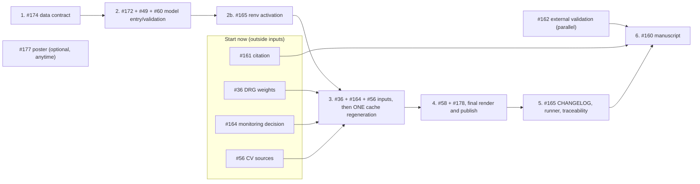

# GitHub Issue Audit

METIMMOX-1 Economic Evaluation, 29 September 2026 (HEAD `9653eba`)

## Summary

There were 23 open issues. Each one was checked against the current code and outputs, not against its own text.

- **9 closed**: 5 because the problem is already solved, and 4 because the IPD-utility work was dropped (author decision).
- **14 remain open.** Ten of them received a comment on 29 September. Seven of those record a partial fix or narrower scope (#56, #58, #164, #172, #174, #177, #178). The other three record that the issue still applies in full and update its context (#160, #162, #165). #36, #49, #60 and #161 still apply as written and received no comment.

The 14 open issues fall into five groups that overlap. The central point for ordering is the cache chain. Any change to the calculation sources, or to the pinned package versions, invalidates the PSA, EVPPI and scenario caches (about 1 h 15 min of computation, plus re-rendering). Everything that changes these should therefore land before **one** regeneration. Publication work should come after it.

## Closed issues

| Issue | Title | Reason for closing |
|---|---|---|
| #159 | PSA not centred on the base case | Joint OS/PFS covariance implemented; the reporting remainder was split out as #180, which closed on 23 Sep. The issue said it would close when #180 did. |
| #124 | Updated figure specifications | Written for Models A/B/C, which no longer exist (#151). Figures 1-5 now implement the specification in single-model form; `suppl_figure_pfs_plots.qmd` has been removed. |
| #66 | Standardize headers/footers | All 21 reports use the standard YAML and the three-line signature; no fancyhdr remains. |
| #16 | QMD warnings | No rendered `.md` or vignette HTML contains a warning or error block. The follow-up (surfacing the suppressed warnings) is in #178. |
| #6 | Working directory warning | `setup_report()` sets `root.dir = here::here()`; no `setwd()` anywhere. |
| #29, #31, #33, #34 | IPD EQ-5D utilities (parametric functions, Norwegian tariffs, by time point, adjusted) | Not planned (author decision): results use the CORRECT-trial utilities (`UTILITY_SOURCE = 1`). |

## Open issues after verification

"Caches" means the change invalidates the PSA/EVPPI/scenario caches (C) or not (-). "Results" means the headline numbers are expected to change.

| Issue | P | Topic | Verified status | Type | Caches | Results |
|---|---|---|---|---|---|---|
| #174 | P2 | Raw export contract (positional Excel columns) | Partly fixed: endpoint columns checked since #181; CRP, TL LD and scan-date columns still unchecked | Code, data | - | No (unless a check fails) |
| #172 | P2 | `run_basecase()`/script 08 ignore `time_horizon`/`cl`; short horizons fail | Partly fixed: the quarterly-cycle part was removed by #163; entry-point and schedule-builder failures remain | Code | C | No |
| #49 | P2 | Schedules hard-coded to 520 weeks | Absorbed by #172 (its own comment says so); closes with it | Code | C | No |
| #60 | P2 | Validate survival curves before building states | Applies in full: only length and OS >= PFS are checked | Code | C | No |
| #36 | P1 | Visit costs from DRG weights | Applies: `c_other_visit = 33` with no DRG source in code or report | Input | C | Yes |
| #164 | P3 | Monitoring schedule | Partly obsolete: 13-week cadence gone since #163; visit-free post-treatment monitoring remains | Input decision | C | Yes (small) |
| #56 | P4 | CVs without a source | Narrowed: CV 0.20 (resource-use costs) and 0.15 (utilities) still uncited | Documentation (input if changed) | C if changed | Only if changed |
| #161 | P2 | Table S8 utility scenario citation placeholder | Applies (`R/scenario_analysis.R:351`) | Literature | - | No |
| #162 | P2 | External validation of the extrapolations | Applies; #179's life-table comparison is explicitly too permissive to count | Analysis, report | - | No |
| #58 | P4 | Hard-coded strategy labels | Mostly fixed (`strategy_label()`); colour maps in figure 3/4/S5 and the poster, `OWSA.qmd:216` remain | Code, reports | - | No |
| #178 | P3 | `publish_reports.R` robustness; suppressed warnings | Partly fixed: render status checked; git steps, stale PDFs, `--no-render` provenance and warnings remain | Tooling | - | No |
| #165 | P4 | CHANGELOG, test runner, renv, roxygen, traceability table | Applies in full; the known-failure caveat is gone since #180 | Hygiene | C (renv part) | No |
| #177 | P3 | SMDM poster CEAC confounds model and uncertainty design | Applies; file is now `poster_SMDM.qmd`, and the caption claims what the issue disputes | Off-pipeline | - | No (poster only) |
| #160 | P1 | Manuscript | Applies: `docs/manuscript/` is empty; the numbers in the body are outdated (see comment) | Writing | - | No |

## Overlap

### A. Model entry point and input validation: #172, #49, #60

All three change `model_fun()`, `validate_model_params()` and `partitioned_survival_states()` (`R/model_fun.R`, `R/calculate_outcomes.R`). #49 is already a subset of #172. #60 adds curve checks at the same place where #172 resolves the time settings, and both need regression cases in the same test files (`test_survival_ordering.R`, `test_interval_integration.R`). These are one change set.

### B. Schedules and cost inputs: #36, #164, #56, plus the schedule builders of #172

- #36 sets the unit cost of a visit.
- #164 decides whether post-treatment CT and blood tests carry a visit, so the size of its effect depends on #36's unit cost (the issue itself asks to resolve them together).
- #56 needs a source for the CV of the same `c_other_visit` parameter.
- The CT, blood and visit schedules are built twice, in `05_basecase_input_parameters.R:27-37` and in `build_horizon_params()`. #172 must fix the short-horizon failures in both. #164 may change the rules in both. Whoever does the second of the two works on code the first just touched.

These are the only results-changing issues. They are also the only ones blocked on information from outside the repository: Eline's DRG weights, the trial protocol and Norwegian follow-up practice, and CV sources.

### C. Upstream data: #174

This issue shares no files with the others, but it is upstream of all of them: every cache is built from the data it guards. It should be in place before the regeneration in group B, so that the final caches are built from verified data.

### D. Evidence for publication: #161, #162, #56 (documentation part)

These provide citations and validation that the manuscript methods need. None of them changes model code or caches. #162 depends only on the fitted survival models, which nothing in groups A or B changes, so it can run in parallel with them.

### E. Output and release: #58, #178, #165, #160, and separately #177

- #58 edits vignettes (figures 3, 4 and S5) that have to be re-rendered after group B anyway.
- #178 governs how those renders are published.
- #165 has two halves with different timing. Activating renv (`renv::restore()`) can change package versions, and package versions are part of the PSA fingerprint (#167), so it invalidates the caches just like a code change. The CHANGELOG, the test runner and the parameter-to-model traceability table are best written after groups A and B have settled, because they should describe the final state and include the new tests.
- #160 consumes everything above.
- #177 concerns only the SMDM poster and overlaps nothing on the pipeline.

## Recommended order

| Step | Issues | Why here |
|---|---|---|
| 0 | Request DRG weights (#36); decide monitoring (#164); find CV sources (#56) and the Table S8 reference (#161) | These are the longest lead times, depend on people and literature rather than code, and block steps 3 and 6 |
| 1 | #174 | Upstream of every cache; expected to change nothing, and if a check fails that has to be known before anything is regenerated |
| 2 | #172 (closes #49), #60 | One change set in the same functions and tests. Expected to be result-neutral, but it invalidates the caches because calculation code changes. Take a baseline snapshot first |
| 2b | #165, renv part only | Also invalidates the caches (package versions), so it belongs before the single regeneration |
| 3 | #36, #164, #56 | The only results-changing batch. Change the inputs, then regenerate PSA, EVPPI, scenario and ordering-diagnostic caches once (the sampling cache is unaffected: survival does not change). Take the fixed snapshot and render `bug_fix_impact.qmd` |
| parallel | #162 | Needs only the survival fits; can start any time after step 1 |
| 4 | #58, #178 | Touch the vignettes and the publishing path that the final render uses; do them just before that render |
| 5 | #165, rest | CHANGELOG, `tests/run_all.R` (including the new tests from steps 1-2), roxygen, traceability table (after the step-3 parameters are final) |
| 6 | #160 | Needs the final numbers, #161 and #162 |
| optional | #177 | Only if the SMDM poster will be shown again; otherwise close it as not planned |

### Where this order departs from the priority labels

- **#36 (P1)** is urgent but cannot move before step 3 without a second cache regeneration, and it is blocked on the DRG weights. Requesting them is step 0.
- **#160 (P1)** comes last by nature; its P1 label reflects importance, not order.
- **#56 (P4)** and **#164 (P3)** move up to step 3 because they change the same parameters as #36, and deferring them would force another regeneration.
- **#165 (P4)** is split: its renv part moves up to step 2b for the same cache reason.

## Decisions the author has to make

1. Unit visit cost from the DRG weights (#36).
2. Whether post-treatment surveillance CTs carry a visit, and whether progressed patients receive imaging (#164).
3. Sources for CV 0.20 and 0.15, or different values (#56).
4. Citation for u_np 0.80 / u_p 0.65, or drop the scenario (#161).
5. External sources and tolerances for the independent validation, fixed before comparing (#162).
6. Whether the SMDM poster is still in use (#177).

---

**Report completed on:** 2026-09-29\
**Repository:** ben-geisler/METIMMOX-1\
**Report version:** 1.0
