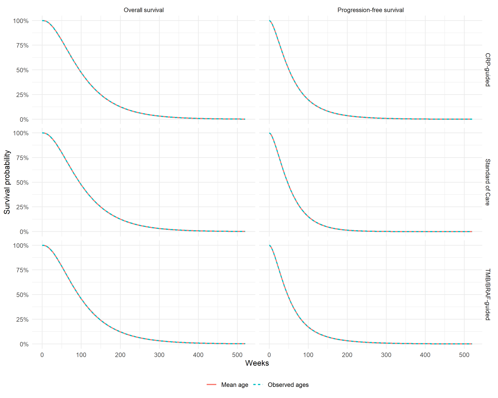

# Age Effect Analysis
Ben Geisler
2026-10-01

- [Overview](#overview)
- [Age Distribution](#age-distribution)
- [Restricted Mean Survival
  Comparison](#restricted-mean-survival-comparison)
- [Interpretation](#interpretation)
  - [Validation warnings](#validation-warnings)

# Overview

This technical note evaluates how population averaging over observed
ages affects survival predictions for the single joint economic model.
The comparison holds all patients at the mean observed age while
retaining their observed sex and biomarker values.

# Age Distribution

| Metric      | Value |
|:------------|------:|
| Patients    |    68 |
| Mean age    |  64.4 |
| Median age  |  65.0 |
| Minimum age |  38.0 |
| Maximum age |  80.0 |

Age distribution in the economic survival complete-case data

# Restricted Mean Survival Comparison

| Strategy | Endpoint | Base Case Years | Mean-Age Years | Difference |
|:---|:---|---:|---:|---:|
| Standard of Care | Overall survival | 2.187 | 2.185 | -0.001 |
| Standard of Care | Progression-free survival | 0.935 | 0.933 | -0.002 |
| CRP-guided | Overall survival | 2.187 | 2.186 | -0.001 |
| CRP-guided | Progression-free survival | 1.229 | 1.225 | -0.004 |
| TMB/BRAF-guided | Overall survival | 2.148 | 2.146 | -0.001 |
| TMB/BRAF-guided | Progression-free survival | 1.099 | 1.095 | -0.004 |

Restricted mean survival (years) over the 520-week (10-year) horizon,
trapezoidal rule, under observed-age and mean-age predictions

# Interpretation

The base case averages predictions over the observed age distribution.
The mean-age scenario is a diagnostic check that removes age
heterogeneity while keeping the same fitted survival model and strategy
definitions.

------------------------------------------------------------------------

**Report completed on:** 2026-10-01  
**Repository:** ben-geisler/METIMMOX-1  
**Report version:** 4.0

## Validation warnings

No warnings recorded during rendering.
