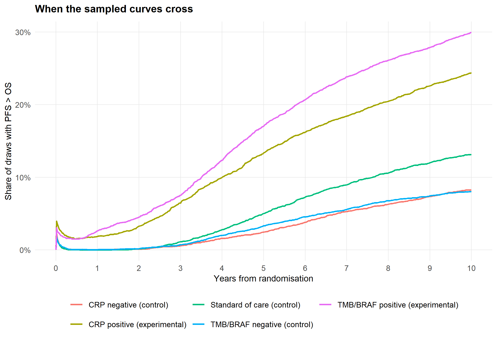
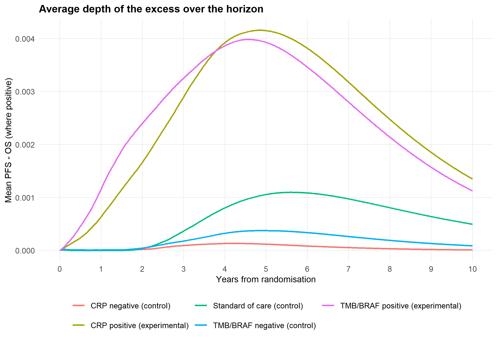
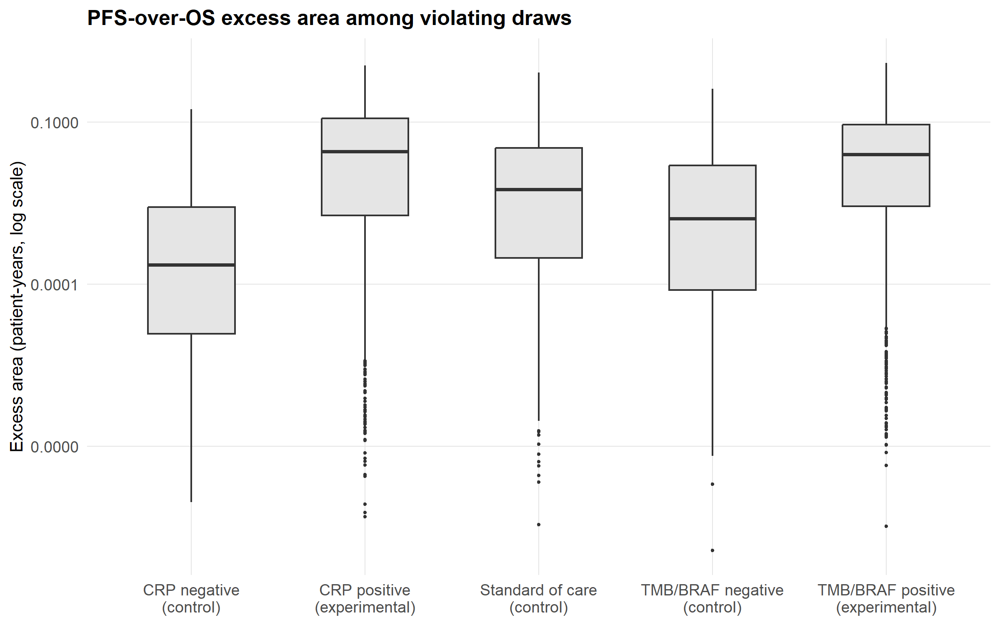
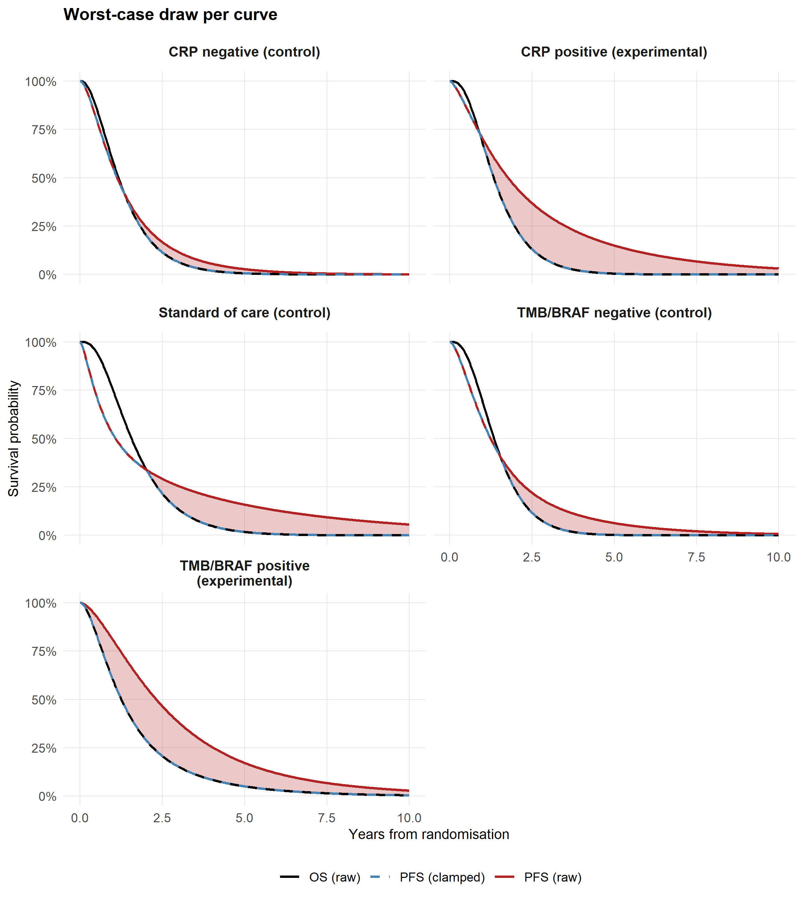

# PFS \> OS Ordering Violations in the PSA
Ben Geisler
2026-09-18

- [Overview](#overview)
- [Methods](#methods)
  - [Two sources of variation in a PSA
    draw](#two-sources-of-variation-in-a-psa-draw)
  - [Curves examined](#curves-examined)
  - [Metrics](#metrics)
  - [Mapping draws to PSA rows](#mapping-draws-to-psa-rows)
  - [Cache provenance](#cache-provenance)
- [Results](#results)
  - [How many draws are affected](#how-many-draws-are-affected)
  - [Where and how far the curves
    cross](#where-and-how-far-the-curves-cross)
  - [PFS-over-OS excess area before and after the
    clamp](#pfs-over-os-excess-area-before-and-after-the-clamp)
  - [QALY consequence of the clamp](#qaly-consequence-of-the-clamp)
  - [Is the clamp why the PSA increments differ from the base
    case?](#is-the-clamp-why-the-psa-increments-differ-from-the-base-case)
- [Interpretation](#interpretation)
- [Notes](#notes)

# Overview

The probabilistic sensitivity analysis (PSA) draws the coefficient
vectors of the joint overall survival (OS) and progression-free survival
(PFS) gamma models independently from their multivariate-normal sampling
distributions (issue \#156). Nothing in that scheme ties a PFS draw to
its OS draw, so a sampled pair can predict PFS above OS on part of the
10-year weekly grid. A partitioned survival model cannot represent that:
the progressed-state occupancy OS - PFS would be negative and the three
states would no longer sum to one.

The model handles the problem with a clamp. In PSA mode `model_fun()`
replaces the PFS curve by min(PFS, OS) for any curve that crosses and
emits a `survival_ordering_warning`; the PSA script counts those
warnings per subgroup but does not retain the curves. In the
deterministic base case the ordering is guaranteed by the
ordering-constrained distribution selection and any crossing stops the
model.

This report quantifies the crossings behind those warnings. For every
one of the 5,000 retained PSA rows it re-predicts the five
population-averaged subgroup curves that the PSA uses and reports:

1.  the number and share of draws, and of retained PSA rows, with at
    least one PFS \> OS violation, overall and per curve;
2.  where in the horizon the curves cross and by how much;
3.  the **PFS-over-OS excess area**, the area between the two curves on
    the stretch where PFS lies above OS (the trough in the figures),
    before the clamp (after the clamp it is zero by construction),
    together with the progression-free and progressed-state areas before
    and after the clamp;
4.  the discounted-QALY consequence of the clamp per curve and per
    strategy.

# Methods

## Two sources of variation in a PSA draw

Each PSA iteration draws one coefficient vector for the OS model (log
shape, log baseline rate, and the covariate effects on the log rate) and
one for the PFS model, each from the multivariate normal N(estimate,
covariance) of its own fit. Within the iteration the OS vector is shared
by every patient and every curve, and so is the PFS vector: a patient’s
rate is the baseline rate multiplied by the exponentiated covariate
effects for their age, sex, arm and biomarker values, with a common
shape. Patient heterogeneity is integrated out by averaging the 68
patient curves (or those of the subgroup) with the shared weights from
that row’s joint biomarker distribution (issue \#166), so only parameter
uncertainty varies between draws. The OS and PFS vectors of one
iteration are paired by index only: the two models are fitted separately
and no covariance between them is estimated, so a slow-hazard PFS draw
can be paired with a fast-hazard OS draw. That pairing, not patient
heterogeneity, is what produces the crossings.

## Curves examined

The PSA evaluates five curves per draw, each a population average over
the complete-case patients of the subgroup with `Rx` set as the strategy
dictates (issue \#151). They are the curves that `model_fun()` checks
and clamps one by one. The short labels in the first column are used in
the tables that follow.

| Label     | Curve                            | Patients | Rx set to    | Strategy |
|:----------|:---------------------------------|---------:|:-------------|:---------|
| SoC       | Standard of care (control)       |       68 | Control      | Control  |
| CRP+      | CRP positive (experimental)      |       23 | Experimental | CRP      |
| CRP-      | CRP negative (control)           |       45 | Control      | CRP      |
| TMB/BRAF+ | TMB/BRAF positive (experimental) |       30 | Experimental | TMB/BRAF |
| TMB/BRAF- | TMB/BRAF negative (control)      |       38 | Control      | TMB/BRAF |

Subgroup curves evaluated per draw

The curves are computed in closed form from the gamma
accelerated-failure-time parameters of each draw (shape and
covariate-specific rate) rather than through `flexsurv::predict()`,
which makes the full pass about twenty times faster. The closed form was
checked against the pipeline’s own prediction helper
(`generate_psa_population_averaged_predictions()`) on 3 draws and all
five curves for both outcomes: the largest absolute difference at any of
the 521 weekly points is 3.3e-16. The clamped QALYs computed here
reproduce the strategy QALYs that `model_fun()` returns for the same
draw.

## Metrics

For each draw and curve, with $t$ running over the weekly grid (0 to 520
weeks) and $\Delta_t = \max(\mathrm{PFS}_t - \mathrm{OS}_t, 0)$ the
excess of PFS over OS:

- **Violation**: $\Delta_t > 0$ at one or more time points. The number
  of violating time points, the first and last violating week, and the
  largest excess are recorded.
- **PFS-over-OS excess area (before the clamp)**: $\int \Delta_t \, dt$
  by the trapezoidal rule on the weekly grid, in patient-years. It is
  the area between the PFS and OS curves on the stretch where PFS lies
  on top. After the clamp, PFS is replaced by min(PFS, OS) and the area
  is zero.
- **State areas**: the progression-free area $\int \mathrm{PFS}_t\,dt$
  and the progressed-state area
  $\int (\mathrm{OS}_t - \mathrm{PFS}_t)\,dt$ before the clamp (the
  latter negative on the violating stretch), and
  $\int \min(\mathrm{PFS}_t, \mathrm{OS}_t)\,dt$ and
  $\int \max(\mathrm{OS}_t - \mathrm{PFS}_t, 0)\,dt$ after it, in
  patient-years. The clamp moves exactly the excess area from the
  progression-free state to the progressed state; OS is untouched.
- **QALY consequence**: discounted QALYs the raw curves would have
  produced minus the clamped QALYs. Because the model’s cycle sum gives
  $p_{PF} = \mathrm{PFS}$ and $p_P = \mathrm{OS} - \mathrm{PFS}$, the
  difference is $\sum_t \Delta_t \,(u_{np} - u_p)\, cl\, w_t$ using each
  PSA row’s sampled utilities, $cl = 1/52$ and effect discount weights
  $w_t$ at 4% per year. It is the amount by which the raw curves
  overstate QALYs by counting the excess as progression-free time at the
  higher utility.

Areas use the trapezoidal rule (the convention of
`restricted_mean_survival()`); the QALY consequence uses the model’s own
cycle sum so that it matches `model_fun()` exactly.

## Mapping draws to PSA rows

The PSA object records, for every retained row (`sim`), the
sampling-cache draw that produced it (`model_idx`; issue \#156).
Diagnostics retain the row’s sampled joint-population weights and
utilities and use its `model_idx` for the survival coefficients. Rows
whose original draw failed therefore keep their economic parameters
while using the replacement model. In the current cache 0 of 5,000 rows
were replaced. Counts below refer to these retained PSA rows.

## Cache provenance

The diagnostics are cached with a fingerprint of the sampling-cache
fingerprint, the explicit prediction population, the PSA parameter table
(including joint weights, utilities and model indices), the base
parameters, the discount rate, the horizon and the cycle length. Changes
to these inputs force regeneration. The PSA cache stores the same
sampling fingerprint. Before rendering, this report stops unless all
three caches carry the same sampling fingerprint and the diagnostics
file is younger than the sampling-cache file.

| Cache | Modified | Sampling fingerprint |
|:---|:---|:---|
| Sampling draws | 2026-09-17 16:11 | c12fbde06dee37fad84f8c7287d14c49f91849850ac0a1fecb1b78f5e7ff2e1a |
| PSA results | 2026-09-17 16:48 | c12fbde06dee37fad84f8c7287d14c49f91849850ac0a1fecb1b78f5e7ff2e1a |
| Violation diagnostics | 2026-09-18 10:20 | c12fbde06dee37fad84f8c7287d14c49f91849850ac0a1fecb1b78f5e7ff2e1a |

Caches read by this report

*Note:* Files in data/tidy: Sampling draws:
sampling_models_n5000_full.rds; PSA results: psa_obj_correct.rds;
Violation diagnostics: pfs_os_violations_n5000.rds.

# Results

## How many draws are affected

| Quantity                                       |        Value |
|:-----------------------------------------------|-------------:|
| Sampling-cache draws evaluated                 |        5,000 |
| Draws with PFS \> OS on at least one curve     |        2,422 |
| Share of draws affected (Monte Carlo SE)       | 48.4% (0.7%) |
| Retained PSA rows                              |        5,000 |
| PSA rows whose draw has at least one violation |        2,422 |
| Share of PSA rows affected                     |        48.4% |

Draws and PSA rows with a PFS \> OS violation

**48.4% of the 5,000 coefficient draws** put PFS above OS on at least
one of the five curves, and 48.4% of the retained PSA rows come from
such a draw. The clamp is therefore not a rare safety net but acts in
roughly half of the PSA.

| Curve     | Draws violating | Share of draws | MC SE |
|:----------|----------------:|---------------:|------:|
| SoC       |             744 |          14.9% | 0.50% |
| CRP+      |           1,409 |          28.2% | 0.64% |
| CRP-      |             524 |          10.5% | 0.43% |
| TMB/BRAF+ |           1,655 |          33.1% | 0.67% |
| TMB/BRAF- |             494 |           9.9% | 0.42% |

Draws with PFS \> OS, by curve

*Note:* Each draw contributes one OS and one PFS coefficient vector
shared by all five curves, so the same draw can violate on several
curves. MC SE: binomial Monte Carlo standard error of the share over
5,000 draws.

| Curves violating in the draw | Draws | Share |
|-----------------------------:|------:|------:|
|                            0 | 2,578 | 51.6% |
|                            1 |   830 | 16.6% |
|                            2 | 1,092 | 21.8% |
|                            3 |   274 |  5.5% |
|                            4 |   140 |  2.8% |
|                            5 |    86 |  1.7% |

Number of curves (out of five) with PFS \> OS per draw

## Where and how far the curves cross

| Curve | Violating draws | Points, median \[IQR\] | Points, max | First week | Last week |
|:---|---:|---:|---:|---:|---:|
| SoC | 744 | 203 \[87, 289\] | 454 | 272 (1) | 520 (520) |
| CRP+ | 1,409 | 249 \[98, 353\] | 520 | 219 (1) | 520 (520) |
| CRP- | 524 | 162 \[31, 254\] | 451 | 280 (1) | 520 (520) |
| TMB/BRAF+ | 1,655 | 267 \[142, 353\] | 520 | 219 (1) | 520 (520) |
| TMB/BRAF- | 494 | 191 \[56, 293\] | 468 | 254 (1) | 520 (520) |

Where the curves cross, among violating draws

*Note:* Points: number of the 521 weekly grid points (weeks 0 to 520) at
which PFS exceeds OS. First week: median (minimum) of the first
violating week; last week: median (maximum) of the last violating week.

| Curve     | Violating draws | Median | 95th percentile | Maximum |
|:----------|----------------:|-------:|----------------:|--------:|
| SoC       |             744 | 0.0024 |          0.0480 |  0.1501 |
| CRP+      |           1,409 | 0.0085 |          0.0870 |  0.2385 |
| CRP-      |             524 | 0.0002 |          0.0104 |  0.0532 |
| TMB/BRAF+ |           1,655 | 0.0074 |          0.0828 |  0.2762 |
| TMB/BRAF- |             494 | 0.0011 |          0.0286 |  0.1097 |

Largest PFS - OS within the draw (survival-probability units), among
violating draws

## PFS-over-OS excess area before and after the clamp

| Curve     |   Mean | Median | 95th percentile | Maximum | After clamp |
|:----------|-------:|-------:|----------------:|--------:|------------:|
| SoC       | 0.0406 | 0.0057 |          0.2193 |  0.8307 |           0 |
| CRP+      | 0.0899 | 0.0284 |          0.3899 |  1.1179 |           0 |
| CRP-      | 0.0056 | 0.0002 |          0.0287 |  0.1728 |           0 |
| TMB/BRAF+ | 0.0762 | 0.0250 |          0.3444 |  1.2468 |           0 |
| TMB/BRAF- | 0.0195 | 0.0016 |          0.1037 |  0.4157 |           0 |

PFS-over-OS excess area (patient-years) among violating draws, before
and after the clamp

*Note:* Area = integral of max(PFS - OS, 0) over the 10-year horizon,
trapezoidal rule on the weekly grid, in patient-years per patient. After
the clamp PFS = min(PFS, OS) and the area is zero for every draw.

| State            | Curve     | Before clamp | After clamp |  Change |
|:-----------------|:----------|-------------:|------------:|--------:|
| Progression-free | CRP+      |       1.9036 |      1.8783 | -0.0253 |
| Progression-free | CRP-      |       1.0272 |      1.0266 | -0.0006 |
| Progression-free | SoC       |       1.1826 |      1.1765 | -0.0060 |
| Progression-free | TMB/BRAF+ |       1.4890 |      1.4638 | -0.0252 |
| Progression-free | TMB/BRAF- |       1.0595 |      1.0576 | -0.0019 |
| Progressed       | CRP+      |       0.9679 |      0.9932 |  0.0253 |
| Progressed       | CRP-      |       0.8867 |      0.8873 |  0.0006 |
| Progressed       | SoC       |       1.0875 |      1.0935 |  0.0060 |
| Progressed       | TMB/BRAF+ |       0.7903 |      0.8155 |  0.0252 |
| Progressed       | TMB/BRAF- |       1.1000 |      1.1019 |  0.0019 |

Mean state areas over all draws (patient-years), before and after the
clamp

*Note:* Means over all 5,000 draws (non-violating draws are unchanged by
the clamp). Progression-free area = integral of PFS (min(PFS, OS) after
the clamp); progressed area = integral of OS - PFS (negative on the
violating stretch before the clamp; max(OS - PFS, 0) after). The change
is the all-draw mean excess area, moved from the progression-free to the
progressed state; the OS area (SoC 2.270, CRP+ 2.872, CRP- 1.914,
TMB/BRAF+ 2.279, TMB/BRAF- 2.159 patient-years) is unchanged.

Averaged over all draws, the clamp moves 0.0060 patient-years from the
progression-free to the progressed state on the standard-of-care curve,
against a mean progressed-state area after the clamp of 1.094
patient-years. The largest excess area on any curve is 1.247
patient-years (TMB/BRAF positive (experimental)).

## QALY consequence of the clamp

| Curve     | All draws | Violating draws | Maximum | Clamped QALYs | Relative |
|:----------|----------:|----------------:|--------:|--------------:|---------:|
| SoC       |    0.0007 |          0.0044 |  0.0929 |         1.415 |    0.05% |
| CRP+      |    0.0028 |          0.0101 |  0.1529 |         1.815 |    0.16% |
| CRP-      |    0.0001 |          0.0007 |  0.0283 |         1.214 |    0.01% |
| TMB/BRAF+ |    0.0029 |          0.0087 |  0.1423 |         1.455 |    0.20% |
| TMB/BRAF- |    0.0002 |          0.0021 |  0.0473 |         1.344 |    0.02% |

Discounted QALYs the raw curves would add relative to the clamped
curves, by curve

*Note:* Raw minus clamped discounted QALYs per patient = sum over cycles
of max(PFS - OS, 0) x (u_np - u_p) x cycle length x discount weight;
mean over all draws and over violating draws, and the maximum. Clamped
QALYs: mean over all draws. Relative: all-draw mean difference as a
share of the mean clamped QALYs of the curve.

| Strategy | Mean overstatement | Maximum | Mean PSA QALYs |
|:---------|-------------------:|--------:|---------------:|
| Control  |             0.0007 |  0.0929 |          1.415 |
| CRP      |             0.0010 |  0.0486 |          1.417 |
| TMB/BRAF |             0.0014 |  0.0614 |          1.392 |

QALY overstatement of the raw curves by strategy (per patient,
discounted)

*Note:* Strategy values use each PSA draw’s joint-population weights,
marginal prevalences and utilities. Mean PSA QALYs are the cached PSA
means (clamped curves).

| Strategy | Mean shift | Largest downward | Largest upward |
|:---------|-----------:|-----------------:|---------------:|
| CRP      |    -0.0003 |          -0.0486 |         0.0924 |
| TMB/BRAF |    -0.0007 |          -0.0614 |         0.0764 |

Shift of the incremental QALYs versus standard of care caused by the
clamp (clamped minus raw, per patient)

*Note:* Per draw, the clamp’s effect on the strategy’s QALYs minus its
effect on standard of care. A negative value means the clamp makes the
guided strategy look worse relative to standard of care than the raw
curves would.

The clamp lowers the QALYs of every strategy, because the excess is
progression-free time that becomes progressed time at the lower sampled
utility. The mean overstatement the raw curves would have produced is
0.0007 QALYs for standard of care, 0.0010 for the CRP-guided strategy
and 0.0014 for the TMB/BRAF-guided strategy. What matters for the
decision is the effect on the increment: the clamp shifts the mean
incremental QALYs of the CRP-guided strategy versus standard of care by
-0.0003 and of the TMB/BRAF-guided strategy by -0.0007, with a per-draw
range from -0.0486 to 0.0924 for CRP.

## Is the clamp why the PSA increments differ from the base case?

| Strategy | Base case | PSA, clamped | PSA, raw |
|:---------|----------:|-------------:|---------:|
| Control  |    1.3714 |       1.4149 |   1.4156 |
| CRP      |    1.3920 |       1.4167 |   1.4177 |
| TMB/BRAF |    1.3599 |       1.3924 |   1.3938 |

Discounted QALYs per patient: deterministic base case, PSA mean with the
clamp (the cached PSA), and PSA mean the raw curves would have given

*Note:* PSA, raw = cached PSA mean + mean overstatement of the raw
curves for the strategy.

| Strategy | Base case | PSA, clamped | PSA, raw |
|:---------|----------:|-------------:|---------:|
| CRP      |    0.0205 |       0.0018 |   0.0021 |
| TMB/BRAF |   -0.0115 |      -0.0226 |  -0.0218 |

Incremental discounted QALYs versus standard of care: base case, PSA
mean with the clamp, and PSA mean without it

The test protocol records that the PSA incremental QALYs of the
CRP-guided strategy (0.0018) fall well short of the base case (0.0205).
Removing the clamp would move the PSA increment only to 0.0021: the
clamp accounts for 1.8% of the gap. The rest is the nonlinearity of the
extrapolated gamma curves in their coefficients under independent OS and
PFS draws, which lifts every strategy’s mean QALYs above its base case
by a different amount, not the ordering correction.

# Interpretation

- **The crossings are frequent but shallow.** About 48% of draws cross
  on at least one curve, yet the median violating draw crosses by at
  most 0.0040 in survival probability and carries an excess area of
  0.0102 patient-years. The crossings sit in the extrapolated tail where
  both curves are close to their floor, so the area involved is small
  relative to the restricted OS area of about 2.30 patient-years.
- **The clamp is a one-sided correction.** min(PFS, OS) accepts the OS
  draw as given and truncates PFS; it never raises OS. Because OS and
  PFS are drawn independently, the direction of the error in any one
  draw is unknown, and the clamp therefore shifts every strategy’s QALYs
  downward rather than towards the base case.
- **The consequence is differential but small.** The five curves cross
  at different rates (SoC 15%; CRP+ 28%; CRP- 10%; TMB/BRAF+ 33%;
  TMB/BRAF- 10%), so the clamp moves the increments of the guided
  strategies versus standard of care, not only their levels. The mean
  shift on the CRP increment is -0.0003 QALYs against a base-case
  incremental gain of 0.0205. Individual draws can move by up to 0.092
  QALYs, so the clamp widens the spread of the increments more than it
  moves their mean.
- **The clamp does not explain the PSA-versus-base-case gap.** The known
  failure of `test_psa_basecase_alignment.R` on the incremental QALYs
  (PSA 0.0018 versus base case 0.0205 for CRP) would remain almost
  unchanged without the clamp (0.0021). The test protocol’s attribution
  of that gap to the clamp should be read as an attribution to the
  independent OS and PFS draws themselves.
- **What would remove the violations.** A joint OS/PFS covariance
  (drawing the two coefficient vectors together) would restore the
  correlation that the earlier bootstrap preserved by refitting both
  models on the same resample, though it would only make crossings
  rarer, not impossible; drawing on a latent shared frailty or sampling
  PFS conditionally on OS would guarantee ordering by construction. Both
  are changes to the sampling scheme of script 06 and are out of scope
  for this report, which documents the size of the problem under the
  current scheme (user decision, issue \#156: OS and PFS are drawn
  independently).

# Notes

- The diagnostics are cached in
  `data/tidy/pfs_os_violations_n{n_samples}.rds`;
  `run_pfs_os_violation_diagnostics()` regenerates the cache on any
  fingerprint mismatch. The current cache was built from sampling cache
  c12fbde06dee37fad84f8c7287d14c49f91849850ac0a1fecb1b78f5e7ff2e1a
  (method mvn_v1) in 1058 seconds on 2026-09-18 10:20.
- Curves are computed in closed form from the gamma parameters of each
  draw; `validate_direct_curves()` checks them against the pipeline’s
  `predict()`-based helper before every regeneration and stops if they
  differ by more than 1e-8.
- All values are per patient over the 10-year horizon; areas are
  restricted means by the trapezoidal rule, QALY differences use the
  model’s cycle sum.
- “PFS-over-OS excess area” is this report’s term for the area between
  the two curves on the stretch where they are inverted; it is not a
  standard quantity. The figures call the same region the trough.

------------------------------------------------------------------------

**Report completed on:** 2026-09-18\
**Repository:** ben-geisler/METIMMOX-1\
**Report version:** 1.2
