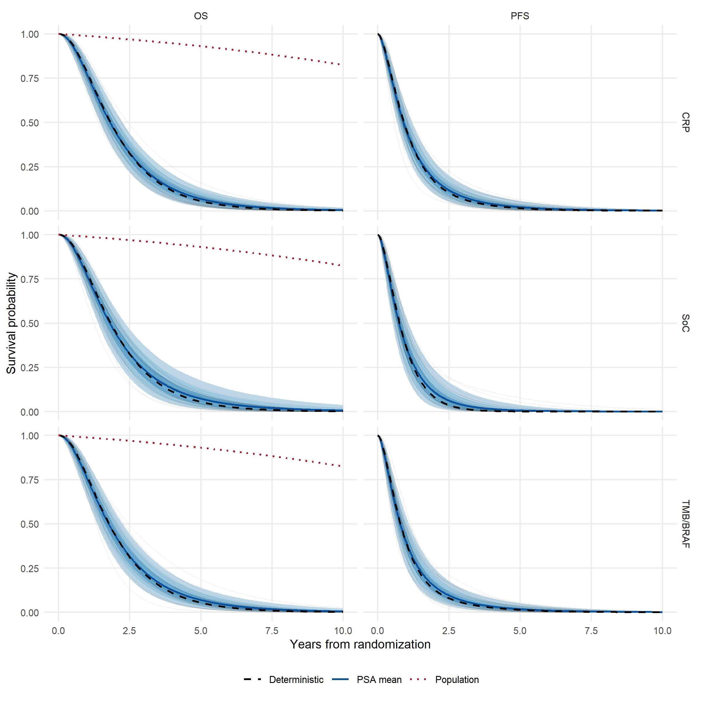
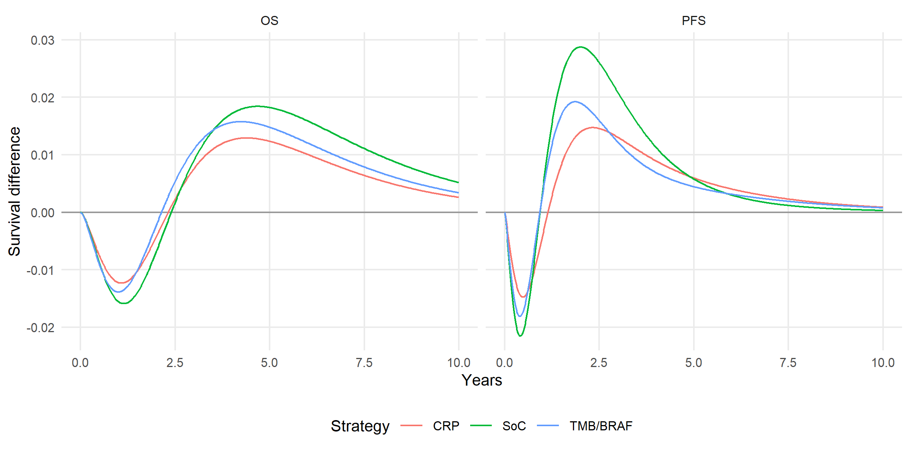
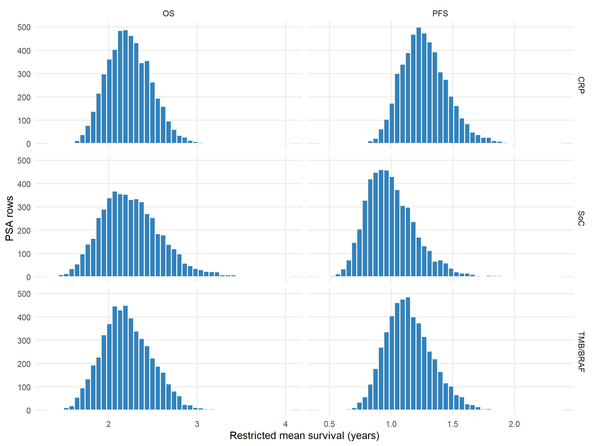

# PSA Extrapolation Plausibility
Ben Geisler
2026-09-25

- [Purpose and scope](#purpose-and-scope)
- [Norwegian population reference](#norwegian-population-reference)
- [Sampled survival curves](#sampled-survival-curves)
- [Restricted means and tail
  contributions](#restricted-means-and-tail-contributions)
  - [Ranked by OS RMST](#ranked-by-os-rmst)
  - [Ranked by PFS RMST](#ranked-by-pfs-rmst)
- [Relationship to PFS-above-OS
  violations](#relationship-to-pfs-above-os-violations)
- [Verdict](#verdict)

# Purpose and scope

This report investigates whether optimistic survival tails dominate the
PSA mean QALYs (issue \#179). It uses all 5000 retained PSA rows and the
existing joint OS/PFS coefficient draws. SoC denotes standard of care;
CRP denotes guidance by week-4 CRP, before the first nivolumab dose;
TMB/BRAF denotes baseline NGS guidance. All strategies target the same
68 complete-case patients.

The sampling cache and paired PSA files pass their current
input-fingerprint and pair validations. The ordering cache passes its
full fingerprint check, including population, PSA parameters, utilities
and horizon. No cache is generated or rewritten. The reconstruction uses
the saved `model_idx`, joint population weights and utilities of each
PSA row, and reproduces all cached strategy QALYs to a maximum absolute
error of 4.440892e-16. The PFS curves shown are **after the
subgroup-level OS clamp**, as used economically; OS is unchanged. The
ordering analysis uses the **raw, unclamped** subgroup curves.

| Strategy | Deterministic |     PSA |     Gap |    MCSE |
|:---------|--------------:|--------:|--------:|--------:|
| SoC      |       1.33995 | 1.37753 | 0.03758 | 0.00419 |
| CRP      |       1.37748 | 1.40075 | 0.02327 | 0.00381 |
| TMB/BRAF |       1.33889 | 1.36962 | 0.03073 | 0.00390 |

MCSE is the Monte Carlo standard error of the PSA mean. A nonlinear mean
under parameter uncertainty need not equal the deterministic result. The
existing five-MCSE alignment diagnostic remains a known failure; this
report does not recenter draws, relax that criterion, or replace
reported economic results.

# Norwegian population reference

The public [Statistics Norway life table
07902](https://www.ssb.no/en/statbank/table/07902) provides 2025
sex-specific annual death probabilities (updated 12 March 2026;
retrieved 23 September 2026 from the [official Deaths
table](https://www.ssb.no/en/befolkning/fodte-og-dode/statistikk/dode)).
The versioned extract is `data/external/ssb_07902_2025.csv` (MD5
f48d606ae9b8770d8981c4d9bb4b692e). Conditional survival from each
patient’s baseline age uses constant hazards within each attained-age
year, $h_x=-\log(1-q_x)$, including fractional years. Trial sex 0 maps
to female and 1 to male. Individual reference curves are averaged
equally over the observed cohort (32 female, 36 male; mean age 64.4
years). The same fixed cohort reference is used for every strategy and
draw; PSA population-weight uncertainty remains in the cancer curves.
This is a 2025 **period** reference, with no future mortality
improvement, not a historical trial-year life table or an individual
cancer-survival prediction.

The matched population survival at week 520 is 82.51%. Exceedance means
strategy-average OS exceeds that fixed reference by more than $10^{-10}$
at any weekly point (or at week 520 specifically). The shared value of
one at week zero is not an exceedance. This aggregate check is a
permissive plausibility screen: it cannot establish plausible individual
hazards, validate a cancer-specific tail, or exclude implausibility
below population survival.

| Strategy | Any week: n (%) | Week 520: n (%) | Maximum OS at 520 |
|:---------|:----------------|:----------------|:------------------|
| SoC      | 4467 (89.34%)   | 0 (0.00%)       | 15.75%            |
| CRP      | 4469 (89.38%)   | 0 (0.00%)       | 4.69%             |
| TMB/BRAF | 4404 (88.08%)   | 0 (0.00%)       | 7.74%             |

| Strategy | First week | Last week | After year 1: n | Max excess (pp) |
|:---------|-----------:|----------:|----------------:|----------------:|
| SoC      |          1 |        27 |               0 |          0.2929 |
| CRP      |          1 |        24 |               0 |          0.2616 |
| TMB/BRAF |          1 |        27 |               0 |          0.2957 |

The timing table pools all draws: it gives the earliest and latest
weekly exceedance, and the largest vertical excess in percentage points
(pp). The mean positive excess area is 0.0000254, 0.0000260, 0.0000227
life-years for SoC, CRP and TMB/BRAF, respectively. The deterministic OS
curves also exceed the reference for SoC, CRP, TMB/BRAF. Thus any-week
counts must be interpreted alongside timing and magnitude, rather than
equated with the frequency of implausibly long tails. Gamma
distributions with shape greater than one start with zero hazard,
whereas the population reference has a positive hazard from time zero. A
brief initial excess can arise from this shape property; it is still a
departure from the population reference.

# Sampled survival curves

Ribbons are pointwise central 95%, 80% and 50% intervals over **all
5,000** PSA rows, drawn from light to dark. Fifty evenly spaced row
indices supply the thin spaghetti lines; they are not selected for their
outcomes. Solid blue is the PSA mean, dashed black the deterministic
curve, and dotted red the Norwegian reference (OS only). The lower plot
makes the mean-minus-deterministic gap visible.

# Restricted means and tail contributions

Restricted mean survival time (RMST) is the undiscounted trapezoidal
area from week 0 to 520, in years, calculated with
`restricted_mean_survival()`. PFS RMST uses clamped curves. QALYs retain
sampled utilities and 4% effect discounting. Ranking is performed
**separately within each strategy and endpoint**; ties use PSA row
order. Thus OS-ranked and PFS-ranked trims can remove different draws.
The top 1%, 5% and 10% contain 50, 250 and 500 rows, respectively.

| strategy | endpoint |  Mean | Median |   P95 |   P99 | Maximum |
|:---------|:---------|------:|-------:|------:|------:|--------:|
| CRP      | OS       | 2.230 |  2.217 | 2.649 | 2.847 |   3.166 |
| CRP      | PFS      | 1.272 |  1.255 | 1.600 | 1.781 |   2.008 |
| SoC      | OS       | 2.256 |  2.224 | 2.858 | 3.209 |   4.036 |
| SoC      | PFS      | 1.002 |  0.974 | 1.388 | 1.634 |   2.374 |
| TMB/BRAF | OS       | 2.206 |  2.185 | 2.697 | 2.926 |   3.522 |
| TMB/BRAF | PFS      | 1.145 |  1.128 | 1.487 | 1.655 |   2.057 |

Contribution is the sum of QALYs in the selected upper tail divided by
the sum over all rows, equivalently its contribution to the untrimmed
PSA mean. Trimmed means renormalize over retained rows. These are
**selection diagnostics only**: trimming favorable outcomes necessarily
lowers the mean even for a valid distribution. It is not evidence by
itself that any draw should be rejected.

## Ranked by OS RMST

| Strategy | Top    | RMST cutoff | QALY contribution |
|:---------|:-------|------------:|:------------------|
| SoC      | 1.00%  |       3.213 | 1.43%             |
| SoC      | 5.00%  |       2.859 | 6.55%             |
| SoC      | 10.00% |       2.707 | 12.56%            |
| CRP      | 1.00%  |       2.853 | 1.29%             |
| CRP      | 5.00%  |       2.649 | 6.09%             |
| CRP      | 10.00% |       2.559 | 11.85%            |
| TMB/BRAF | 1.00%  |       2.939 | 1.33%             |
| TMB/BRAF | 5.00%  |       2.697 | 6.19%             |
| TMB/BRAF | 10.00% |       2.588 | 11.95%            |

| Strategy | Trim   | PSA mean | Trimmed mean | Trimmed - det. |
|:---------|:-------|---------:|-------------:|---------------:|
| SoC      | 1.00%  |  1.37753 |      1.37155 |        0.03159 |
| SoC      | 5.00%  |  1.37753 |      1.35510 |        0.01515 |
| SoC      | 10.00% |  1.37753 |      1.33831 |       -0.00164 |
| CRP      | 1.00%  |  1.40075 |      1.39668 |        0.01921 |
| CRP      | 5.00%  |  1.40075 |      1.38471 |        0.00723 |
| CRP      | 10.00% |  1.40075 |      1.37189 |       -0.00558 |
| TMB/BRAF | 1.00%  |  1.36962 |      1.36504 |        0.02615 |
| TMB/BRAF | 5.00%  |  1.36962 |      1.35250 |        0.01361 |
| TMB/BRAF | 10.00% |  1.36962 |      1.33998 |        0.00108 |

## Ranked by PFS RMST

| Strategy | Top    | RMST cutoff | QALY contribution |
|:---------|:-------|------------:|:------------------|
| SoC      | 1.00%  |       1.634 | 1.27%             |
| SoC      | 5.00%  |       1.389 | 5.90%             |
| SoC      | 10.00% |       1.276 | 11.48%            |
| CRP      | 1.00%  |       1.781 | 1.28%             |
| CRP      | 5.00%  |       1.601 | 5.95%             |
| CRP      | 10.00% |       1.513 | 11.51%            |
| TMB/BRAF | 1.00%  |       1.657 | 1.31%             |
| TMB/BRAF | 5.00%  |       1.487 | 5.98%             |
| TMB/BRAF | 10.00% |       1.399 | 11.66%            |

| Strategy | Trim   | PSA mean | Trimmed mean | Trimmed - det. |
|:---------|:-------|---------:|-------------:|---------------:|
| SoC      | 1.00%  |  1.37753 |      1.37379 |        0.03384 |
| SoC      | 5.00%  |  1.37753 |      1.36444 |        0.02449 |
| SoC      | 10.00% |  1.37753 |      1.35481 |        0.01486 |
| CRP      | 1.00%  |  1.40075 |      1.39673 |        0.01925 |
| CRP      | 5.00%  |  1.40075 |      1.38674 |        0.00926 |
| CRP      | 10.00% |  1.40075 |      1.37721 |       -0.00027 |
| TMB/BRAF | 1.00%  |  1.36962 |      1.36530 |        0.02641 |
| TMB/BRAF | 5.00%  |  1.36962 |      1.35546 |        0.01657 |
| TMB/BRAF | 10.00% |  1.36962 |      1.34438 |        0.00549 |

# Relationship to PFS-above-OS violations

Each reconstructed row joins the ordering cache on **model_idx plus
simulation ID and curve**. The additional keys preserve the population
and utility draws if a replacement coefficient vector is reused. There
are 0 repeated model indices in this PSA. A guided strategy is
classified as crossing if either contributing subgroup crosses; SoC uses
its own curve. All reconstructed raw flags agree with the saved flags.
The long-tail indicator here is the **top 10% by strategy OS RMST**.
Counts below compare its crossing rate with the other 90%; medians
describe OS RMST in crossing and non-crossing draws.

| Strategy | Crossings | Top 10%: n (%) | Other 90%: n (%) |
|:---------|----------:|:---------------|:-----------------|
| SoC      |       155 | 7 (1.40%)      | 148 (3.29%)      |
| CRP      |       688 | 34 (6.80%)     | 654 (14.53%)     |
| TMB/BRAF |       945 | 60 (12.00%)    | 885 (19.67%)     |

| Strategy | RMST: crossing | RMST: other | Odds ratio (95% CI) | Fisher p |
|:---------|---------------:|------------:|:--------------------|:---------|
| SoC      |          2.081 |       2.229 | 0.42 (0.16, 0.89)   | 0.02     |
| CRP      |          2.160 |       2.227 | 0.43 (0.29, 0.62)   | \<0.001  |
| TMB/BRAF |          2.146 |       2.194 | 0.56 (0.41, 0.74)   | \<0.001  |

Fisher’s exact test compares crossing odds in the upper decile versus
the rest. It describes association within simulated draws, not clinical
hypothesis testing; the three strategies share coefficient draws and
these comparisons are dependent.

# Verdict

The diagnostics support a broadly distributed nonlinear averaging effect
rather than a mean dominated by a tiny, demonstrably implausible
survival tail. Across SoC, CRP and TMB/BRAF, the highest 1% of OS-RMST
draws contribute 1.43%, 1.29% and 1.33% of total QALYs; removing them
changes the means by 0.00598, 0.00407 and 0.00458 QALYs, leaving gaps of
0.03159, 0.01921 and 0.02615 above the deterministic results. The top
10% contribute 12.56%, 11.85% and 11.95%, showing meaningful upper-tail
sensitivity without dominance. 13340 of 15000 strategy-draw curves
exceed matched population survival at any modeled week (0 at week 520).
Crossing rates in the top OS-RMST decile are 1.40%, 6.80% and 12.00%
versus 3.29%, 14.53% and 19.67% in the remaining draws, distinguishing
ordering violations from optimistic OS tails. The exceedances occur
between weeks 1 and 27, with a maximum vertical excess of 0.2957
percentage points; they therefore require interpretation as an
early-curve limitation, not evidence that optimistic ten-year tails
dominate the mean. The evidence favors the broad-spread explanation for
the mean shift, but does not establish that every extrapolation is
plausible: a general-population comparator is too permissive to
establish cancer-specific extrapolation validity. The unbounded
extrapolation remains a stated limitation; no draw is excluded, no mean
is corrected, and a population-mortality hazard floor remains outside
this paper’s scope.

------------------------------------------------------------------------

**Report completed on:** 2026-09-25  
**Repository:** ben-geisler/METIMMOX-1  
**Report version:** 1.0
