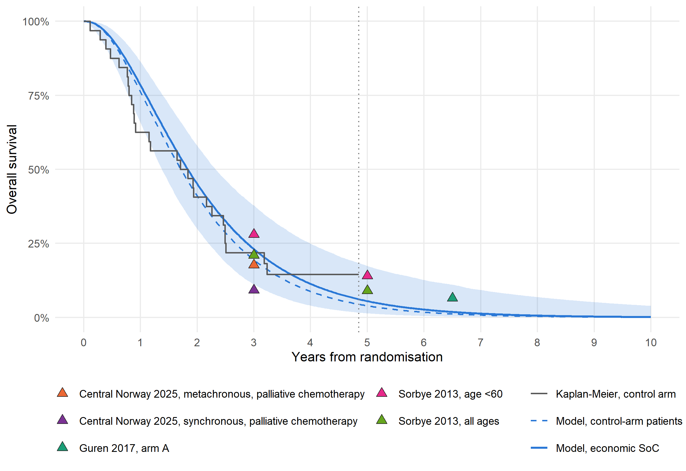

# Survival Extrapolation Validation
Ben Geisler
2026-10-01

- [Purpose and classification](#purpose-and-classification)
- [Dependent validation: model versus trial
  Kaplan-Meier](#dependent-validation-model-versus-trial-kaplan-meier)
- [Independent validation: published first-line mCRC
  survival](#independent-validation-published-first-line-mcrc-survival)
  - [Benchmarks and tolerance](#benchmarks-and-tolerance)
  - [Comparison](#comparison)
  - [Interpretation](#interpretation)
  - [Secondary comparison: control-arm
    patients](#secondary-comparison-control-arm-patients)
  - [Model-predicted control-arm OS at fixed
    landmarks](#model-predicted-control-arm-os-at-fixed-landmarks)
- [Applicability of the benchmarks](#applicability-of-the-benchmarks)
- [Limitations](#limitations)
- [References](#references)
  - [Validation warnings](#validation-warnings)

# Purpose and classification

This report answers validateHE finding TR-COMP-022 (AdViSHE item D4:
model outcomes compared with empirical data) and GitHub issue \#162. The
economic model extrapolates the gamma (OS) and gamma (PFS) joint
regression models, fitted to 68 complete-case patients with at most 4.8
years of follow-up, to a 10-year horizon. Before this report, the fits
had been compared only visually with the trial’s own Kaplan-Meier curves
(`para_models.qmd`, `survival_model_specification.qmd`).

The report contains two comparisons, classified as AdViSHE asks:

- **Dependent validation (Section 2).** Model versus Kaplan-Meier OS and
  PFS at 1, 2, 3 and 5 years and at the median, in the METIMMOX patients
  the curves were fitted to. Agreement here shows that the fit
  reproduces its own data. It says nothing about the extrapolated tail.
- **Independent validation (Section 3).** The economic standard-of-care
  curves against published survival of first-line mCRC patients outside
  METIMMOX. The benchmarks and the tolerance were committed (not
  available) before any comparison was computed.

The general-population plausibility check of the PSA draws (Norwegian
life table) is in `psa_extrapolation_plausibility.qmd` (issue \#179) and
is not repeated here.

# Dependent validation: model versus trial Kaplan-Meier

Each Kaplan-Meier curve is compared with the model predicted for
**exactly the same patients**, each with their own age, sex, biomarker
values and actual arm, then averaged (the issue \#157 convention). The
groups are those that enter the economic model:

- control-arm patients (SoC);
- biomarker-positive patients on FLOX + nivolumab;
- biomarker-negative patients on FLOX.

Kaplan-Meier 95% confidence intervals use the log-log transformation.
The model interval is the 2.5th-97.5th percentile over 1000 joint
coefficient draws from the PSA sampling cache, with the patients held
fixed.

A Kaplan-Meier landmark after a group’s last observed time is not
estimable (“NE”). Where every patient had an event before the landmark,
the estimate is 0 without a confidence interval. 5 of the 40 landmark
cells are NE, including every 5-year Kaplan-Meier cell. 7 estimable
cells rest on fewer than 5 patients at risk.

| Group | Landmark | Kaplan-Meier | KM 95% CI | At risk | Model | Model 95% interval | In KM CI |
|:---|:---|---:|---:|---:|---:|---:|:--:|
| SoC (n = 32) | 1 year | 62.5% | 43.5-76.7% | 20 | 76.2% | 63.5-85.1% | Yes |
|  | 2 years | 40.6% | 23.8-56.8% | 13 | 41.1% | 27.7-53.9% | Yes |
|  | 3 years | 21.9% | 9.6-37.2% | 6 | 19.4% | 10.1-31.8% | Yes |
|  | 5 years | NE | – | 0 | 3.9% | 1.2-11.9% | – |
|  | Median (months) | 21.2 | 10.5-29.5 |  | 20.6 | 15.8-25.7 | Yes |
| CRP+ (n = 17) | 1 year | 100.0% | – | 17 | 87.1% | 74.0-94.0% | – |
|  | 2 years | 64.7% | 37.7-82.3% | 11 | 60.9% | 41.1-76.8% | Yes |
|  | 3 years | 35.3% | 14.5-57.0% | 6 | 38.0% | 20.2-57.5% | Yes |
|  | 5 years | NE | – | 0 | 12.5% | 3.6-28.9% | – |
|  | Median (months) | 26.2 | 19.5-41.1 |  | 29.3 | 20.4-40.7 | Yes |
| CRP- (n = 26) | 1 year | 57.7% | 36.8-73.9% | 15 | 73.8% | 59.6-83.7% | Yes |
|  | 2 years | 42.3% | 23.5-60.0% | 11 | 36.7% | 22.7-51.2% | Yes |
|  | 3 years | 19.2% | 7.0-36.0% | 4 | 15.5% | 7.2-28.6% | Yes |
|  | 5 years | NE | – | 0 | 2.2% | 0.6-8.2% | – |
|  | Median (months) | 20.9 | 10.2-29.5 |  | 19.2 | 14.4-24.5 | Yes |
| TMB/BRAF+ (n = 16) | 1 year | 87.5% | 58.6-96.7% | 15 | 82.3% | 67.5-91.2% | Yes |
|  | 2 years | 50.0% | 24.5-71.0% | 8 | 53.4% | 34.1-70.6% | Yes |
|  | 3 years | 31.2% | 11.4-53.6% | 5 | 32.0% | 16.1-51.0% | Yes |
|  | 5 years | NE | – | 0 | 10.6% | 2.9-25.1% | – |
|  | Median (months) | 23.8 | 15.6-38.7 |  | 25.6 | 17.5-36.7 | Yes |
| TMB/BRAF- (n = 18) | 1 year | 72.2% | 45.6-87.4% | 13 | 76.4% | 60.6-86.7% | Yes |
|  | 2 years | 38.9% | 17.5-60.0% | 7 | 41.6% | 24.1-58.0% | Yes |
|  | 3 years | 16.7% | 4.1-36.5% | 3 | 20.1% | 7.7-36.5% | Yes |
|  | 5 years | NE | – | 0 | 4.3% | 0.7-14.6% | – |
|  | Median (months) | 22.6 | 10.9-29.5 |  | 20.7 | 14.9-28.1 | Yes |

Overall survival: Kaplan-Meier versus model predicted for the same
patients

*Note:* NE: not estimable (after the group’s last follow-up). NR: not
reached. At risk: patients at risk at the landmark. In KM CI: model
point estimate inside the Kaplan-Meier 95% CI; – where the Kaplan-Meier
CI is unavailable (not estimable, or no event yet so the estimate is
100% with a degenerate interval). Groups: SoC = control arm; + =
biomarker-positive on FLOX + nivolumab; - = biomarker-negative on FLOX.

| Group | Landmark | Kaplan-Meier | KM 95% CI | At risk | Model | Model 95% interval | In KM CI |
|:---|:---|---:|---:|---:|---:|---:|:--:|
| SoC (n = 32) | 1 year | 41.3% | 21.3-60.3% | 8 | 36.6% | 22.2-51.7% | Yes |
|  | 2 years | 15.5% | 4.0-34.0% | 2 | 8.3% | 2.8-21.2% | Yes |
|  | 3 years | 0.0% | – | 0 | 1.7% | 0.3-9.7% | – |
|  | 5 years | 0.0% | – | 0 | 0.1% | 0.0-2.3% | – |
|  | Median (months) | 9.7 | 3.7-13.9 |  | 9.2 | 6.6-12.5 | Yes |
| CRP+ (n = 17) | 1 year | 73.7% | 44.1-89.2% | 11 | 68.1% | 49.7-81.0% | Yes |
|  | 2 years | 33.5% | 12.2-56.6% | 5 | 36.8% | 19.2-54.6% | Yes |
|  | 3 years | 25.1% | 6.9-48.9% | 3 | 19.1% | 6.8-35.9% | Yes |
|  | 5 years | 0.0% | – | 0 | 5.1% | 0.8-16.3% | – |
|  | Median (months) | 15.8 | 9.9-35.0 |  | 18.2 | 11.9-26.4 | Yes |
| CRP- (n = 26) | 1 year | 35.8% | 15.9-56.4% | 6 | 38.0% | 21.9-54.7% | Yes |
|  | 2 years | 17.9% | 4.6-38.2% | 2 | 8.8% | 2.4-22.9% | Yes |
|  | 3 years | 0.0% | – | 0 | 1.9% | 0.2-9.6% | – |
|  | 5 years | 0.0% | – | 0 | 0.1% | 0.0-2.0% | – |
|  | Median (months) | 9.2 | 3.6-14.8 |  | 9.5 | 6.7-13.2 | Yes |
| TMB/BRAF+ (n = 16) | 1 year | 61.4% | 33.3-80.5% | 9 | 61.4% | 45.0-75.8% | Yes |
|  | 2 years | 39.0% | 15.1-62.5% | 5 | 33.0% | 17.8-49.4% | Yes |
|  | 3 years | 29.2% | 8.3-54.4% | 3 | 18.0% | 6.4-33.0% | Yes |
|  | 5 years | 0.0% | – | 0 | 5.1% | 0.8-15.7% | – |
|  | Median (months) | 19.8 | 4.4-NR |  | 15.9 | 10.6-23.6 | – |
| TMB/BRAF- (n = 18) | 1 year | 41.2% | 15.7-65.4% | 5 | 30.5% | 14.1-51.1% | Yes |
|  | 2 years | 8.2% | 0.5-30.7% | 1 | 5.1% | 1.0-19.0% | Yes |
|  | 3 years | 0.0% | – | 0 | 0.8% | 0.1-7.7% | – |
|  | 5 years | 0.0% | – | 0 | 0.0% | 0.0-1.4% | – |
|  | Median (months) | 9.2 | 3.5-12.7 |  | 8.2 | 5.4-12.3 | Yes |

Progression-free survival: Kaplan-Meier versus model predicted for the
same patients

*Note:* As for the OS table. A Kaplan-Meier estimate of 0.0% without a
CI means every patient in the group had progressed or died before the
landmark.

Of the 35 cells with a Kaplan-Meier confidence interval, the model point
estimate lies inside the interval in 35. There is no cell where it lies
outside. Cells without any event before the landmark have no informative
interval and are not counted: OS CRP+, 1 year (model 87.1%). With groups
of 16 to 32 patients the Kaplan-Meier intervals are wide, so this is a
weak test, and it cannot reach the 5-year landmark at all.

The control arm’s observed OS is flat from its last death at week 168
(3.2 years) to its last follow-up at week 252, at 14.6%. At that time
the model predicts 4.5% for the same patients. The fitted curve keeps
falling where the Kaplan-Meier curve has levelled off. That plateau
rests on the few control patients still under follow-up and is not by
itself evidence of a cured fraction.

# Independent validation: published first-line mCRC survival

## Benchmarks and tolerance

The benchmarks are in `data/external/survival_benchmarks.csv` (MD5
70e2364d4771b368f28d5e3ac767840a). Its provenance, including why each
source is treated as comparable or as a lower bound, is in
`data/external/README.md`. Every value is transcribed from a published
table or text; nothing was digitised.

- **Comparable** sources are first-line oxaliplatin-based chemotherapy
  cohorts. They allow a two-sided check.
- **Lower-bound** sources are unselected or real-world populations:
  older patients, poorer performance status, monotherapy, and in the
  registries also untreated patients. A trial population receiving FLOX
  should not have shorter survival than these, so they allow a one-sided
  check only.

**Pre-specified tolerance.** For a comparable benchmark the model value
must lie within the benchmark’s reported 95% confidence interval
(inclusive); for a lower-bound benchmark the model value must be at
least the benchmark estimate. Medians are compared in months and
survival proportions at the stated time. A value the model cannot
provide is not evaluable. A failed check is reported, not enforced.

The primary model curve is the economic standard-of-care curve, the
curve that enters the cost-effectiveness model: the joint model averaged
over all 68 complete-case patients with `Rx` set to control. The curve
predicted for the 32 control-arm patients is a secondary comparison
(Section 3.4). The model interval is the 95% percentile range over the
same 1000 coefficient draws. It is reported for context but is not part
of the tolerance.

| Source | Population | Period | MSI | Median age | DOI |
|:---|:---|:---|:---|:---|:---|
| Tveit 2012 (NORDIC-VII arm A) | First-line Nordic FLOX, randomised trial, ITT | 2005-2007 | not selected | 61.2 | 10.1200/JCO.2011.38.0915 |
| Guren 2017 (NORDIC-VII final analysis) | First-line Nordic FLOX, randomised trial, ITT | 2005-2007 | not selected | 61.2 | 10.1038/bjc.2017.93 |
| Aasebo 2019 (Scandinavian population-based cohort) | MSS, first-line combination chemotherapy, population-based | 2003-2006 | MSS only | 70.0 | 10.1002/cam4.2205 |
| Aasebo 2019 (Scandinavian population-based cohort) | MSS, any first-line chemotherapy, population-based | 2003-2006 | MSS only | 70.0 | 10.1002/cam4.2205 |
| Central Norway 2025 (population-based) | Synchronous metastases, primary palliative chemotherapy | 2001-2015 | not selected | 68.0 | 10.2340/1651-226X.2025.42985 |
| Central Norway 2025 (population-based) | Metachronous metastases, primary palliative chemotherapy | 2001-2015 | not selected | 69.0 | 10.2340/1651-226X.2025.42985 |
| Sorbye 2013 (Norwegian Cancer Registry) | Synchronous mCRC, all patients incl. untreated, all ages | 2006-2008 | not selected | – | 10.1093/annonc/mdt197 |
| Sorbye 2013 (Norwegian Cancer Registry) | Synchronous mCRC, all patients incl. untreated, age \<60 | 2006-2008 | not selected | – | 10.1093/annonc/mdt197 |

Benchmark sources

## Comparison

| Source | Measure | Benchmark | Role | Model SoC (95% interval) | Verdict |
|:---|:---|---:|:---|---:|:---|
| Tveit 2012, arm A | OS median (months) | 20.4 (17.0-23.7) | Comparable | 22.0 (16.5-27.9) | Within CI |
| Tveit 2012, arm A | PFS median (months) | 7.9 (7.3-8.5) | Comparable | 9.2 (6.3-12.8) | Outside CI |
| Guren 2017, arm A | OS at 6.5 years | 6.5% | Lower bound | 1.9% (0.3-11.1%) | Below lower bound |
| Aasebo 2019, MSS, combination chemotherapy | OS median (months) | 20.0 (17.3-22.7) | Comparable | 22.0 (16.5-27.9) | Within CI |
| Aasebo 2019, MSS, combination chemotherapy | PFS median (months) | 8.0 (7.8-9.0) | Comparable | 9.2 (6.3-12.8) | Outside CI |
| Aasebo 2019, MSS, any chemotherapy | OS median (months) | 18.0 (15.8-20.2) | Lower bound | 22.0 (16.5-27.9) | Above lower bound |
| Aasebo 2019, MSS, any chemotherapy | PFS median (months) | 8.0 (7.2-8.6) | Lower bound | 9.2 (6.3-12.8) | Above lower bound |
| Central Norway 2025, synchronous, palliative chemotherapy | OS median (months) | 15.0 | Lower bound | 22.0 (16.5-27.9) | Above lower bound |
| Central Norway 2025, synchronous, palliative chemotherapy | OS at 3 years | 9.2% (7.0-11.4%) | Lower bound | 23.1% (11.2-37.8%) | Above lower bound |
| Central Norway 2025, metachronous, palliative chemotherapy | OS median (months) | 18.0 | Lower bound | 22.0 (16.5-27.9) | Above lower bound |
| Central Norway 2025, metachronous, palliative chemotherapy | OS at 3 years | 17.7% (14.2-22.5%) | Lower bound | 23.1% (11.2-37.8%) | Above lower bound |
| Sorbye 2013, all ages | OS median (months) | 10.0 | Lower bound | 22.0 (16.5-27.9) | Above lower bound |
| Sorbye 2013, all ages | OS at 3 years | 21.0% | Lower bound | 23.1% (11.2-37.8%) | Above lower bound |
| Sorbye 2013, all ages | OS at 5 years | 9.0% | Lower bound | 5.5% (1.4-17.4%) | Below lower bound |
| Sorbye 2013, age \<60 | OS median (months) | 16.0 | Lower bound | 22.0 (16.5-27.9) | Above lower bound |
| Sorbye 2013, age \<60 | OS at 3 years | 28.0% | Lower bound | 23.1% (11.2-37.8%) | Below lower bound |
| Sorbye 2013, age \<60 | OS at 5 years | 14.0% | Lower bound | 5.5% (1.4-17.4%) | Below lower bound |

Economic standard-of-care curve versus published benchmarks

*Note:* Benchmark: estimate with reported 95% CI where available.
Medians in months; survival as the proportion alive. Model SoC: the
economic standard-of-care curve with the 2.5th-97.5th percentile over
coefficient draws. Verdict: the pre-specified tolerance applied to the
model point estimate.

**Result.** 11 of the 17 evaluable checks meet the pre-specified
tolerance and 6 do not. By role: 2 of 4 comparable checks and 9 of 13
lower-bound checks pass.

The failed checks:

- Tveit 2012, arm A, PFS median (months): model 9.2, benchmark 7.9
  (7.3-8.5) (above the upper CI limit).
- Guren 2017, arm A, OS at 6.5 years: model 1.9%, benchmark 6.5% (below
  the lower bound).
- Aasebo 2019, MSS, combination chemotherapy, PFS median (months): model
  9.2, benchmark 8.0 (7.8-9.0) (above the upper CI limit).
- Sorbye 2013, all ages, OS at 5 years: model 5.5%, benchmark 9.0%
  (below the lower bound).
- Sorbye 2013, age \<60, OS at 3 years: model 23.1%, benchmark 28.0%
  (below the lower bound).
- Sorbye 2013, age \<60, OS at 5 years: model 5.5%, benchmark 14.0%
  (below the lower bound).

## Interpretation

**Medians.** The model’s standard-of-care median OS is 22.0 months and
its median PFS 9.2 months. The control-arm Kaplan-Meier median PFS is
9.7 months (95% CI 3.7-13.9), and METIMMOX’s own publication reports 9.2
months for the control group (Ree et al. 2024,
doi:10.1038/s41416-024-02696-6). The model median PFS lies inside the
trial’s Kaplan-Meier interval, so the PFS failures reflect a difference
between METIMMOX and the benchmark cohorts, not a fault of the fitted
curve. Two differences can lengthen METIMMOX PFS relative to other
trials:

- the analysis PFS endpoint counts deaths without recorded progression
  only within 16 weeks of the last assessment (issue \#181);
- the scan schedules differ between the trials.

**Tail.** 3 of the 3 checks at 5 years or later fail (Guren 2017, arm A,
OS at 6.5 years; Sorbye 2013, all ages, OS at 5 years; Sorbye 2013, age
\<60, OS at 5 years), all with model survival below a lower bound. The
modelled standard-of-care OS is 5.5% at 5 years and 1.9% at 6.5 years.
The extrapolated tail is therefore pessimistic relative to the external
evidence, consistent with the fitted curve falling below the trial’s own
late Kaplan-Meier plateau (Section 2).

*Post hoc remark, outside the pre-specified rule:* the registry rows for
patients under 60 describe a younger population than METIMMOX
(complete-case median age 65 years), so they are a stricter bound than
intended. The all-ages registry rows, which include patients over 75 and
untreated patients, give: OS median (months), above lower bound; OS at 3
years, above lower bound; OS at 5 years, below lower bound.

**Consequence for the economic model.** This report checks the
standard-of-care curve only. The guided strategies use the same joint
model, so their tails are extrapolated with the same distribution.
Whether a heavier tail would raise or lower the incremental QALYs
depends on how the biomarker-by-treatment effects carry into it, and
that is not assessed here. The survival-family structural sensitivity in
`OWSA.qmd` is the existing bound on this uncertainty. No model input is
changed by this report.

## Secondary comparison: control-arm patients

| Source | Measure | Benchmark | Model, control-arm patients (95% interval) | Verdict |
|:---|:---|---:|---:|:---|
| Tveit 2012, arm A | OS median (months) | 20.4 (17.0-23.7) | 20.6 (15.8-25.7) | Within CI |
| Tveit 2012, arm A | PFS median (months) | 7.9 (7.3-8.5) | 9.2 (6.6-12.5) | Outside CI |
| Guren 2017, arm A | OS at 6.5 years | 6.5% | 1.2% (0.2-6.4%) | Below lower bound |
| Aasebo 2019, MSS, combination chemotherapy | OS median (months) | 20.0 (17.3-22.7) | 20.6 (15.8-25.7) | Within CI |
| Aasebo 2019, MSS, combination chemotherapy | PFS median (months) | 8.0 (7.8-9.0) | 9.2 (6.6-12.5) | Outside CI |
| Aasebo 2019, MSS, any chemotherapy | OS median (months) | 18.0 (15.8-20.2) | 20.6 (15.8-25.7) | Above lower bound |
| Aasebo 2019, MSS, any chemotherapy | PFS median (months) | 8.0 (7.2-8.6) | 9.2 (6.6-12.5) | Above lower bound |
| Central Norway 2025, synchronous, palliative chemotherapy | OS median (months) | 15.0 | 20.6 (15.8-25.7) | Above lower bound |
| Central Norway 2025, synchronous, palliative chemotherapy | OS at 3 years | 9.2% (7.0-11.4%) | 19.4% (10.1-31.8%) | Above lower bound |
| Central Norway 2025, metachronous, palliative chemotherapy | OS median (months) | 18.0 | 20.6 (15.8-25.7) | Above lower bound |
| Central Norway 2025, metachronous, palliative chemotherapy | OS at 3 years | 17.7% (14.2-22.5%) | 19.4% (10.1-31.8%) | Above lower bound |
| Sorbye 2013, all ages | OS median (months) | 10.0 | 20.6 (15.8-25.7) | Above lower bound |
| Sorbye 2013, all ages | OS at 3 years | 21.0% | 19.4% (10.1-31.8%) | Below lower bound |
| Sorbye 2013, all ages | OS at 5 years | 9.0% | 3.9% (1.2-11.9%) | Below lower bound |
| Sorbye 2013, age \<60 | OS median (months) | 16.0 | 20.6 (15.8-25.7) | Above lower bound |
| Sorbye 2013, age \<60 | OS at 3 years | 28.0% | 19.4% (10.1-31.8%) | Below lower bound |
| Sorbye 2013, age \<60 | OS at 5 years | 14.0% | 3.9% (1.2-11.9%) | Below lower bound |

Model predicted for the control-arm patients versus published benchmarks

Predicted for the 32 control-arm patients instead of the whole cohort,
the model meets 10 of 17 checks. The two curves differ because the
control arm has a different covariate mix (median age 67.5 versus 65
years, 6 of 32 CRP-positive versus 23 of 68).

## Model-predicted control-arm OS at fixed landmarks

| Year | Model SoC | Model, control-arm patients | KM control arm | Published (lower bounds) |
|---:|---:|---:|---:|:---|
| 1 | 78.5% (65.8-86.4%) | 76.2% (63.5-85.1%) | 62.5% (43.5-76.7%) | – |
| 2 | 45.1% (29.9-58.0%) | 41.1% (27.7-53.9%) | 40.6% (23.8-56.8%) | – |
| 3 | 23.1% (11.2-37.8%) | 19.4% (10.1-31.8%) | 21.9% (9.6-37.2%) | Central Norway 2025, synchronous, palliative chemotherapy: 9.2%; Central Norway 2025, metachronous, palliative chemotherapy: 17.7%; Sorbye 2013, all ages: 21.0%; Sorbye 2013, age \<60: 28.0% |
| 5 | 5.5% (1.4-17.4%) | 3.9% (1.2-11.9%) | NE | Sorbye 2013, all ages: 9.0%; Sorbye 2013, age \<60: 14.0% |

Overall survival at 1, 2, 3 and 5 years: model, trial and published
values

None of the comparable sources reports landmark survival in its text or
tables; they report medians only. The published landmark values above
are all lower bounds.

Figure 1: Overall survival under standard of care. Solid line and band:
the economic model curve (all complete-case patients with Rx = control)
and its 95% coefficient-draw interval, compared with the published
values (triangles; all are lower bounds). Dashed line: the model
predicted for the control-arm patients, the same patients as the
Kaplan-Meier step curve (issue \#157 convention). Dotted line: end of
trial follow-up.

# Applicability of the benchmarks

None of the benchmark cohorts matches METIMMOX exactly. The differences
pull in both directions:

- **Era.** The benchmark cohorts were treated between 2001 and 2015;
  METIMMOX enrolled from 2018. Survival of metastatic colorectal cancer
  has improved over these decades (Sorbye et al. 2013; Storli et
  al. 2025). Older cohorts should therefore, if anything, show *shorter*
  survival, which supports their use as lower bounds.
- **MSI selection.** Only Aasebo et al. 2019 is restricted to MSS
  tumours. In that cohort 7% of unselected patients had MSI-high
  tumours, which had shorter survival with first-line chemotherapy than
  MSS tumours. Unselected cohorts are therefore slightly pessimistic for
  an MSS population.
- **Age and fitness.** The METIMMOX complete-case median age is 65
  years, against 61 in NORDIC-VII arm A and about 70 in the
  population-based cohorts, which also include patients with performance
  status above 1.
- **Time origin.** The population-based studies measure OS from the
  diagnosis of metastatic disease, not from the start of first-line
  treatment, which lengthens their OS relative to METIMMOX.
- **Endpoint definitions.** PFS definitions and scan intervals differ
  between trials (see Section 3.3).

# Limitations

- The comparable sources report medians, not survival at 1, 2, 3 and 5
  years. The only landmark benchmarks are lower bounds, so the tail is
  tested one-sidedly: an extrapolation that was too optimistic would not
  be detected.
- No benchmark is restricted to the METIMMOX eligibility criteria, and
  none reports survival by CRP or TMB/BRAF status. The biomarker-guided
  strategies are therefore validated only against the trial data
  (Section 2).
- The 5-year Kaplan-Meier landmark is not estimable in any group,
  because follow-up ends at 4.8 years.
- The full texts of Tveit et al. 2012 and Sorbye et al. 2013 were not
  accessible. NORDIC-VII confidence intervals come from a published
  tabulation of the trial, and the registry values from the abstract.
- The validateHE external-validation module was not run. This report is
  the external validation referred to in the manuscript methods (issue
  \#160).

# References

- Tveit KM, Guren T, Glimelius B, et al. Phase III trial of cetuximab
  with continuous or intermittent fluorouracil, leucovorin, and
  oxaliplatin (Nordic FLOX) versus FLOX alone in first-line treatment of
  metastatic colorectal cancer: the NORDIC-VII study. J Clin Oncol
  2012;30:1755-62. doi:10.1200/JCO.2011.38.0915
- Guren TK, Thomsen M, Kure EH, et al. Cetuximab in treatment of
  metastatic colorectal cancer: final survival analyses and extended RAS
  data from the NORDIC-VII study. Br J Cancer 2017;116:1271-8.
  doi:10.1038/bjc.2017.93
- Aasebo KO, Dragomir A, Sundstrom M, et al. Consequences of a high
  incidence of microsatellite instability and BRAF-mutated tumors: a
  population-based cohort of metastatic colorectal cancer patients.
  Cancer Med 2019;8:3623-35. doi:10.1002/cam4.2205
- Storli PE, Dille-Amdam RG, Skjerseth GH, et al. Synchronous metastases
  from colorectal cancer. Treatment and long-term survival compared to
  patients with metachronous metastases: a population-based study from
  Central Norway 2001-2015. Acta Oncol 2025;64:797-806.
  doi:10.2340/1651-226X.2025.42985 (labelled “Central Norway 2025” in
  the tables)
- Sorbye H, Cvancarova M, Qvortrup C, et al. Age-dependent improvement
  in median and long-term survival in unselected population-based Nordic
  registries of patients with synchronous metastatic colorectal cancer.
  Ann Oncol 2013;24:2354-60. doi:10.1093/annonc/mdt197
- Ree AH, Saltyte Benth J, Hamre HM, et al. First-line oxaliplatin-based
  chemotherapy and nivolumab for metastatic microsatellite-stable
  colorectal cancer: the randomised METIMMOX trial. Br J Cancer
  2024;130:1921-8. doi:10.1038/s41416-024-02696-6

------------------------------------------------------------------------

**Report completed on:** 2026-10-01  
**Repository:** ben-geisler/METIMMOX-1  
**Report version:** 1.0

## Validation warnings

Warnings recorded during rendering: 11 (7 distinct).

- report setup: Hessian not positive definite: smallest eigenvalue is
  -1.0e+00 (threshold: -1.0e-05). This might indicate that the
  optimization did not converge to the maximum likelihood, so that the
  results are invalid. Continuing with the nearest positive definite
  approximation of the covariance matrix.
- table-dep-os: Warning: ‘xfun::attr()’ is deprecated. Use
  ‘xfun::attr2()’ instead. See help(“Deprecated”)
- table-dep-pfs: Warning: ‘xfun::attr()’ is deprecated. Use
  ‘xfun::attr2()’ instead. See help(“Deprecated”)
- table-sources: Warning: ‘xfun::attr()’ is deprecated. Use
  ‘xfun::attr2()’ instead. See help(“Deprecated”)
- table-comparison: Warning: ‘xfun::attr()’ is deprecated. Use
  ‘xfun::attr2()’ instead. See help(“Deprecated”)
- table-ctrl: Warning: ‘xfun::attr()’ is deprecated. Use ‘xfun::attr2()’
  instead. See help(“Deprecated”)
- table-landmarks: Warning: ‘xfun::attr()’ is deprecated. Use
  ‘xfun::attr2()’ instead. See help(“Deprecated”)
