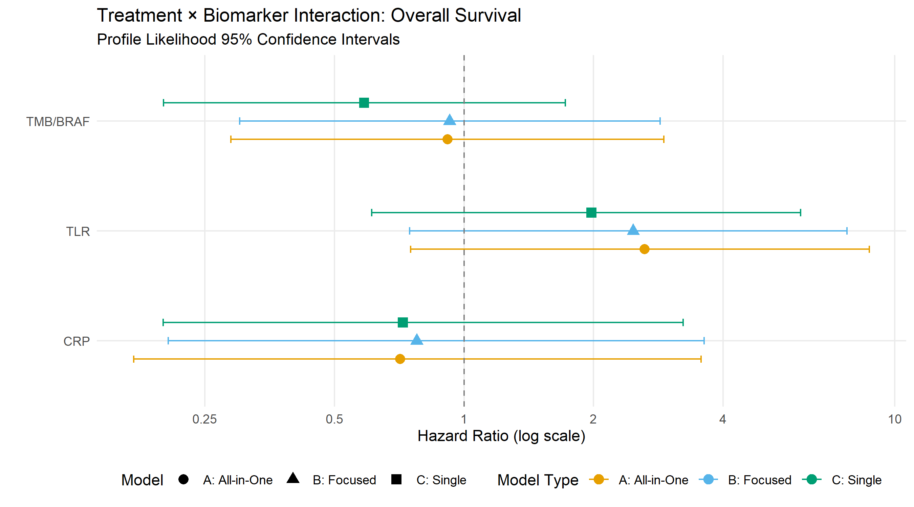
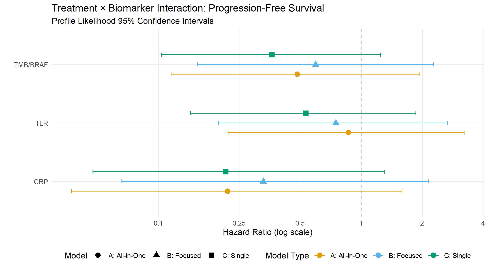

# Clinical Effectiveness
Ben Geisler
2026-03-27

- [Overview](#overview)
- [Methodological Notes](#methodological-notes)
  - [Software Packages](#software-packages)
  - [Firth-Corrected Cox Regression](#firth-corrected-cox-regression)
  - [Ridge Regression Sensitivity
    Analysis](#ridge-regression-sensitivity-analysis)
  - [Multiple Testing Correction](#multiple-testing-correction)
- [Data Preparation](#data-preparation)
  - [Sample Characteristics](#sample-characteristics)
  - [Biomarker Correlations](#biomarker-correlations)
- [Proportional Hazards Assumption](#proportional-hazards-assumption)
  - [Schoenfeld Residual Tests](#schoenfeld-residual-tests)
  - [Log-Log Survival Plots](#log-log-survival-plots)
- [Primary Analysis: Firth-Corrected Cox
  Models](#primary-analysis-firth-corrected-cox-models)
  - [Model Type A: All-in-One Model](#model-type-a-all-in-one-model)
    - [Overall Survival (Model A)](#overall-survival-model-a)
    - [Progression-Free Survival (Model
      A)](#progression-free-survival-model-a)
  - [Model B: Focused Models](#model-b-focused-models)
    - [Full Coefficient Tables](#full-coefficient-tables)
  - [Model C: Single-Biomarker Models](#model-c-single-biomarker-models)
    - [Full Coefficient Tables](#full-coefficient-tables-1)
- [Model Comparison](#model-comparison)
  - [Summary: Interaction HRs Across Model
    Types](#summary-interaction-hrs-across-model-types)
  - [Forest Plots](#forest-plots)
- [Sensitivity Analysis: Ridge
  Regression](#sensitivity-analysis-ridge-regression)
- [Summary](#summary)

# Overview

This report presents clinical effectiveness results from the METIMMOX-1
trial, evaluating biomarker-guided treatment strategies for selecting
immunotherapy candidates in metastatic MSS/pMMR colorectal cancer.

The analysis uses **Firth-corrected Cox proportional hazards
regression** with profile likelihood confidence intervals to assess
treatment effect heterogeneity across three candidate biomarkers:

- **CRP** (C-reactive protein): Low CRP (\<5 mg/L) at baseline
- **TLR** (Tumor Lesion Reduction): Early response (≥10% reduction at
  first CT scan)
- **TMB/BRAF**: High tumor mutational burden (≥9 mut/MB) or BRAF
  mutation

We compare three model structures to assess the robustness of
treatment-biomarker interactions:

- **Model A**: All-in-one model with all biomarkers and interactions
- **Model B**: Focused models with per-strategy formulas: CRP/TMB_BRAF
  with both interactions, TLR with TLR-only interaction
- **Model C**: Single-biomarker models with one biomarker and its
  interaction

# Methodological Notes

## Software Packages

This analysis uses the following R packages:

- `coxphf` version 1.13.4: Firth-corrected Cox regression with profile
  likelihood CIs
- `survival` version 3.7.0: Cox regression and Schoenfeld residual
  diagnostics
- `glmnet` version 4.1.8: Ridge regression sensitivity analysis
- `vcd` version 1.4.13: Cramér’s V for biomarker correlation assessment

## Firth-Corrected Cox Regression

We use Firth’s penalized maximum likelihood method for Cox regression,
which addresses:

1.  **Monotone likelihood**: When a covariate perfectly separates events
    from non-events
2.  **Small sample bias**: Reduces bias in coefficient estimates with
    sparse data
3.  **Unstable confidence intervals**: Profile likelihood CIs are more
    reliable than Wald-based CIs in small samples

Statistical inference is based on **penalized likelihood ratio tests
(PLRT)**, which are more appropriate than Wald tests for testing
treatment-biomarker interactions in this setting.

## Ridge Regression Sensitivity Analysis

We use Ridge regression as a sensitivity analysis to assess the
stability of our interaction estimates. Ridge regression (also called
L2-penalized regression or Tikhonov regularization) belongs to the
family of regularized or penalized regression methods. In survival
analysis, this is implemented as a penalized Cox model.

**How Ridge regression works:**

- Ridge adds a penalty term that discourages large coefficients. The
  bigger a coefficient tries to get, the more the model resists, pulling
  estimates toward zero (HR toward 1.0).
- Unlike LASSO (alpha = 1), which sets some coefficients exactly to zero
  and performs variable selection, Ridge (alpha = 0) shrinks all
  coefficients but retains all predictors.
- The degree of shrinkage is controlled by the tuning parameter lambda,
  which is selected via **cross-validation (CV)**: the data are
  repeatedly split into training and validation sets, and the lambda
  that produces the best predictive performance is chosen.

**Why not LASSO or Elastic Net?**

We determined that LASSO and elastic net are **not appropriate** for
this analysis:

1.  **Correlated biomarkers**: LASSO arbitrarily selects one of
    correlated predictors while setting others to zero, which does not
    reflect the clinical question of comparing ALL biomarker strategies.

2.  **Hierarchy principle violation**: LASSO may select interaction
    terms (e.g., `crp:Rx`) while setting the main effect (`crp`) to
    zero, producing models that are difficult to interpret clinically.

3.  **Clinical objective**: Our goal is to estimate treatment effect
    heterogeneity across ALL biomarkers simultaneously, not to select a
    “winning” biomarker.

Elastic net (alpha = 0.1–0.3) represents a compromise but does not fully
address these concerns.

**Interpreting Ridge results:**

Ridge regression is not replacing the Firth estimates—it provides a
reality check. When Ridge substantially shrinks an interaction
coefficient toward zero while Firth estimates a large effect, this
indicates the effect is too unstable to trust for practical use. The
CV-selected lambda reflects how much regularization is needed for
reasonable out-of-sample prediction given the sample size and
collinearity structure.

## Multiple Testing Correction

We apply the **Benjamini-Hochberg (BH) procedure** to control the false
discovery rate (FDR) on the primary Firth analysis:

- 6 interaction tests: 3 biomarkers × 2 outcomes (OS, PFS)
- Both raw PLRT p-values and BH-adjusted q-values are reported
- The Ridge sensitivity analysis does not require separate multiplicity
  correction

# Data Preparation

## Sample Characteristics

## Biomarker Correlations

**Note:** Cramér’s V interpretation: \<0.1 = Negligible, 0.1–0.3 = Weak,
\>0.3 = Moderate/Strong. The observed correlations are weak to
negligible. While modest, any correlation among candidate biomarkers
supports our decision not to use LASSO, which would arbitrarily select
among correlated predictors.



# Proportional Hazards Assumption

## Schoenfeld Residual Tests

The proportional hazards assumption was tested using scaled Schoenfeld
residuals. A significant p-value indicates potential violation of the PH
assumption for that covariate.

**Note:** GLOBAL is the omnibus test for all covariates. Individual
covariate tests help identify specific PH violations.

## Log-Log Survival Plots

**Interpretation:** Approximately parallel lines on the log-log plot
support the proportional hazards assumption. Crossing or converging
lines suggest time-varying effects.



# Primary Analysis: Firth-Corrected Cox Models

## Model Type A: All-in-One Model

This model includes all three biomarkers as main effects and all three
treatment-biomarker interactions simultaneously.

**Formula:**
`Surv(time, event) ~ Age + sex + Rx + crp + tlr + tmb_braf + crp:Rx + tlr:Rx + tmb_braf:Rx`

### Overall Survival (Model A)

### Progression-Free Survival (Model A)



## Model B: Focused Models

These models use per-strategy formulas. CRP and TMB/BRAF strategies
share a formula with both interaction terms (`crp:Rx` and `tmb_braf:Rx`)
while adjusting for each other as main effects. TLR uses a separate
formula with only the TLR-treatment interaction (`tlr:Rx`), adjusting
for CRP and TMB/BRAF as main effects.

**Note:** Model B uses per-strategy formulas. CRP and TMB/BRAF
strategies share a formula with both interaction terms (`crp:Rx` and
`tmb_braf:Rx`). TLR uses a separate formula with only `tlr:Rx`,
adjusting for CRP and TMB/BRAF as main effects.



### Full Coefficient Tables



## Model C: Single-Biomarker Models

These models include only ONE biomarker and its treatment interaction.
This is the simplest specification but does not control for other
biomarkers.

**Note:** Each row represents a separate model with only that biomarker
and its interaction (no other biomarkers included).



### Full Coefficient Tables



# Model Comparison

## Summary: Interaction HRs Across Model Types



## Forest Plots

**Interpretation:** HR \< 1 indicates that biomarker-positive patients
derive greater benefit from experimental treatment (reduced hazard of
death/progression). The dashed vertical line at HR = 1 represents no
differential treatment effect by biomarker status.



# Sensitivity Analysis: Ridge Regression

Ridge regression (alpha = 0) shrinks coefficients toward zero but does
not eliminate any, providing a sensitivity analysis for the stability of
our interaction estimates.

**Interpretation:** Ridge regression applies an L2 penalty that shrinks
all coefficients toward zero (HR toward 1.0), providing a sensitivity
analysis for estimate stability across three model structures:

- **Model A (All-in-One)**: Ridge regularizes all three biomarker main
  effects simultaneously while estimating all three interactions. This
  tests whether interaction estimates are stable when accounting for
  multicollinearity among biomarkers.

- **Model B (Focused)**: Ridge regularizes biomarker main effects using
  per-strategy formulas. CRP and TMB/BRAF share a formula with both
  interaction terms; TLR uses a separate formula with only `tlr:Rx`.
  Comparing Model B Ridge to Model A Ridge reveals whether
  regularization effects differ with fewer interaction terms competing
  for variance.

- **Model C (Single-Biomarker)**: Ridge regularizes only one biomarker
  term per model. Since there is minimal multicollinearity to address,
  Model C Ridge estimates should be closest to their Firth counterparts.
  Substantial shrinkage here would indicate instability in the
  biomarker-treatment relationship itself, not confounding.

**Key patterns to examine**: (1) Consistent shrinkage across all three
models suggests the interaction estimate is inherently unstable; (2)
Shrinkage only in Model A suggests multicollinearity with other
biomarkers; (3) Similar Firth and Ridge estimates across all models
supports robustness.



# Summary

This analysis evaluated treatment effect heterogeneity across three
candidate predictive biomarkers (CRP, TLR, TMB/BRAF) using
Firth-corrected Cox regression with profile likelihood confidence
intervals and penalized likelihood ratio tests.

**Key Findings:**

1.  **Model Robustness:** Treatment-biomarker interaction estimates were
    compared across three model specifications (all-in-one, focused,
    single-biomarker) to assess sensitivity to model structure.

2.  **Multiple Testing:** Benjamini-Hochberg correction was applied to
    control the false discovery rate across the 6 primary interaction
    tests (3 biomarkers × 2 outcomes).

3.  **Proportional Hazards:** The PH assumption was assessed using
    Schoenfeld residual tests and log-log survival plots. For overall
    survival, no significant PH violations were detected. For
    progression-free survival, significant violations were observed for
    TMB/BRAF main effect (p = 0.004) and TMB/BRAF × Rx interaction (p =
    0.009), with the global test also significant (p = 0.004). These
    findings suggest time-varying effects for TMB/BRAF-related terms in
    PFS models, warranting caution in interpretation. The log-log plots
    show some crossing of survival curves for the treatment comparison,
    consistent with potential non-proportional hazards.

4.  **Sensitivity Analysis (Ridge Regression):** Ridge regression was
    applied to all three model structures (A, B, C) to assess estimate
    stability. This comprehensive comparison reveals whether shrinkage
    patterns are consistent across model specifications or driven by
    specific modeling choices:

    - Consistent shrinkage across all three models suggests inherent
      instability in the interaction estimate
    - Shrinkage only in Model A (all-in-one) suggests multicollinearity
      with other biomarkers
    - Model C (single-biomarker) provides the most direct
      biomarker-treatment estimate with minimal confounding

    Both methods answer different questions: Firth provides the best
    point estimate given the data structure, while Ridge prioritizes
    predictive stability. Comparing patterns across models helps
    distinguish true effect instability from model-specific artifacts.

**Methodological Note:** The use of Firth-corrected Cox regression
addresses potential monotone likelihood issues and small sample bias.
Profile likelihood-based confidence intervals and penalized likelihood
ratio tests are more appropriate than Wald-based methods in this
setting.

------------------------------------------------------------------------

**Report completed on:** 2026-03-27  
**Repository:** ben-geisler/METIMMOX-1  
**Report version:** 2.3
