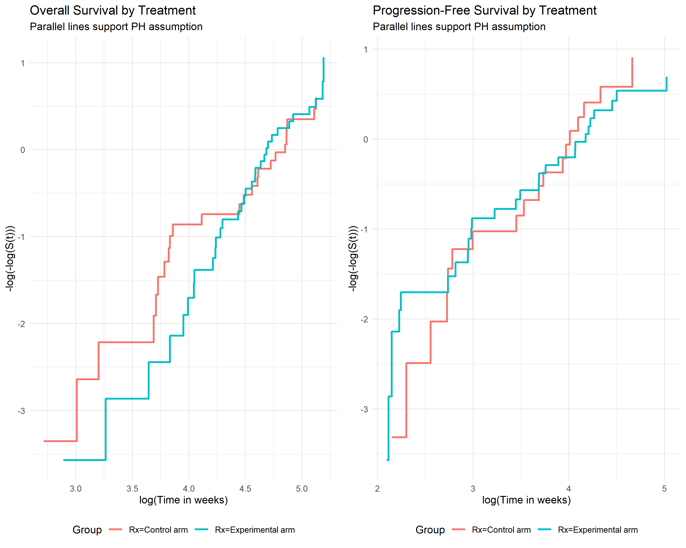
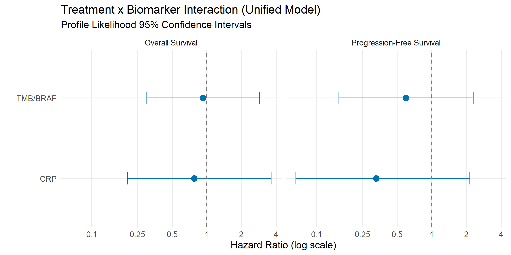
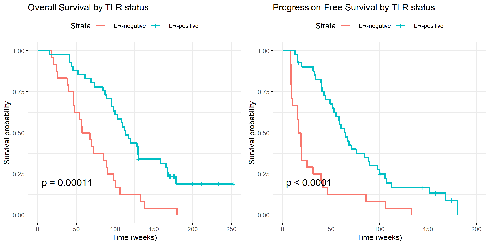
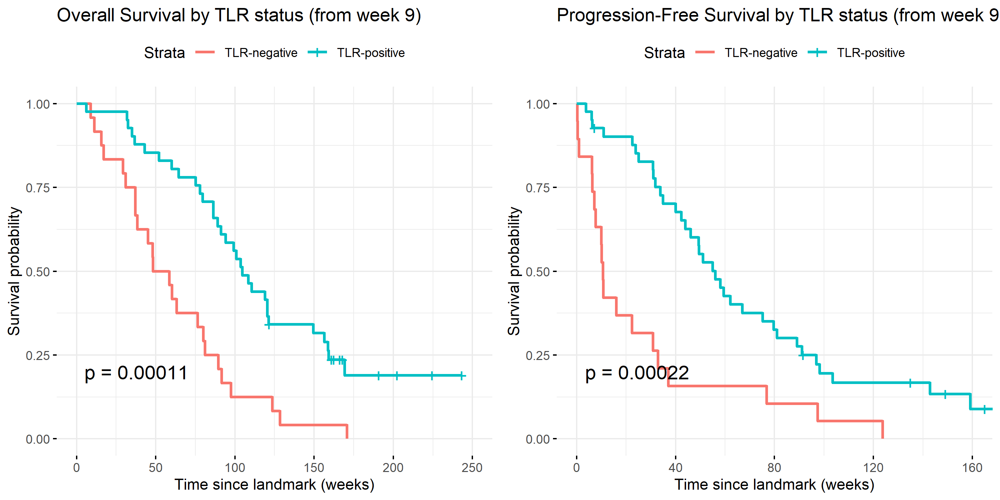

# Clinical Effectiveness
Ben Geisler
2026-08-31

- [Overview](#overview)
- [Methodological Notes](#methodological-notes)
  - [Software Packages](#software-packages)
  - [Firth-Corrected Cox Regression](#firth-corrected-cox-regression)
  - [Ridge Regression Sensitivity
    Analysis](#ridge-regression-sensitivity-analysis)
- [Data Preparation](#data-preparation)
  - [Sample Characteristics](#sample-characteristics)
  - [Biomarker Correlations](#biomarker-correlations)
- [Proportional Hazards Assumption](#proportional-hazards-assumption)
  - [Schoenfeld Residual Tests](#schoenfeld-residual-tests)
  - [Log-Log Survival Plots](#log-log-survival-plots)
- [Primary Analysis: Firth-Corrected Cox
  Models](#primary-analysis-firth-corrected-cox-models)
  - [Standard Cox vs Firth](#standard-cox-vs-firth)
  - [Unified Model Results](#unified-model-results)
    - [Overall Survival](#overall-survival)
    - [Progression-Free Survival](#progression-free-survival)
  - [Forest Plot](#forest-plot)
- [Sensitivity Analysis: Ridge
  Regression](#sensitivity-analysis-ridge-regression)
- [Exploratory: TLR as a Predictive Biomarker (Responder
  Analysis)](#exploratory-tlr-as-a-predictive-biomarker-responder-analysis)
  - [Descriptive Context](#descriptive-context)
    - [TLR Prevalence by Treatment
      Arm](#tlr-prevalence-by-treatment-arm)
    - [Kaplan-Meier Curves Stratified by
      TLR](#kaplan-meier-curves-stratified-by-tlr)
  - [Standard Cox vs Firth](#standard-cox-vs-firth-1)
  - [Firth-Corrected Cox Model](#firth-corrected-cox-model)
    - [Overall Survival](#overall-survival-1)
    - [Progression-Free Survival](#progression-free-survival-1)
  - [Ridge Sensitivity Analysis (TLR Terms
    Penalized)](#ridge-sensitivity-analysis-tlr-terms-penalized)
- [Landmark Analysis: TLR at Week 9](#landmark-analysis-tlr-at-week-9)
  - [Landmark Cohort and Attrition](#landmark-cohort-and-attrition)
  - [Descriptive Context (Landmark
    Cohort)](#descriptive-context-landmark-cohort)
    - [Characteristics of the Week-9 Landmark Cohorts by TLR
      Status](#characteristics-of-the-week-9-landmark-cohorts-by-tlr-status)
    - [TLR Prevalence by Treatment Arm at Week
      9](#tlr-prevalence-by-treatment-arm-at-week-9)
    - [Landmark Kaplan-Meier Curves Stratified by
      TLR](#landmark-kaplan-meier-curves-stratified-by-tlr)
  - [Standard Cox vs Firth (Landmark)](#standard-cox-vs-firth-landmark)
  - [Firth-Corrected Cox Model
    (Landmark)](#firth-corrected-cox-model-landmark)
    - [Overall Survival](#overall-survival-2)
    - [Progression-Free Survival](#progression-free-survival-2)
  - [Ridge Sensitivity Analysis (Landmark, TLR Terms
    Penalized)](#ridge-sensitivity-analysis-landmark-tlr-terms-penalized)
- [Discussion](#discussion)
  - [Primary interaction results](#primary-interaction-results)
  - [Proportional hazards and
    TMB/BRAF](#proportional-hazards-and-tmbbraf)
  - [Ridge regression sensitivity](#ridge-regression-sensitivity)
  - [TLR responder analysis
    (exploratory)](#tlr-responder-analysis-exploratory)
  - [TLR landmark analysis
    (exploratory)](#tlr-landmark-analysis-exploratory)
- [Summary](#summary)

# Overview

This report presents clinical effectiveness results from the METIMMOX-1
trial, evaluating biomarker-guided treatment strategies for selecting
immunotherapy candidates in metastatic MSS/pMMR colorectal cancer.

The analysis uses **Firth-corrected Cox proportional hazards
regression** with profile likelihood confidence intervals to assess
treatment effect heterogeneity across two pre-treatment biomarkers
identified by the causal DAG analysis:

- **CRP** (C-reactive protein): Low CRP (\<5 mg/L) at baseline — a
  pre-treatment prognostic and potentially predictive marker
- **TMB/BRAF**: High tumor mutational burden (≥9 mut/MB) or BRAF
  mutation — a pre-treatment genomic marker

**Model specification is motivated by the causal DAG** (see `dag.qmd`
and `dag_associations.qmd`). The DAG encodes treatment (T) as randomized
with no parents, so no confounding adjustment is needed for causal
identification; Age and Sex are included as precision covariates. TLR
(Tumor Lesion Reduction) is encoded as a post-randomization intermediate
variable (T → TLR → PFS): it is not a pre-treatment baseline
characteristic and conditioning on it as a covariate would block part of
the treatment effect pathway. TLR is therefore excluded from the primary
survival models and examined separately as a descriptive endpoint.

The **unified DAG-informed model** is:

$$\text{Surv}(\text{time}, \text{event}) \sim \text{Age} + \text{sex} + \text{Rx} + \text{CRP} + \text{TMB/BRAF} + \text{CRP} \times \text{Rx} + \text{TMB/BRAF} \times \text{Rx}$$

Ridge regression (L2-penalized Cox) is applied as a sensitivity analysis
to assess the stability of the interaction estimates under shrinkage.
TLR is reported in a separate exploratory section.

# Methodological Notes

## Software Packages

This analysis uses the following R packages:

- `coxphf` version 1.13.4: Firth-corrected Cox regression with profile
  likelihood CIs
- `survival` version 3.7.0: Cox regression and Schoenfeld residual
  diagnostics
- `glmnet` version 4.1.8: Ridge regression sensitivity analysis
- `vcd` version 1.4.13: Cramér’s V for biomarker correlation assessment

## Firth-Corrected Cox Regression

We use Firth’s penalized maximum likelihood method for Cox regression,
which addresses:

1.  **Monotone likelihood**: When a covariate perfectly separates events
    from non-events
2.  **Small sample bias**: Reduces bias in coefficient estimates with
    sparse data
3.  **Unstable confidence intervals**: Profile likelihood CIs are more
    reliable than Wald-based CIs in small samples

Statistical inference is based on **penalized likelihood ratio tests
(PLRT)**, which are more appropriate than Wald tests for testing
treatment-biomarker interactions in this setting.

## Ridge Regression Sensitivity Analysis

We use Ridge regression as a sensitivity analysis to assess the
stability of our interaction estimates. Ridge regression (also called
L2-penalized regression or Tikhonov regularization) belongs to the
family of regularized or penalized regression methods. In survival
analysis, this is implemented as a penalized Cox model.

**How Ridge regression works:**

- Ridge adds a penalty term that discourages large coefficients. The
  bigger a coefficient tries to get, the more the model resists, pulling
  estimates toward zero (HR toward 1.0).
- Unlike LASSO (alpha = 1), which sets some coefficients exactly to zero
  and performs variable selection, Ridge (alpha = 0) shrinks all
  coefficients but retains all predictors.
- The degree of shrinkage is controlled by the tuning parameter lambda,
  which is selected via **cross-validation (CV)**: the data are
  repeatedly split into training and validation sets, and the lambda
  that produces the best predictive performance is chosen.

**Why not LASSO or Elastic Net?**

We determined that LASSO and elastic net are **not appropriate** for
this analysis:

1.  **Correlated biomarkers**: LASSO arbitrarily selects one of
    correlated predictors while setting others to zero, which does not
    reflect the clinical question of comparing ALL biomarker strategies.

2.  **Hierarchy principle violation**: LASSO may select interaction
    terms (e.g., `crp:Rx`) while setting the main effect (`crp`) to
    zero, producing models that are difficult to interpret clinically.

3.  **Clinical objective**: Our goal is to estimate treatment effect
    heterogeneity across ALL biomarkers simultaneously, not to select a
    “winning” biomarker.

Elastic net (alpha = 0.1–0.3) represents a compromise but does not fully
address these concerns.

**Interpreting Ridge results:**

Ridge regression is not replacing the Firth estimates—it provides a
reality check. When Ridge substantially shrinks an interaction
coefficient toward zero while Firth estimates a large effect, this
indicates the effect is too unstable to trust for practical use. The
CV-selected lambda reflects how much regularization is needed for
reasonable out-of-sample prediction given the sample size and
collinearity structure.

# Data Preparation

## Sample Characteristics

## Biomarker Correlations

**Note:** Cramér’s V interpretation: \<0.1 = Negligible, 0.1–0.3 = Weak,
\>0.3 = Moderate/Strong. The observed correlations are weak to
negligible. While modest, any correlation among candidate biomarkers
supports our decision not to use LASSO, which would arbitrarily select
among correlated predictors.



# Proportional Hazards Assumption

## Schoenfeld Residual Tests

The proportional hazards assumption was tested using scaled Schoenfeld
residuals. A significant p-value indicates potential violation of the PH
assumption for that covariate.

**Note:** GLOBAL is the omnibus test for all covariates. Individual
covariate tests help identify specific PH violations.

## Log-Log Survival Plots

**Interpretation:** Approximately parallel lines on the log-log plot
support the proportional hazards assumption. Crossing or converging
lines suggest time-varying effects.



# Primary Analysis: Firth-Corrected Cox Models

## Standard Cox vs Firth

The standard Cox model is the unpenalized maximum-likelihood reference.
Divergence between standard Cox and Firth estimates flags small-sample
or near-separation instability that Firth corrects.

| Term              | Standard Cox HR (95% CI) | Firth HR (95% CI) |
|:------------------|:-------------------------|:------------------|
| CRP x Rx          | 0.88 (0.20-3.85)         | 0.78 (0.21-3.61)  |
| TMB/BRAF x Rx     | 0.95 (0.30-2.97)         | 0.93 (0.30-2.85)  |
| Rx (Experimental) | 1.69 (0.79-3.63)         | 1.70 (0.81-3.67)  |
| CRP               | 0.45 (0.13-1.55)         | 0.52 (0.13-1.47)  |
| TMB/BRAF          | 0.91 (0.40-2.10)         | 0.94 (0.41-2.12)  |
| Age               | 1.00 (0.97-1.03)         | 1.00 (0.97-1.03)  |
| Sex               | 1.59 (0.90-2.81)         | 1.58 (0.90-2.79)  |

Unified Model - Overall Survival: Standard Cox vs Firth

| Term              | Standard Cox HR (95% CI) | Firth HR (95% CI) |
|:------------------|:-------------------------|:------------------|
| CRP x Rx          | 0.38 (0.06-2.34)         | 0.33 (0.07-2.15)  |
| TMB/BRAF x Rx     | 0.61 (0.16-2.38)         | 0.60 (0.16-2.28)  |
| Rx (Experimental) | 2.04 (0.86-4.81)         | 2.01 (0.89-4.84)  |
| CRP               | 0.84 (0.18-3.95)         | 1.00 (0.19-3.60)  |
| TMB/BRAF          | 0.74 (0.27-1.99)         | 0.77 (0.28-2.01)  |
| Age               | 0.99 (0.95-1.02)         | 0.99 (0.96-1.02)  |
| Sex               | 1.21 (0.65-2.26)         | 1.20 (0.65-2.26)  |

Unified Model - Progression-Free Survival: Standard Cox vs Firth

## Unified Model Results

The unified DAG-informed model includes CRP and TMB/BRAF as
pre-treatment biomarkers with their treatment interactions, adjusted for
Age and Sex.

**Formula:**
`Surv(time, event) ~ Age + sex + Rx + CRP + TMB/BRAF + CRP:Rx + TMB/BRAF:Rx`

### Overall Survival

### Progression-Free Survival



## Forest Plot

**Interpretation:** HR \< 1 indicates that biomarker-positive patients
derive greater benefit from experimental treatment (reduced hazard of
death/progression). The dashed line at HR = 1 represents no differential
treatment effect.



# Sensitivity Analysis: Ridge Regression

Ridge regression (L2-penalized Cox, alpha = 0) shrinks all coefficients
toward zero but does not eliminate any, providing a sensitivity check
for the stability of the interaction estimates. The same unified model
formula is used; only the main effects (CRP and TMB/BRAF) are penalized.

**Interpretation:** Firth provides the best unbiased point estimate
given the sample size and data structure. Ridge applies L2 shrinkage
toward zero (HR toward 1.0). Comparing the two methods reveals estimate
stability: if Firth and Ridge agree closely, the estimate is robust; if
Ridge substantially shrinks the interaction toward null, the effect is
sensitive to regularization in this sample.



# Exploratory: TLR as a Predictive Biomarker (Responder Analysis)

This section presents an **exploratory responder analysis** that
includes TLR (Tumor Lesion Reduction) as an effect modifier in a Cox
model with the same structural form as the primary analysis. Because TLR
is measured post-randomization (at the first on-treatment CT scan), this
is not a pre-treatment patient-selection analysis: TLR status is itself
influenced by treatment, and the resulting TLR x Rx interaction is
informative only as a hypothesis-generating, responder-stratified
contrast. It cannot be used to guide treatment decisions at baseline.
The primary causal-DAG-informed analysis remains the inferential anchor
for predictive biomarker claims.

The model adjusts for the pre-treatment biomarkers **CRP** and
**TMB/BRAF** as prognostic main effects (their treatment interactions
belong to the primary analysis and are not re-estimated here). In the
ridge sensitivity model, CRP and TMB/BRAF remain **unpenalized**
(well-established prognostic adjustment covariates), while the **TLR
main effect and TLR x Rx interaction are penalized**. These are the
post-randomization terms whose stability we want to stress-test against
the small effective sample size and the partially tautological TLR-PFS
association.

**Formula:**
`Surv(time, event) ~ Age + sex + Rx + CRP + TMB/BRAF + TLR + TLR:Rx`

## Descriptive Context

### TLR Prevalence by Treatment Arm

### Kaplan-Meier Curves Stratified by TLR

**Note:** These curves are purely descriptive and stratify by a
post-treatment response variable. The observed difference in survival by
TLR status reflects treatment response, not a pre-treatment patient
characteristic.



## Standard Cox vs Firth

The standard Cox model is the unpenalized maximum-likelihood reference.
Divergence between standard Cox and Firth estimates flags small-sample
or near-separation instability that Firth corrects.

| Term              | Standard Cox HR (95% CI) | Firth HR (95% CI) |
|:------------------|:-------------------------|:------------------|
| TLR x Rx          | 2.43 (0.74-7.95)         | 2.47 (0.75-7.75)  |
| TLR (main effect) | 0.21 (0.08-0.54)         | 0.21 (0.08-0.55)  |
| Rx (Experimental) | 0.60 (0.23-1.55)         | 0.59 (0.24-1.55)  |
| CRP               | 0.52 (0.25-1.06)         | 0.53 (0.25-1.05)  |
| TMB/BRAF          | 0.86 (0.48-1.52)         | 0.86 (0.48-1.52)  |
| Age               | 1.01 (0.98-1.04)         | 1.01 (0.98-1.04)  |
| Sex               | 1.48 (0.81-2.68)         | 1.47 (0.82-2.67)  |

TLR Responder Model - Overall Survival: Standard Cox vs Firth

| Term              | Standard Cox HR (95% CI) | Firth HR (95% CI) |
|:------------------|:-------------------------|:------------------|
| TLR x Rx          | 0.73 (0.19-2.76)         | 0.75 (0.20-2.66)  |
| TLR (main effect) | 0.17 (0.06-0.50)         | 0.17 (0.06-0.52)  |
| Rx (Experimental) | 1.41 (0.46-4.27)         | 1.35 (0.48-4.22)  |
| CRP               | 0.41 (0.18-0.96)         | 0.43 (0.18-0.96)  |
| TMB/BRAF          | 0.48 (0.24-0.99)         | 0.50 (0.24-0.99)  |
| Age               | 1.00 (0.96-1.03)         | 1.00 (0.96-1.03)  |
| Sex               | 1.23 (0.61-2.47)         | 1.22 (0.62-2.45)  |

TLR Responder Model - Progression-Free Survival: Standard Cox vs Firth

## Firth-Corrected Cox Model

### Overall Survival

### Progression-Free Survival



## Ridge Sensitivity Analysis (TLR Terms Penalized)

Ridge regression is applied here with a targeted penalty: only the TLR
main effect and the TLR x Rx interaction are L2-shrunk. CRP, TMB/BRAF,
Age, sex, and Rx are estimated without penalty, since they enter the
model as adjustment covariates whose effects are not the inferential
target.

**Interpretation:** The Firth HR is the best unbiased point estimate of
the TLR x Rx interaction under penalized maximum likelihood. The ridge
HR applies L2 shrinkage targeted at the TLR terms; if the ridge estimate
is substantially closer to HR = 1.0 than the Firth estimate, the
responder-stratified interaction is sensitive to regularization,
consistent with a small-sample, partly tautological signal. Findings
here are exploratory and should not be used for pre-treatment patient
selection, since TLR is not measurable at baseline. They may motivate
landmark or formal causal-mediation analyses in future work.



# Landmark Analysis: TLR at Week 9

The responder analysis above treats TLR status as if it were known at
baseline. It is not: TLR is measured at the first on-treatment CT scan,
so a patient can only be classified TLR-positive or TLR-negative *after*
surviving (and remaining progression-free) long enough to reach that
scan. Conditioning survival on a post-baseline response therefore
induces **guarantee-time (immortal-time) bias** — TLR-classified
patients are, by construction, a more favourable risk set than the full
randomized population.

A **landmark analysis** removes this bias by (i) fixing a landmark time,
(ii) restricting to patients still at risk at the landmark, and (iii)
measuring survival **from the landmark onward**. Here the landmark is
set to **week 9**, the time of the second CT (the first on-treatment
response assessment): TLR compares this scan to the baseline CT, so a
patient’s TLR status does not exist until week 9. Placing the landmark
at the measurement time ensures every patient in the cohort has actually
reached the scan and has a defined TLR. Every retained patient is
guaranteed to have reached the assessment, so the TLR x Rx contrast is
no longer inflated by the survival required to be classifiable. This
section **complements** the responder analysis above (which is retained
for comparison); it does not replace it.

If the true response-assessment week differs from 9, only the single
`LANDMARK_WK` value below needs changing. Because the small trial loses
patients with events or censoring before the landmark, the cohort sizes
and event counts are reported explicitly, and all model fits are wrapped
so a too-small cohort degrades gracefully rather than aborting the
render.

## Landmark Cohort and Attrition

## Descriptive Context (Landmark Cohort)

### Characteristics of the Week-9 Landmark Cohorts by TLR Status

The two tables below describe the patients who enter the landmark
analysis, overall and split by the TLR status that becomes defined at
the week-9 scan. The at-risk set is endpoint-specific: the
**overall-survival** cohort keeps everyone alive at week 9, whereas the
**progression-free-survival** cohort additionally drops patients who had
already progressed by week 9. The PFS cohort is therefore smaller.
Reporting both fixes the denominators for the OS and PFS models that
follow and makes the composition of the two TLR groups directly
comparable.

#### Overall-survival at-risk set (OSwk \>= 9)

| Characteristic                    | At-risk cohort | TLR-positive | TLR-negative |
|:----------------------------------|---------------:|-------------:|-------------:|
| n                                 |             65 |           41 |           24 |
| Age, years, mean (SD)             |    64.0 (10.0) |   65.0 (9.9) |  62.2 (10.2) |
| Female sex                        |     30 (46.2%) |   19 (46.3%) |   11 (45.8%) |
| Control arm (FLOX)                |     29 (44.6%) |   22 (53.7%) |    7 (29.2%) |
| Experimental arm (FLOX/nivolumab) |     36 (55.4%) |   19 (46.3%) |   17 (70.8%) |
| Deaths (OS events)                |     56 (86.2%) |   32 (78.0%) |  24 (100.0%) |
| Progressions (PFS events)         |     48 (73.8%) |   27 (65.9%) |   21 (87.5%) |
| CRP-positive                      |     22 (33.8%) |   18 (43.9%) |    4 (16.7%) |
| TMB/BRAF-positive                 |     29 (44.6%) |   18 (43.9%) |   11 (45.8%) |

Characteristics of the week-9 OS landmark cohort (alive at week 9), by
TLR status

Because no patient dies or is censored before week 9, the OS at-risk set
coincides with the full complete-case cohort (n = 65).

#### Progression-free-survival at-risk set (PFSwk \>= 9)

| Characteristic                    | At-risk cohort | TLR-positive | TLR-negative |
|:----------------------------------|---------------:|-------------:|-------------:|
| n                                 |             56 |           38 |           18 |
| Age, years, mean (SD)             |     64.7 (9.6) |   65.6 (9.2) |  62.8 (10.5) |
| Female sex                        |     26 (46.4%) |   18 (47.4%) |    8 (44.4%) |
| Control arm (FLOX)                |     24 (42.9%) |   19 (50.0%) |    5 (27.8%) |
| Experimental arm (FLOX/nivolumab) |     32 (57.1%) |   19 (50.0%) |   13 (72.2%) |
| Deaths (OS events)                |     47 (83.9%) |   29 (76.3%) |  18 (100.0%) |
| Progressions (PFS events)         |     43 (76.8%) |   27 (71.1%) |   16 (88.9%) |
| CRP-positive                      |     20 (35.7%) |   16 (42.1%) |    4 (22.2%) |
| TMB/BRAF-positive                 |     24 (42.9%) |   17 (44.7%) |    7 (38.9%) |

Characteristics of the week-9 PFS landmark cohort (alive and
progression-free at week 9), by TLR status

The PFS at-risk set drops the 9 patient(s) who had already progressed
(or were censored) by week 9, leaving n = 56.

*Definitions:* percentages are column percentages; the “Deaths” and
“Progressions” rows count events over the whole follow-up, not only
after the landmark. CRP-positive = CRP \< 5 mg/L; TMB/BRAF-positive =
TMB \>= 9 mut/Mb or BRAF mutation; TLR-positive = tumour lesion
reduction \>= 10% at the first on-treatment CT.

**Note:** In both cohorts the two TLR groups are well matched on age,
sex, and TMB/BRAF status, but differ sharply on treatment arm and CRP:
the TLR-positive group is enriched for control-arm patients and for
CRP-positivity, while every TLR-negative patient died during follow-up.
These imbalances are the descriptive counterpart of the interaction
estimates below and reinforce that TLR status is realised after
randomization rather than being a baseline characteristic.

### TLR Prevalence by Treatment Arm at Week 9

### Landmark Kaplan-Meier Curves Stratified by TLR

**Note:** Follow-up time is measured from the week-9 landmark. All
patients shown were alive (OS) or alive and progression-free (PFS) at
the landmark, so the curves are free of the guarantee-time bias
affecting the responder-analysis curves above.



## Standard Cox vs Firth (Landmark)

| Term              | Standard Cox HR (95% CI) | Firth HR (95% CI) |
|:------------------|:-------------------------|:------------------|
| TLR x Rx          | 2.43 (0.74-7.95)         | 2.47 (0.75-7.75)  |
| TLR (main effect) | 0.21 (0.08-0.54)         | 0.21 (0.08-0.55)  |
| Rx (Experimental) | 0.60 (0.23-1.55)         | 0.59 (0.24-1.55)  |
| CRP               | 0.52 (0.25-1.06)         | 0.53 (0.25-1.05)  |
| TMB/BRAF          | 0.86 (0.48-1.52)         | 0.86 (0.48-1.52)  |
| Age               | 1.01 (0.98-1.04)         | 1.01 (0.98-1.04)  |
| Sex               | 1.48 (0.81-2.68)         | 1.47 (0.82-2.67)  |

Landmark (Week 9) TLR Model - Overall Survival: Standard Cox vs Firth

| Term              | Standard Cox HR (95% CI) | Firth HR (95% CI) |
|:------------------|:-------------------------|:------------------|
| TLR x Rx          | 0.86 (0.20-3.59)         | 0.88 (0.21-3.42)  |
| TLR (main effect) | 0.16 (0.05-0.53)         | 0.17 (0.05-0.55)  |
| Rx (Experimental) | 1.08 (0.31-3.83)         | 1.05 (0.32-3.80)  |
| CRP               | 0.52 (0.22-1.24)         | 0.53 (0.22-1.23)  |
| TMB/BRAF          | 0.35 (0.16-0.77)         | 0.36 (0.16-0.77)  |
| Age               | 1.00 (0.96-1.04)         | 1.00 (0.96-1.04)  |
| Sex               | 1.06 (0.50-2.27)         | 1.06 (0.50-2.27)  |

Landmark (Week 9) TLR Model - Progression-Free Survival: Standard Cox vs
Firth

## Firth-Corrected Cox Model (Landmark)

### Overall Survival

### Progression-Free Survival



## Ridge Sensitivity Analysis (Landmark, TLR Terms Penalized)

Ridge regression is applied to the landmark cohorts with the same
targeted penalty as the responder analysis: only the TLR main effect and
the TLR x Rx interaction are L2-shrunk, while Age, sex, Rx, CRP, and
TMB/BRAF remain unpenalized.

**Interpretation:** The two endpoints behave very differently under the
landmark, and the contrast is itself informative.

*Overall survival* is clean: 0 patient(s) are excluded (no deaths occur
before week 9), so the landmark OS cohort is the full randomized
population and the landmark Firth TLR x Rx HR (2.47 (0.75-7.75)) is
**identical** to the responder estimate (2.47 (0.75-7.75)) — a Cox model
is invariant to a common shift of the time origin when no one leaves the
risk set. The OS responder signal is therefore not an early-death
guarantee-time artefact.

*Progression-free survival* exposes a deeper problem. 9 patients are
excluded, of whom 5 progressed, 5 of them **TLR-negative**. This is not
a coincidence: progression and TLR are read from the *same* first
on-treatment scan, so a patient whose tumour grows at that scan is
simultaneously classified as a progression and as TLR-negative. The
week-9 landmark removes exactly these TLR-negative scan-time
progressors, shifting the Firth TLR x Rx HR from 0.75 (0.20-2.66)
(responder) to 0.88 (0.21-3.42) (landmark). The responder PFS
association is thus **partly tautological** — TLR-negativity and early
progression are the same measurement — which the landmark makes explicit
by excluding the coupled events.

Neither analysis resolves the most fundamental issue: TLR lies on the
causal path of treatment (Rx -\> TLR -\> outcome), so the TLR x Rx
contrast is not a baseline patient-selection estimate under any time
origin; disentangling it would require formal causal mediation, not a
landmark. All estimates remain exploratory and imprecise (PLRT p 0.135
OS, 0.851 PFS) and must not guide treatment selection. The landmark is
fixed at week 9 (the second, first-on-treatment CT); if the assessment
week differs, change `LANDMARK_WK`.



# Discussion

## Primary interaction results

Neither biomarker-treatment interaction reached conventional
significance in the unified model. For **overall survival**, CRP × Rx
yielded HR 0.78 (95% CI 0.21–3.61, PLRT p = 0.728) and TMB/BRAF × Rx HR
0.93 (0.30–2.85, p = 0.893) — point estimates close to null with very
wide confidence intervals. For **progression-free survival**, the CRP ×
Rx interaction showed a more directionally suggestive effect (HR 0.33,
0.07–2.15, p = 0.224): CRP-positive patients in the experimental arm had
roughly one-third the hazard of progression relative to CRP-positive
controls, though the CI spans more than an order of magnitude. These
results are consistent with the trial being underpowered to detect
treatment-effect heterogeneity (n = 65, 48 progressions, 56 deaths):
even a moderate subgroup effect (HR ~0.5) would require far larger
samples for reliable estimation.

The PFS pattern is worth noting as a hypothesis-generating finding. The
CRP direction (HR 0.33) is consistent with the DAG association test
showing CRP → PFS (HR 0.40, p = 0.004) and the biological hypothesis
that low CRP (reflecting lower systemic inflammation) identifies
patients more likely to respond to immunotherapy. However, the OS CRP
interaction estimate (HR 0.78) is considerably closer to null,
suggesting that any PFS benefit does not clearly translate to an OS
benefit in this dataset.

## Proportional hazards and TMB/BRAF

The PH assumption was well supported in overall survival (Schoenfeld
global p = 0.40). In progression-free survival, however, the global test
was significant (p = 0.007), driven mainly by TMB/BRAF — both the main
effect (p = 0.021) and the TMB/BRAF × Rx interaction (p = 0.045)
violated the PH assumption. This indicates that the hazard ratio for
TMB/BRAF (and its modification by treatment) is not constant over time
in PFS, which may reflect different kinetics of early vs late events in
TMB/BRAF-positive tumours. The PFS TMB/BRAF × Rx interaction estimate
(HR 0.60) should therefore be interpreted with caution; a time-varying
Cox model or landmark analysis would be more appropriate for that
specific question.

## Ridge regression sensitivity

For OS, Ridge shrinks the CRP × Rx estimate substantially toward null
(Firth HR 0.78 → Ridge HR 0.39), suggesting the OS estimate is sensitive
to regularization and should be treated as imprecise. The TMB/BRAF × Rx
OS estimate shows minimal shrinkage (0.93 → 0.87), consistent with a
near-null interaction. For PFS, the CRP × Rx estimate is essentially
unchanged by Ridge (Firth 0.33 → Ridge 0.32), indicating that the
directional PFS finding is robust to regularization — the data support
it even when the model is penalized for large coefficients. TMB/BRAF ×
Rx PFS shows moderate shrinkage (0.60 → 0.45).

## TLR responder analysis (exploratory)

The exploratory responder model —
`Surv ~ Age + sex + Rx + CRP + TMB/BRAF + TLR + TLR:Rx` — estimates the
differential treatment effect between TLR-positive and TLR-negative
subgroups while adjusting for the pre-treatment biomarkers as prognostic
main effects. The Firth-estimated TLR × Rx HR was 2.47 (0.75-7.75) for
overall survival and 0.75 (0.20-2.66) for progression-free survival. The
OS estimate sits **above 1.0**, which directionally implies the
(TLR-positive vs TLR-negative) hazard contrast is *worse* on the
experimental arm than on the control arm — the opposite of a
“TLR-positive predicts immunotherapy benefit” pattern. PFS is closer to
null. Ridge shrinkage of the TLR terms gives 2.12 (SE: 0.58) (OS) and
0.68 (SE: 0.64) (PFS): ridge moves the OS estimate modestly toward null
but preserves the directional pattern, and barely changes the PFS
estimate. PLRT p-values (0.135 OS, 0.660 PFS) do not reach conventional
significance, consistent with the wide profile-likelihood CIs in this
small sample.

The directional pattern is consistent with the descriptive imbalance:
TLR-positive prevalence is 75.9% in the control arm and 52.8% in the
experimental arm. If TLR cleanly captured immunotherapy response one
would expect higher TLR-positivity in the experimental arm, not lower.
The observed prevalence pattern, together with the OS direction (HR
\> 1) of the TLR × Rx interaction, is more consistent with TLR acting as
a **prognostic** marker (identifying chemotherapy-responsive disease,
which is more prevalent in the control arm by chance or by timing) than
as a predictive marker for immunotherapy benefit. Possible explanations
for the imbalance include small-sample randomization imbalance, a timing
artefact (TLR measured at a fixed CT that may occur during different
treatment phases across arms), or genuine heterogeneity in the patient
mix. Because TLR is itself influenced by treatment, the TLR × Rx
interaction is a responder-stratified contrast — useful for hypothesis
generation, but not a causal predictive-biomarker estimate.

## TLR landmark analysis (exploratory)

A **week-9 landmark analysis** conditions on survival to the second
(first on-treatment) CT — the scan at which TLR is defined — and
measures survival from that point, to test whether the responder signal
is a guarantee-time artefact. The two endpoints diverge instructively.
For **OS**, 0 patients are excluded (no early deaths), so the landmark
estimate is identical to the responder estimate (2.47 (0.75-7.75)): the
OS signal is not driven by early-death immortal time. For **PFS**, 9
patients are excluded, with 5 of the 5 excluded progressors being
TLR-negative, because progression and TLR are ascertained at the same
scan; removing these coupled events moves the Firth TLR × Rx HR from
0.75 (0.20-2.66) to 0.88 (0.21-3.42). The PFS responder association is
therefore partly tautological. Under any time origin TLR remains on the
causal path of treatment, so a definitive predictive-biomarker estimate
would require causal mediation rather than a landmark. Both analyses
remain underpowered and exploratory, and neither supports baseline
treatment selection on TLR.



# Summary

**Study:** METIMMOX-1 biomarker subgroup analysis. N = 65 complete
cases, 56 OS events, 48 PFS events.

**Methods:** Two Firth-corrected Cox analyses are presented. **Primary
(DAG-informed):**
`Surv ~ Age + sex + Rx + CRP + TMB/BRAF + CRP:Rx + TMB/BRAF:Rx` —
pre-treatment biomarkers as effect modifiers; TLR omitted because it is
post-randomization. **Exploratory responder analysis:**
`Surv ~ Age + sex + Rx + CRP + TMB/BRAF + TLR + TLR:Rx` — adds TLR and
its treatment interaction, with CRP and TMB/BRAF retained as prognostic
main-effect adjustments. Profile likelihood CIs, PLRT for interaction
testing. Ridge sensitivity analysis penalizes the CRP/TMB main effects
in the primary model and the TLR terms (main effect + TLR:Rx) in the
exploratory model.

**Proportional hazards:** No violations in OS (global p = 0.40). In PFS,
the TMB/BRAF main effect (p = 0.021) and TMB/BRAF × Rx interaction (p =
0.045) violate the PH assumption; PFS TMB/BRAF estimates should be
interpreted with caution.

**Interaction estimates:**

| Interaction   | OS HR (95% CI)   | PLRT p | PFS HR (95% CI)  | PLRT p |
|---------------|------------------|--------|------------------|--------|
| CRP × Rx      | 0.78 (0.21–3.61) | 0.728  | 0.33 (0.07–2.15) | 0.224  |
| TMB/BRAF × Rx | 0.93 (0.30–2.85) | 0.893  | 0.60 (0.16–2.28) | 0.447  |

No interaction is statistically significant. CRP × Rx PFS (HR 0.33) is
the most directionally consistent finding and is robust to Ridge
regularization (Ridge HR 0.32). TMB/BRAF OS shows near-null interaction
(Ridge HR 0.87 ≈ Firth); TMB/BRAF PFS violated PH.

**TLR responder analysis (exploratory):** Firth TLR × Rx HR 2.47
(0.75-7.75) for OS and 0.75 (0.20-2.66) for PFS. Ridge-penalized TLR
terms: 2.12 (SE: 0.58) (OS), 0.68 (SE: 0.64) (PFS). PLRT p-values (0.135
OS, 0.660 PFS) do not reach conventional significance in this small
sample. TLR-positive prevalence: control 75.9%, experimental 52.8% —
markedly higher TLR-positivity in the control arm. The OS direction (HR
\> 1) of TLR × Rx, combined with the prevalence pattern, is more
consistent with TLR acting as a prognostic marker for chemo-responsive
disease than as a predictive marker for immunotherapy benefit. Because
TLR is post-randomization, this is a responder-stratified,
hypothesis-generating contrast rather than a causal predictive-biomarker
estimate.

**TLR week-9 landmark analysis (exploratory):** A landmark analysis
conditioning on survival to the second (first on-treatment) CT in week 9
— the scan at which TLR is defined — was added. For OS, 0 patients are
excluded (no early deaths), so the landmark HR 2.47 (0.75-7.75) is
identical to the responder value: the OS signal is not an early-death
immortal-time artefact. For PFS, 9 patients are excluded, 5 of the 5
excluded progressors being TLR-negative because progression and TLR are
read from the same scan; this shifts the HR from 0.75 (0.20-2.66)
(responder) to 0.88 (0.21-3.42) (landmark), exposing the PFS association
as partly tautological (PLRT p 0.135 OS, 0.851 PFS). Both analyses are
retained for comparison; both are underpowered and exploratory, and the
residual confounding from TLR being treatment-influenced needs causal
mediation, not a landmark. Neither supports baseline treatment selection
on TLR.

------------------------------------------------------------------------

**Report completed on:** 2026-08-31  
**Repository:** ben-geisler/METIMMOX-1  
**Report version:** 3.4
