# Parametric Survival Model Specification
Ben Geisler
2026-08-31

- [Model specification](#model-specification)
- [Regression coefficients](#regression-coefficients)
  - [Fit statistics](#fit-statistics)
  - [Interpretation of the exponentiated
    coefficients](#interpretation-of-the-exponentiated-coefficients)
  - [Coefficient tables by
    distribution](#coefficient-tables-by-distribution)
    - [Gamma (selected for OS and PFS)](#gamma-selected-for-os-and-pfs)
    - [Weibull (AFT) (previous OS
      distribution)](#weibull-aft-previous-os-distribution)
    - [Weibull (PH)](#weibull-ph)
    - [Log-normal (previous PFS
      distribution)](#log-normal-previous-pfs-distribution)
    - [Exponential](#exponential)
    - [Log-logistic](#log-logistic)
    - [Gompertz](#gompertz)
    - [Generalised gamma](#generalised-gamma)
    - [Generalised F](#generalised-f)
- [Current versus previous distribution
  pair](#current-versus-previous-distribution-pair)
- [All candidate distributions](#all-candidate-distributions)
  - [Unlabelled curves](#unlabelled-curves)
  - [Labelled curves](#labelled-curves)
- [Notes](#notes)

# Model specification

The economic model uses **one joint parametric regression model per
endpoint**: one for overall survival (OS) and one for progression-free
survival (PFS). Both share the same linear predictor:

    OS : Surv(OSwk, Death) ~ Age + sex + Rx + crp * Rx + tmb_braf * Rx
    PFS: Surv(PFSwk, Progression) ~ Age + sex + Rx + crp * Rx + tmb_braf * Rx

The three strategies are **not three models**. They are three ways of
setting the treatment indicator `Rx` in the same fitted model before
predicting each patient’s survival curve and averaging over the patients
in the relevant subgroup (population averaging; see
`generate_population_averaged_predictions()`):

| Strategy | Rx set per patient | Non-zero treatment terms |
|:---|:---|:---|
| Standard of care strategy | Control for every patient | None |
| CRP-guided strategy | Experimental if CRP+, else control | Rx, Rx x CRP+ (and Rx x TMB/BRAF+ if TMB/BRAF+) |
| TMB/BRAF-guided strategy | Experimental if TMB/BRAF+, else control | Rx, Rx x TMB/BRAF+ (and Rx x CRP+ if CRP+) |

How the single joint model is used by each strategy

Because every patient enters the prediction with their observed age,
sex, and both biomarker values, the strategy only determines the value
of `Rx` (and therefore which interaction terms are non-zero) for each
patient; the age, sex, and biomarker main effects are always active.
Prevalence-weighted strategy curves are then formed from the
biomarker-positive and biomarker-negative subgroup curves.

Nine parametric families were fitted to each endpoint (Gamma, Weibull
(AFT), Weibull (PH), Log-normal, Exponential, Log-logistic, Gompertz,
Generalised gamma, Generalised F) on the complete-case data set (n =
68). The base case uses the pair with the smallest combined AIC among
all pairs that satisfy OS \>= PFS at every weekly time point for the
control group and all four biomarker subgroups: **Gamma for OS and Gamma
for PFS**.

# Regression coefficients

## Fit statistics

| Distribution      | OS AIC | PFS AIC | OS dAIC | PFS dAIC |
|:------------------|-------:|--------:|--------:|---------:|
| Gamma             | 667.31 |  491.48 |    0.32 |     1.62 |
| Weibull (AFT)     | 666.98 |  492.54 |    0.00 |     2.68 |
| Weibull (PH)      | 666.98 |  492.54 |    0.00 |     2.68 |
| Log-normal        | 670.97 |  489.86 |    3.99 |     0.00 |
| Exponential       | 686.14 |  501.16 |   19.15 |    11.30 |
| Log-logistic      | 668.86 |  492.85 |    1.87 |     2.99 |
| Gompertz          | 673.66 |  496.55 |    6.67 |     6.69 |
| Generalised gamma | 668.97 |  491.68 |    1.99 |     1.82 |
| Generalised F     | 670.98 |  493.68 |    3.99 |     3.82 |

AIC by distribution and endpoint (dAIC = difference from the
best-fitting distribution for that endpoint). Weibull (AFT) and Weibull
(PH) are reparametrisations of the same model and therefore share the
same AIC and fitted curves.

## Interpretation of the exponentiated coefficients

`flexsurv` places covariates on the location parameter of each
distribution. What the exponentiated coefficient (`exp(Est.)` in the
tables below) means therefore depends on the family (AFT = accelerated
failure time; PH = proportional hazards; TR = time ratio; RR = rate
ratio):

| Distribution      | Family | Location parameter | exp(coefficient) is a    |
|:------------------|:-------|:-------------------|:-------------------------|
| Gamma             | AFT    | rate               | Rate ratio (TR = 1 / RR) |
| Weibull (AFT)     | AFT    | scale              | Time ratio               |
| Weibull (PH)      | PH     | scale              | Hazard ratio             |
| Log-normal        | AFT    | meanlog            | Time ratio               |
| Exponential       | PH     | rate               | Hazard ratio             |
| Log-logistic      | AFT    | scale              | Time ratio               |
| Gompertz          | PH     | rate               | Hazard ratio             |
| Generalised gamma | AFT    | mu                 | Time ratio               |
| Generalised F     | AFT    | mu                 | Time ratio               |

Location parameter and interpretation of exp(coefficient) by
distribution

- **Time ratio** (AFT families): values above 1 lengthen survival times
  (Weibull AFT, log-logistic, log-normal, generalised gamma, generalised
  F).
- **Hazard ratio** (PH families): values above 1 increase the hazard
  (exponential, Weibull PH, Gompertz).
- **Rate ratio** (gamma): covariates act on the gamma rate parameter, so
  values above 1 *shorten* survival times; the equivalent time ratio is
  the reciprocal.

Baseline parameters (`shape`, `rate`, `scale`, `meanlog`, `sdlog`, `mu`,
`sigma`, `Q`, `P`) are shown on their natural scale and are not
exponentiated (blank `exp(Est.)` column). Covariate coefficients are
shown on the estimation scale of the location parameter. `Rx` is the
experimental arm (alternating FLOX + nivolumab) versus the control arm
(FLOX); `CRP+` and `TMB/BRAF+` are the biomarker-positive indicators;
`Rx x CRP+` and `Rx x TMB/BRAF+` are the treatment-by-biomarker
interactions that carry the biomarker-guided treatment benefit. Values
with an absolute magnitude of 10,000 or more are shown in scientific
notation; this only occurs for the generalised F fits, whose `P`
parameter is estimated at its lower boundary (P = 0, where the
generalised F reduces to the generalised gamma), so its confidence
interval is not meaningful.

## Coefficient tables by distribution

### Gamma (selected for OS and PFS)

| Endpoint | Parameter      | Estimate |    SE |            95% CI | exp(Est.) |
|:---------|:---------------|---------:|------:|------------------:|----------:|
| OS       | shape          |    2.430 | 0.424 |  \[1.727, 3.420\] |           |
| OS       | rate           |    0.019 | 0.012 |  \[0.005, 0.068\] |           |
| OS       | Age            |    0.004 | 0.009 | \[-0.014, 0.022\] |     1.004 |
| OS       | Sex (male)     |    0.180 | 0.167 | \[-0.149, 0.508\] |     1.197 |
| OS       | Rx             |    0.222 | 0.236 | \[-0.242, 0.685\] |     1.248 |
| OS       | CRP+           |   -0.390 | 0.331 | \[-1.038, 0.258\] |     0.677 |
| OS       | TMB/BRAF+      |   -0.066 | 0.247 | \[-0.551, 0.419\] |     0.936 |
| OS       | Rx x CRP+      |   -0.171 | 0.414 | \[-0.982, 0.640\] |     0.843 |
| OS       | Rx x TMB/BRAF+ |   -0.098 | 0.345 | \[-0.775, 0.578\] |     0.906 |
| PFS      | shape          |    1.925 | 0.342 |  \[1.359, 2.727\] |           |
| PFS      | rate           |    0.067 | 0.053 |  \[0.014, 0.317\] |           |
| PFS      | Age            |   -0.009 | 0.011 | \[-0.031, 0.013\] |     0.991 |
| PFS      | Sex (male)     |    0.171 | 0.214 | \[-0.247, 0.590\] |     1.187 |
| PFS      | Rx             |    0.572 | 0.303 | \[-0.022, 1.166\] |     1.772 |
| PFS      | CRP+           |    0.097 | 0.471 | \[-0.826, 1.019\] |     1.101 |
| PFS      | TMB/BRAF+      |   -0.174 | 0.343 | \[-0.846, 0.498\] |     0.840 |
| PFS      | Rx x CRP+      |   -1.023 | 0.562 | \[-2.126, 0.079\] |     0.359 |
| PFS      | Rx x TMB/BRAF+ |   -0.397 | 0.457 | \[-1.293, 0.498\] |     0.672 |

Gamma: OS and PFS regression coefficients; exp(Est.) is a rate ratio (tr
= 1 / rr)

### Weibull (AFT) (previous OS distribution)

| Endpoint | Parameter      | Estimate |     SE |              95% CI | exp(Est.) |
|:---------|:---------------|---------:|-------:|--------------------:|----------:|
| OS       | shape          |    1.747 |  0.188 |    \[1.415, 2.158\] |           |
| OS       | scale          |  158.034 | 94.104 | \[49.191, 507.707\] |           |
| OS       | Age            |   -0.004 |  0.009 |   \[-0.022, 0.013\] |     0.996 |
| OS       | Sex (male)     |   -0.197 |  0.156 |   \[-0.502, 0.108\] |     0.821 |
| OS       | Rx             |   -0.257 |  0.211 |   \[-0.672, 0.157\] |     0.773 |
| OS       | CRP+           |    0.473 |  0.313 |   \[-0.141, 1.087\] |     1.605 |
| OS       | TMB/BRAF+      |    0.059 |  0.229 |   \[-0.390, 0.508\] |     1.061 |
| OS       | Rx x CRP+      |    0.057 |  0.390 |   \[-0.707, 0.821\] |     1.058 |
| OS       | Rx x TMB/BRAF+ |    0.073 |  0.322 |   \[-0.559, 0.705\] |     1.076 |
| PFS      | shape          |    1.481 |  0.163 |    \[1.193, 1.838\] |           |
| PFS      | scale          |   30.204 | 22.835 |  \[6.863, 132.919\] |           |
| PFS      | Age            |    0.009 |  0.011 |   \[-0.012, 0.031\] |     1.009 |
| PFS      | Sex (male)     |   -0.137 |  0.208 |   \[-0.545, 0.271\] |     0.872 |
| PFS      | Rx             |   -0.542 |  0.287 |   \[-1.105, 0.020\] |     0.581 |
| PFS      | CRP+           |   -0.093 |  0.455 |   \[-0.984, 0.798\] |     0.911 |
| PFS      | TMB/BRAF+      |    0.210 |  0.335 |   \[-0.447, 0.867\] |     1.234 |
| PFS      | Rx x CRP+      |    0.919 |  0.548 |   \[-0.156, 1.993\] |     2.506 |
| PFS      | Rx x TMB/BRAF+ |    0.426 |  0.455 |   \[-0.465, 1.317\] |     1.531 |

Weibull (AFT): OS and PFS regression coefficients; exp(Est.) is a time
ratio

### Weibull (PH)

| Endpoint | Parameter      | Estimate |    SE |            95% CI | exp(Est.) |
|:---------|:---------------|---------:|------:|------------------:|----------:|
| OS       | shape          |    1.747 | 0.188 |  \[1.415, 2.158\] |           |
| OS       | scale          |    0.000 | 0.000 |  \[0.000, 0.002\] |           |
| OS       | Age            |    0.008 | 0.015 | \[-0.023, 0.038\] |     1.008 |
| OS       | Sex (male)     |    0.344 | 0.274 | \[-0.194, 0.882\] |     1.411 |
| OS       | Rx             |    0.450 | 0.372 | \[-0.279, 1.178\] |     1.568 |
| OS       | CRP+           |   -0.827 | 0.552 | \[-1.910, 0.256\] |     0.437 |
| OS       | TMB/BRAF+      |   -0.103 | 0.400 | \[-0.887, 0.681\] |     0.902 |
| OS       | Rx x CRP+      |   -0.099 | 0.681 | \[-1.433, 1.236\] |     0.906 |
| OS       | Rx x TMB/BRAF+ |   -0.127 | 0.563 | \[-1.231, 0.976\] |     0.880 |
| PFS      | shape          |    1.481 | 0.163 |  \[1.193, 1.838\] |           |
| PFS      | scale          |    0.006 | 0.008 |  \[0.001, 0.076\] |           |
| PFS      | Age            |   -0.014 | 0.016 | \[-0.046, 0.018\] |     0.986 |
| PFS      | Sex (male)     |    0.203 | 0.307 | \[-0.400, 0.805\] |     1.225 |
| PFS      | Rx             |    0.803 | 0.429 | \[-0.038, 1.644\] |     2.232 |
| PFS      | CRP+           |    0.138 | 0.674 | \[-1.183, 1.458\] |     1.148 |
| PFS      | TMB/BRAF+      |   -0.312 | 0.497 | \[-1.286, 0.662\] |     0.732 |
| PFS      | Rx x CRP+      |   -1.360 | 0.821 | \[-2.969, 0.249\] |     0.257 |
| PFS      | Rx x TMB/BRAF+ |   -0.631 | 0.677 | \[-1.957, 0.696\] |     0.532 |

Weibull (PH): OS and PFS regression coefficients; exp(Est.) is a hazard
ratio

### Log-normal (previous PFS distribution)

| Endpoint | Parameter      | Estimate |    SE |            95% CI | exp(Est.) |
|:---------|:---------------|---------:|------:|------------------:|----------:|
| OS       | meanlog        |    4.878 | 0.695 |  \[3.517, 6.239\] |           |
| OS       | sdlog          |    0.741 | 0.070 |  \[0.616, 0.892\] |           |
| OS       | Age            |   -0.008 | 0.010 | \[-0.027, 0.012\] |     0.992 |
| OS       | Sex (male)     |   -0.187 | 0.185 | \[-0.549, 0.174\] |     0.829 |
| OS       | Rx             |   -0.142 | 0.283 | \[-0.696, 0.412\] |     0.867 |
| OS       | CRP+           |    0.074 | 0.365 | \[-0.642, 0.789\] |     1.076 |
| OS       | TMB/BRAF+      |    0.122 | 0.280 | \[-0.427, 0.671\] |     1.130 |
| OS       | Rx x CRP+      |    0.576 | 0.460 | \[-0.325, 1.477\] |     1.779 |
| OS       | Rx x TMB/BRAF+ |    0.086 | 0.384 | \[-0.668, 0.839\] |     1.090 |
| PFS      | meanlog        |    3.492 | 0.825 |  \[1.876, 5.109\] |           |
| PFS      | sdlog          |    0.814 | 0.082 |  \[0.669, 0.992\] |           |
| PFS      | Age            |    0.003 | 0.012 | \[-0.019, 0.026\] |     1.003 |
| PFS      | Sex (male)     |   -0.241 | 0.223 | \[-0.677, 0.196\] |     0.786 |
| PFS      | Rx             |   -0.605 | 0.338 | \[-1.267, 0.057\] |     0.546 |
| PFS      | CRP+           |   -0.167 | 0.486 | \[-1.120, 0.786\] |     0.846 |
| PFS      | TMB/BRAF+      |    0.130 | 0.357 | \[-0.570, 0.829\] |     1.138 |
| PFS      | Rx x CRP+      |    1.359 | 0.581 |  \[0.220, 2.498\] |     3.892 |
| PFS      | Rx x TMB/BRAF+ |    0.264 | 0.465 | \[-0.647, 1.175\] |     1.302 |

Log-normal: OS and PFS regression coefficients; exp(Est.) is a time
ratio

### Exponential

| Endpoint | Parameter      | Estimate |    SE |            95% CI | exp(Est.) |
|:---------|:---------------|---------:|------:|------------------:|----------:|
| OS       | rate           |    0.006 | 0.006 |  \[0.001, 0.042\] |           |
| OS       | Age            |    0.007 | 0.015 | \[-0.022, 0.036\] |     1.007 |
| OS       | Sex (male)     |    0.214 | 0.268 | \[-0.310, 0.739\] |     1.239 |
| OS       | Rx             |    0.287 | 0.370 | \[-0.438, 1.012\] |     1.332 |
| OS       | CRP+           |   -0.534 | 0.550 | \[-1.612, 0.544\] |     0.586 |
| OS       | TMB/BRAF+      |   -0.135 | 0.397 | \[-0.915, 0.644\] |     0.873 |
| OS       | Rx x CRP+      |   -0.132 | 0.679 | \[-1.463, 1.200\] |     0.876 |
| OS       | Rx x TMB/BRAF+ |   -0.121 | 0.554 | \[-1.207, 0.965\] |     0.886 |
| PFS      | rate           |    0.035 | 0.038 |  \[0.004, 0.295\] |           |
| PFS      | Age            |   -0.010 | 0.016 | \[-0.041, 0.021\] |     0.990 |
| PFS      | Sex (male)     |    0.208 | 0.302 | \[-0.385, 0.800\] |     1.231 |
| PFS      | Rx             |    0.608 | 0.423 | \[-0.220, 1.437\] |     1.838 |
| PFS      | CRP+           |    0.017 | 0.663 | \[-1.283, 1.317\] |     1.017 |
| PFS      | TMB/BRAF+      |   -0.248 | 0.484 | \[-1.196, 0.700\] |     0.780 |
| PFS      | Rx x CRP+      |   -0.958 | 0.794 | \[-2.515, 0.598\] |     0.384 |
| PFS      | Rx x TMB/BRAF+ |   -0.415 | 0.648 | \[-1.685, 0.855\] |     0.661 |

Exponential: OS and PFS regression coefficients; exp(Est.) is a hazard
ratio

### Log-logistic

| Endpoint | Parameter      | Estimate |     SE |              95% CI | exp(Est.) |
|:---------|:---------------|---------:|-------:|--------------------:|----------:|
| OS       | shape          |    2.431 |  0.266 |    \[1.962, 3.012\] |           |
| OS       | scale          |   92.445 | 63.536 | \[24.036, 355.551\] |           |
| OS       | Age            |   -0.001 |  0.010 |   \[-0.021, 0.018\] |     0.999 |
| OS       | Sex (male)     |   -0.154 |  0.178 |   \[-0.502, 0.195\] |     0.857 |
| OS       | Rx             |   -0.162 |  0.274 |   \[-0.699, 0.374\] |     0.850 |
| OS       | CRP+           |    0.223 |  0.401 |   \[-0.563, 1.009\] |     1.250 |
| OS       | TMB/BRAF+      |   -0.031 |  0.291 |   \[-0.602, 0.540\] |     0.970 |
| OS       | Rx x CRP+      |    0.332 |  0.477 |   \[-0.602, 1.266\] |     1.393 |
| OS       | Rx x TMB/BRAF+ |    0.206 |  0.373 |   \[-0.525, 0.937\] |     1.228 |
| PFS      | shape          |    2.062 |  0.236 |    \[1.647, 2.581\] |           |
| PFS      | scale          |   31.846 | 27.688 |  \[5.794, 175.029\] |           |
| PFS      | Age            |    0.006 |  0.013 |   \[-0.019, 0.030\] |     1.006 |
| PFS      | Sex (male)     |   -0.278 |  0.237 |   \[-0.743, 0.187\] |     0.757 |
| PFS      | Rx             |   -0.716 |  0.355 |  \[-1.412, -0.019\] |     0.489 |
| PFS      | CRP+           |   -0.055 |  0.537 |   \[-1.107, 0.997\] |     0.947 |
| PFS      | TMB/BRAF+      |    0.020 |  0.385 |   \[-0.735, 0.775\] |     1.020 |
| PFS      | Rx x CRP+      |    1.234 |  0.639 |   \[-0.019, 2.486\] |     3.434 |
| PFS      | Rx x TMB/BRAF+ |    0.389 |  0.500 |   \[-0.592, 1.369\] |     1.475 |

Log-logistic: OS and PFS regression coefficients; exp(Est.) is a time
ratio

### Gompertz

| Endpoint | Parameter      | Estimate |    SE |            95% CI | exp(Est.) |
|:---------|:---------------|---------:|------:|------------------:|----------:|
| OS       | shape          |    0.010 | 0.002 |  \[0.005, 0.015\] |           |
| OS       | rate           |    0.002 | 0.002 |  \[0.000, 0.019\] |           |
| OS       | Age            |    0.010 | 0.016 | \[-0.021, 0.040\] |     1.010 |
| OS       | Sex (male)     |    0.344 | 0.275 | \[-0.196, 0.883\] |     1.410 |
| OS       | Rx             |    0.444 | 0.374 | \[-0.289, 1.176\] |     1.558 |
| OS       | CRP+           |   -0.971 | 0.570 | \[-2.087, 0.145\] |     0.379 |
| OS       | TMB/BRAF+      |   -0.136 | 0.401 | \[-0.921, 0.649\] |     0.872 |
| OS       | Rx x CRP+      |    0.054 | 0.686 | \[-1.292, 1.399\] |     1.055 |
| OS       | Rx x TMB/BRAF+ |   -0.119 | 0.563 | \[-1.223, 0.985\] |     0.888 |
| PFS      | shape          |    0.012 | 0.005 |  \[0.003, 0.021\] |           |
| PFS      | rate           |    0.025 | 0.028 |  \[0.003, 0.225\] |           |
| PFS      | Age            |   -0.011 | 0.016 | \[-0.043, 0.020\] |     0.989 |
| PFS      | Sex (male)     |    0.231 | 0.306 | \[-0.368, 0.830\] |     1.260 |
| PFS      | Rx             |    0.794 | 0.432 | \[-0.053, 1.641\] |     2.212 |
| PFS      | CRP+           |    0.140 | 0.672 | \[-1.177, 1.458\] |     1.151 |
| PFS      | TMB/BRAF+      |   -0.300 | 0.491 | \[-1.261, 0.662\] |     0.741 |
| PFS      | Rx x CRP+      |   -1.386 | 0.839 | \[-3.031, 0.259\] |     0.250 |
| PFS      | Rx x TMB/BRAF+ |   -0.736 | 0.692 | \[-2.091, 0.620\] |     0.479 |

Gompertz: OS and PFS regression coefficients; exp(Est.) is a hazard
ratio

### Generalised gamma

| Endpoint | Parameter      | Estimate |    SE |            95% CI | exp(Est.) |
|:---------|:---------------|---------:|------:|------------------:|----------:|
| OS       | mu             |    4.955 | 0.627 |  \[3.725, 6.185\] |           |
| OS       | sigma          |    0.590 | 0.110 |  \[0.408, 0.851\] |           |
| OS       | Q              |    0.905 | 0.504 | \[-0.082, 1.892\] |           |
| OS       | Age            |   -0.003 | 0.009 | \[-0.021, 0.014\] |     0.997 |
| OS       | Sex (male)     |   -0.193 | 0.161 | \[-0.509, 0.124\] |     0.825 |
| OS       | Rx             |   -0.249 | 0.222 | \[-0.683, 0.186\] |     0.780 |
| OS       | CRP+           |    0.457 | 0.334 | \[-0.199, 1.112\] |     1.579 |
| OS       | TMB/BRAF+      |    0.059 | 0.234 | \[-0.399, 0.516\] |     1.060 |
| OS       | Rx x CRP+      |    0.077 | 0.423 | \[-0.753, 0.907\] |     1.080 |
| OS       | Rx x TMB/BRAF+ |    0.083 | 0.330 | \[-0.563, 0.730\] |     1.087 |
| PFS      | mu             |    3.639 | 0.945 |  \[1.787, 5.491\] |           |
| PFS      | sigma          |    0.816 | 0.099 |  \[0.643, 1.034\] |           |
| PFS      | Q              |   -0.410 | 1.147 | \[-2.659, 1.838\] |           |
| PFS      | Age            |   -0.001 | 0.018 | \[-0.037, 0.034\] |     0.999 |
| PFS      | Sex (male)     |   -0.283 | 0.255 | \[-0.782, 0.217\] |     0.754 |
| PFS      | Rx             |   -0.584 | 0.354 | \[-1.278, 0.111\] |     0.558 |
| PFS      | CRP+           |   -0.220 | 0.482 | \[-1.165, 0.725\] |     0.802 |
| PFS      | TMB/BRAF+      |    0.153 | 0.367 | \[-0.567, 0.874\] |     1.166 |
| PFS      | Rx x CRP+      |    1.541 | 0.724 |  \[0.123, 2.959\] |     4.670 |
| PFS      | Rx x TMB/BRAF+ |    0.134 | 0.614 | \[-1.068, 1.337\] |     1.144 |

Generalised gamma: OS and PFS regression coefficients; exp(Est.) is a
time ratio

### Generalised F

| Endpoint | Parameter      | Estimate |    SE |              95% CI | exp(Est.) |
|:---------|:---------------|---------:|------:|--------------------:|----------:|
| OS       | mu             |    4.959 | 0.628 |    \[3.728, 6.190\] |           |
| OS       | sigma          |    0.587 | 0.111 |    \[0.405, 0.852\] |           |
| OS       | Q              |    0.914 | 0.512 |   \[-0.089, 1.917\] |           |
| OS       | P              |    0.003 | 0.073 | \[0.000, 1.21e+22\] |           |
| OS       | Age            |   -0.003 | 0.009 |   \[-0.020, 0.014\] |     0.997 |
| OS       | Sex (male)     |   -0.194 | 0.161 |   \[-0.510, 0.122\] |     0.824 |
| OS       | Rx             |   -0.249 | 0.221 |   \[-0.682, 0.185\] |     0.780 |
| OS       | CRP+           |    0.457 | 0.334 |   \[-0.198, 1.111\] |     1.579 |
| OS       | TMB/BRAF+      |    0.059 | 0.233 |   \[-0.398, 0.515\] |     1.060 |
| OS       | Rx x CRP+      |    0.075 | 0.423 |   \[-0.753, 0.903\] |     1.078 |
| OS       | Rx x TMB/BRAF+ |    0.082 | 0.329 |   \[-0.563, 0.727\] |     1.086 |
| PFS      | mu             |    3.651 | 0.948 |    \[1.793, 5.509\] |           |
| PFS      | sigma          |    0.815 | 0.102 |    \[0.637, 1.042\] |           |
| PFS      | Q              |   -0.429 | 1.169 |   \[-2.719, 1.861\] |           |
| PFS      | P              |    0.000 | 0.013 | \[0.000, 1.66e+30\] |           |
| PFS      | Age            |   -0.002 | 0.018 |   \[-0.038, 0.034\] |     0.998 |
| PFS      | Sex (male)     |   -0.285 | 0.256 |   \[-0.787, 0.218\] |     0.752 |
| PFS      | Rx             |   -0.583 | 0.356 |   \[-1.280, 0.114\] |     0.558 |
| PFS      | CRP+           |   -0.223 | 0.481 |   \[-1.165, 0.720\] |     0.800 |
| PFS      | TMB/BRAF+      |    0.154 | 0.369 |   \[-0.570, 0.877\] |     1.166 |
| PFS      | Rx x CRP+      |    1.550 | 0.723 |    \[0.132, 2.968\] |     4.711 |
| PFS      | Rx x TMB/BRAF+ |    0.129 | 0.622 |   \[-1.089, 1.348\] |     1.138 |

Generalised F: OS and PFS regression coefficients; exp(Est.) is a time
ratio

# Current versus previous distribution pair

The previous base case used the unconstrained minimum-combined-AIC pair,
**Weibull (AFT) for OS and Log-normal for PFS**. That pair fits the
observed data marginally better but produces population-averaged PFS
curves that exceed the OS curves in parts of the horizon, which is
impossible in a partitioned survival model (the progressed-state
occupancy OS - PFS would be negative). The current base case, **Gamma /
Gamma**, is the best-fitting pair that respects OS \>= PFS everywhere.

| Pair     | OS            | PFS        |     AIC | Ordered | Violations | Max gap |
|:---------|:--------------|:-----------|--------:|--------:|-----------:|--------:|
| Current  | Gamma         | Gamma      | 1158.79 |     Yes |   0 / 2605 |   0.000 |
| Previous | Weibull (AFT) | Log-normal | 1156.84 |      No | 775 / 2605 |   0.023 |

Current and previous distribution pairs. AIC is the combined OS + PFS
AIC (endpoint AICs are in the fit-statistics table); Ordered = OS \>=
PFS at every time point; Violations are counted over 521 weekly time
points x 5 subgroups; Max gap is the largest PFS - OS difference. The
ordering constraint costs 1.95 AIC points.

| Subgroup                     |   n | Violating weeks | Max gap |
|:-----------------------------|----:|----------------:|--------:|
| Standard of care (FLOX)      |  32 |               3 |   0.001 |
| CRP+ (FLOX + nivolumab)      |  17 |             264 |   0.023 |
| CRP- (FLOX)                  |  26 |             237 |   0.002 |
| TMB/BRAF+ (FLOX + nivolumab) |  16 |             269 |   0.014 |
| TMB/BRAF- (FLOX)             |  18 |               2 |   0.000 |

Where the previous Weibull (AFT) / Log-normal pair violates OS \>= PFS,
by subgroup (of 521 weekly time points each)

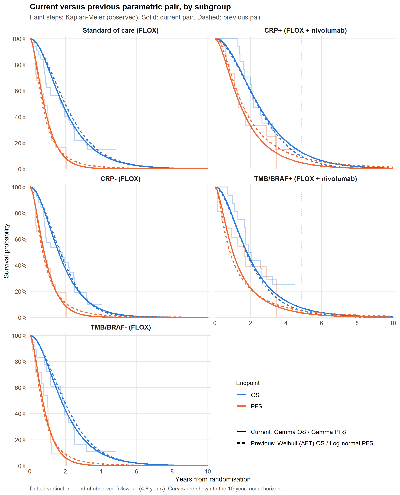

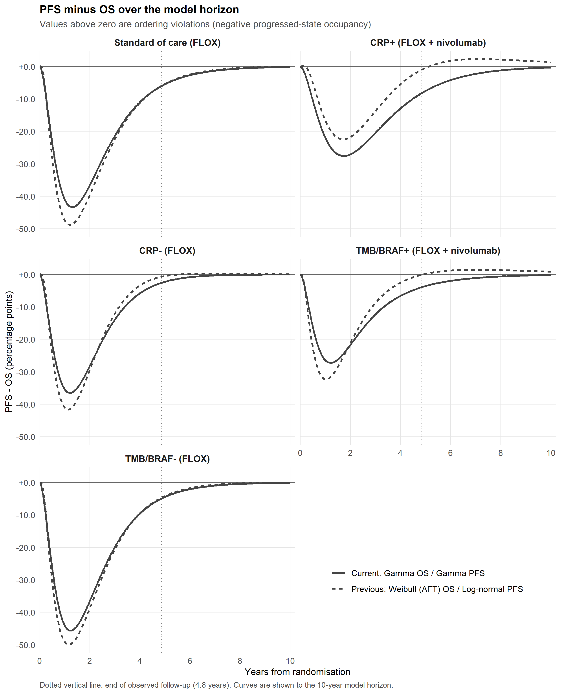

# All candidate distributions

Each figure shows one subgroup with OS (left) and PFS (right); every
candidate distribution is drawn together with the observed Kaplan-Meier
curve. The unlabelled versions are presented first so that visual fit
can be judged before the identity of each curve is revealed. Because
Weibull (AFT) and Weibull (PH) are the same model, they coincide exactly
and only eight distinct curves are visible in each panel.

## Unlabelled curves

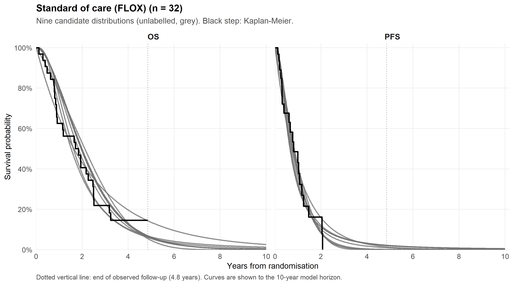

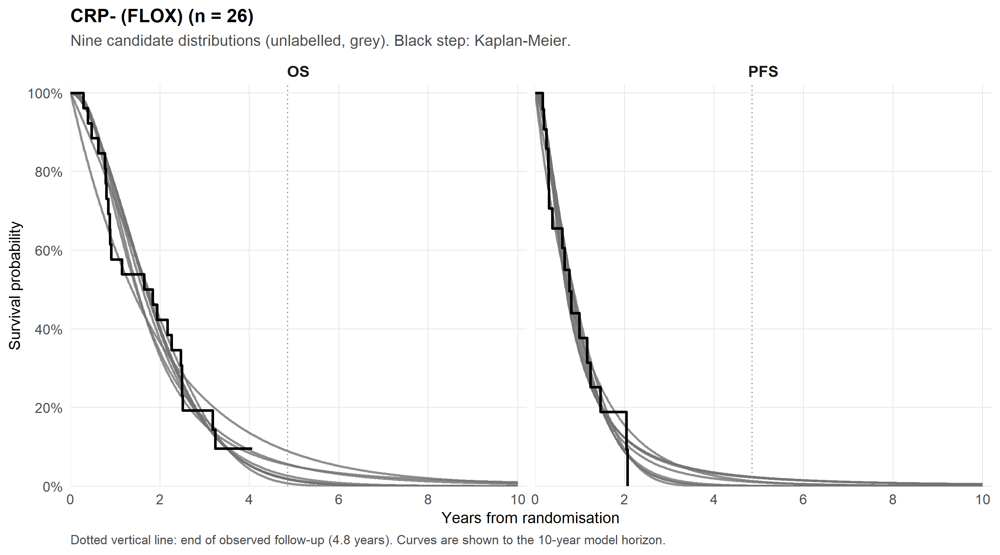

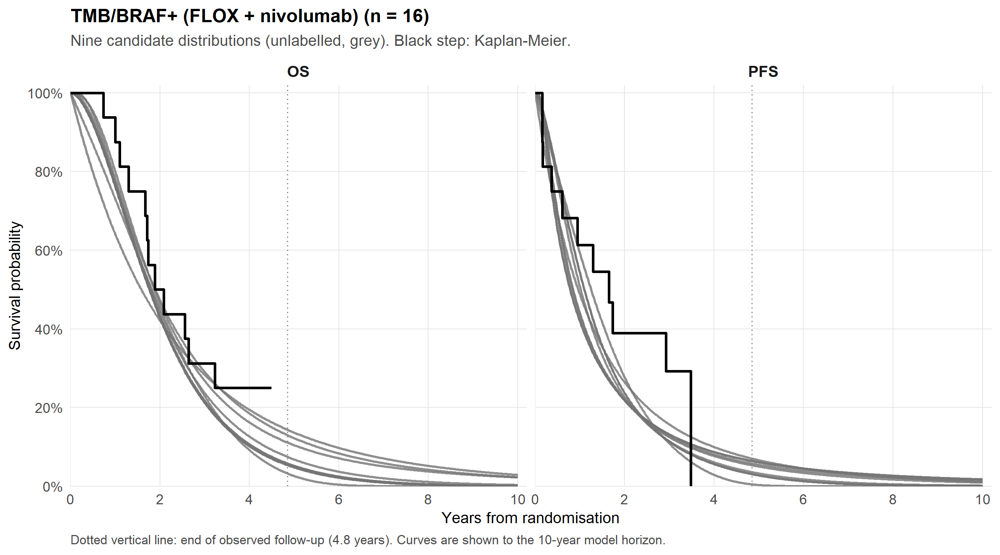

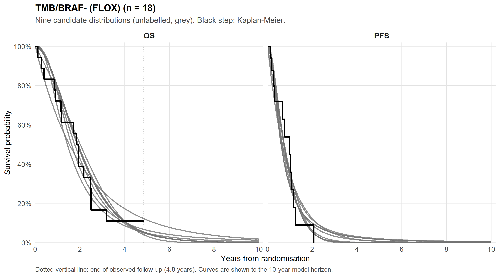

## Labelled curves

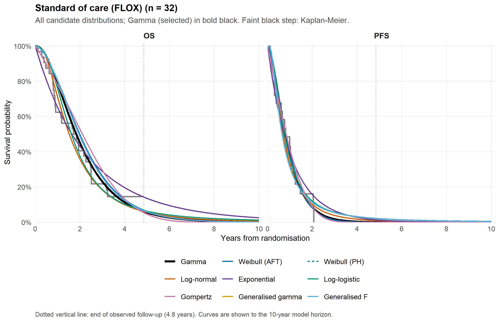

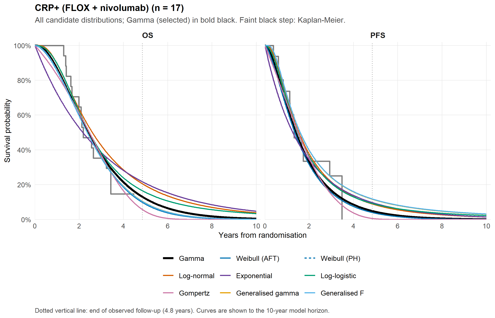

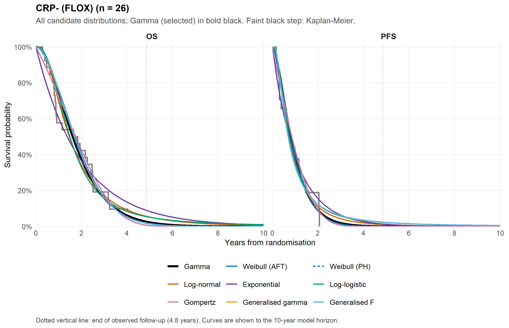

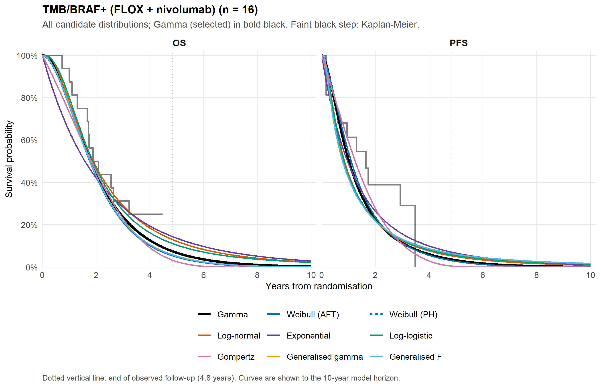

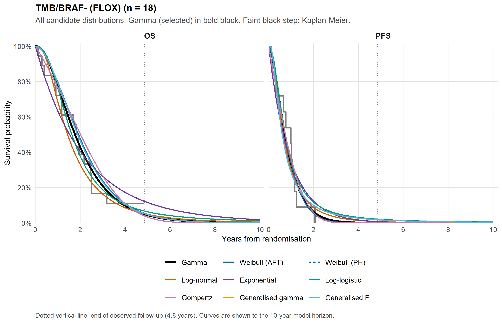

# Notes

- All parametric curves are population-averaged predictions over the
  complete-case patients in each subgroup, using each patient’s observed
  age, sex, and biomarker values, with `Rx` set as the strategy
  dictates. They are the same curves that
  `04_parametric_survival_analysis.R` uses for the ordering-constrained
  selection; for the selected pair they are identical to the base-case
  curves in `l_params_base`.
- Kaplan-Meier curves are estimated on the same complete-case patients
  (control arm for standard of care and the biomarker-negative
  subgroups; experimental arm for the biomarker-positive subgroups).
- The previous pair referred to in Section 3 is the unconstrained
  minimum-combined-AIC pair, which was the base case before the ordering
  constraint was introduced.
- Coefficient estimates, standard errors, and confidence intervals are
  taken directly from `flexsurvreg` (`fit$res`).

------------------------------------------------------------------------

**Report completed on:** 2026-08-31  
**Repository:** ben-geisler/METIMMOX-1  
**Report version:** 1.0
